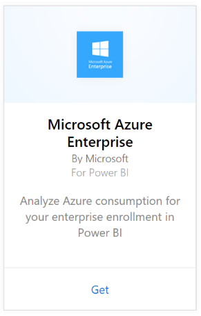
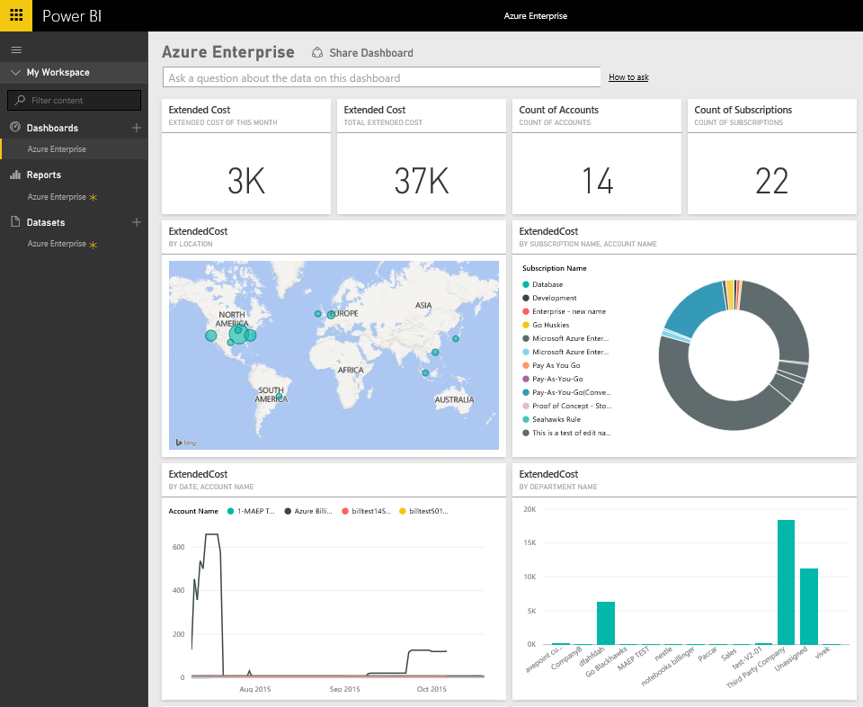
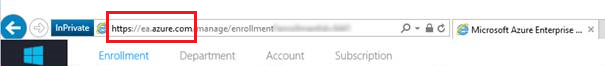

# Connect to Microsoft Azure Enterprise with Power BI
Explore and monitor your Microsoft Azure Enterprise data in Power BI with the Power BI content pack. The data will be refreshed automatically once per day.

Connect to the [Microsoft Azure Enterprise content pack](https://app.powerbi.com/getdata/services/azure-enterprise) for Power BI.

## How to connect
1. Select **Get Data** at the bottom of the left navigation pane.
   
    
2. In the **Services** box, select **Get**.
   
   
3. Select **Microsoft Azure Enterprise** \> **Get**.
   
   
4. Provide the Azure Environment URL, the number months of data you want to import and your Azure Enterprise enrollment number. Your Azure Environment URL will be `https://ea.azure.com` or `https://ea.windowsazure.cn`. See details on [finding these parameters](#FindingParams) below.
   
    
5. Provide your Access key to connect. The key for your enrollment can be found in your Azure EA Portal.
   
    
6. The import process will begin automatically. When complete, a new dashboard, report and model will appear in the Navigation Pane. Select the dashboard to view your imported data.
   
   

**What now?**

* Try [asking a question in the Q&A box](consumer/end-user-q-and-a.md) at the top of the dashboard
* [Change the tiles](service-dashboard-edit-tile.md) in the dashboard.
* [Select a tile](consumer/end-user-tiles.md) to open the underlying report.
* While your dataset will be scheduled to refresh daily, you can change the refresh schedule or try refreshing it on demand using **Refresh Now**

## What's included
The Azure Enterprise content pack includes monthly reporting data for the range of months that you provide during the connection flow. The range is a moving window, so the dates included will update as the dataset refreshes.

## System Requirements
The content pack requires access to the Enterprise features within the Azure Portal.

## Finding parameters
Power BI reporting is available for EA Direct, Partner and Indirect Customers who are able to view billing information. Please read below for details about finding each of the values the connection flow expects.

**Azure Environment URL**

* This value is typically https://ea.azure.com, however you can check the URL once you sign in to confirm.
  
    

**Number of Months**

* This should be a number between 1-36 representing the number of months of data (from today) you'd like to import.

**Enrollment Number**

* This is your Azure Enterprise enrollment number which can be found on the home screen of the [Azure Enterprise Portal](https://ea.azure.com/) under “Enrollment Detail”.
  
    

**Access Key**

* Your key can be found in the Azure Enterprise portal, under "Download Usage" > "API Access Key"
  
    

**Additional Help**

* For additional help setting up the Azure Enterprise Power BI Pack, log in to the Azure Enterprise Portal to view the API Help File under “Help” and additional instructions under Reports -> Download Usage -> API Access Key.

## Next steps
[Get started in Power BI](service-get-started.md)

[Get data in Power BI](service-get-data.md)

