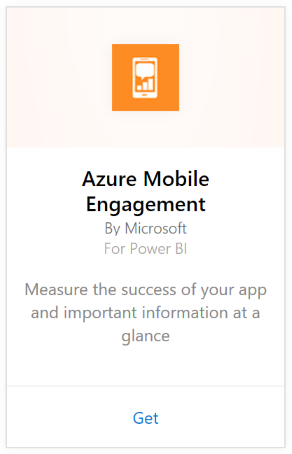
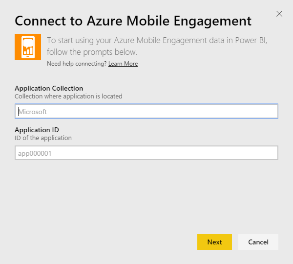

# Connect to Azure Mobile Engagement with Power BI
The Power BI Azure Mobile Engagement content pack allows to you quickly gain insights into your app data.

Connect to the [Azure Mobile Engagement content pack](https://app.powerbi.com/groups/me/getdata/services/azme) for Power BI.

## How to connect
1. Select **Get Data** at the bottom of the left navigation pane.
   
    
2. In the **Services** box, select **Get**.
   
    
3. Select **Azure Mobile Engagement** \> **Get**.
   
     
4. Specify your App Collection and App Name. This information can be found in your Azure Mobile Engagement account.
   
     
5. For Authentication Method, provide your Key then click Sign In.
   
    
6. After Power BI imports the data you will see a new dashboard, report, and dataset in the left navigation pane. New items are marked with a yellow asterisk \* which disappears once selected:
   
    

 **What Now?**

* Try [asking a question in the Q&A box](service-q-and-a.md) at the top of the dashboard
* [Change the tiles](service-dashboard-edit-tile.md) in the dashboard.
* [Select a tile](service-dashboard-tiles.md) to open the underlying report.
* While your dataset will be schedule to refreshed daily, you can change the refresh schedule or try refreshing it on demand using **Refresh Now**

### See also
[Get started in Power BI](service-get-started.md)

[Get data in Power BI](service-get-data.md)

