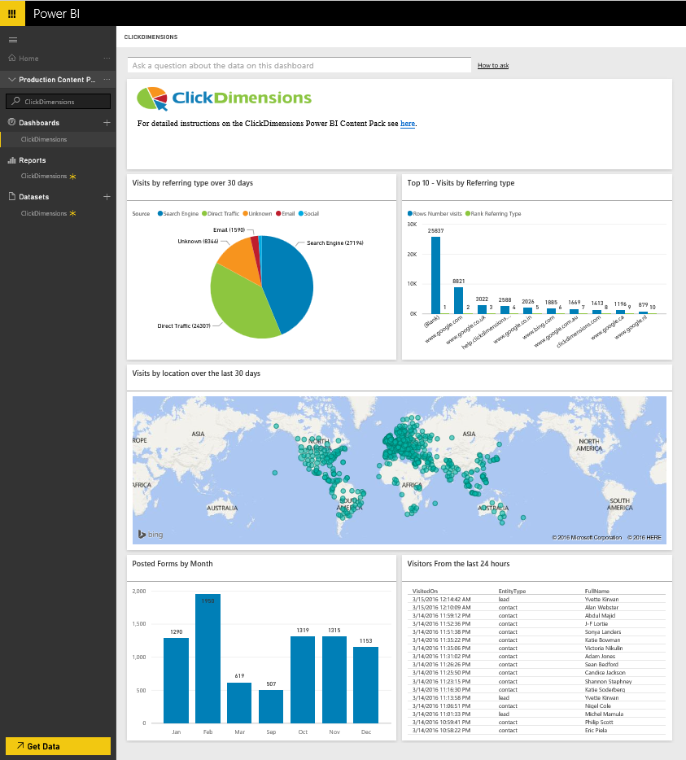
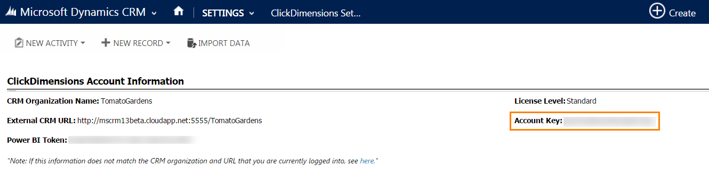

# Connect to ClickDimensions with Power BI
The ClickDimensions content pack for Power BI allows users to utilize ClickDimensions marketing data in Power BI, giving management teams further insight into the success of their sales and marketing efforts. Visualize and analyze email interactions, web visits and form submissions in Power BI dashboards and reports.

Connect to the [ClickDimensions content pack](https://app.powerbi.com/getdata/services/click-dimensions) for Power BI.

## How to connect
1. Select **Get Data** at the bottom of the left navigation pane.
   
   
2. In the **Services** box, select **Get**.
   
   
3. Select **ClickDimensions** \>  **Get**.
   
   
4. Provide the location of your data center (US, EU or AU) and select **Next**.
   
   
5. For **Authentication Method**, select **Basic** \> **Sign In**. When prompted, enter your ClickDimensions credentials. See details in [finding those parameters](#FindingParams) below
   
    
6. After approving, the import process will begin automatically. When complete, a new dashboard, report and model will appear in the Navigation Pane. Select the dashboard to view your imported data.
   
     

**What now?**

* Try [asking a question in the Q&A box](consumer/end-user-q-and-a.md) at the top of the dashboard
* [Change the tiles](service-dashboard-edit-tile.md) in the dashboard.
* [Select a tile](consumer/end-user-tiles.md) to open the underlying report.
* While your dataset will be scheduled to refresh daily, you can change the refresh schedule or try refreshing it on demand using **Refresh Now**

## System requirements
To connect to the Power BI content pack, you must provide the data center corresponding to your account and log in with your ClickDimensions account. If you're unsure which data center to provide, please check with your admin.

## Finding parameters
The Account Key is found within CRM Settings \> ClickDimensions Settings. Copy the Account Key from within ClickDimensions Settings and paste it into the User name field.  

  

Copy the Power BI Token from within ClickDimensions Settings and paste it into the Password field. The Power BI Token is found within CRM Settings \> ClickDimensions Settings.  

  

## Next steps
[Get started in Power BI](service-get-started.md)

[Get data in Power BI](service-get-data.md)

