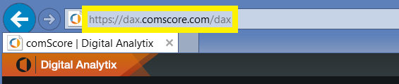

# Connect to comScore Digital Analytix with Power BI
Visual and explore your comScore Digital Analytix data in Power BI with the Power BI content pack. The data will be refreshed automatically once per day.

Connect to the [comScore content pack for Power BI.](https://app.powerbi.com/getdata/services/comscore)

>[!NOTE]
>To connect to the content pack you need a comScore DAx user account and have comScore API access. More [details](#Requirements) below.

## How to connect
1. Select Get Data at the bottom of the left navigation pane.
   
   
2. In the **Services** box, select **Get**.
   
   
3. Select **comScore Digital Analytix** \> **Get**.
   
   
4. Provide the datacenter, comScore Client ID and Site you’d like to connect to. For more details on how to find these values, please see [Finding your comScore Parameters](#FindingParams) below.
   
   
5. Provide your comScore username and password to connect. See details on finding this value below.
   
   
6. The import process will begin automatically. When complete, a new dashboard, report and model will appear in the Navigation Pane. Select the dashboard to view your imported data.

**What now?**

* Try [asking a question in the Q&A box](consumer/end-user-q-and-a.md) at the top of the dashboard
* [Change the tiles](service-dashboard-edit-tile.md) in the dashboard.
* [Select a tile](consumer/end-user-tiles.md) to open the underlying report.
* While your dataset will be scheduled to refresh daily, you can change the refresh schedule or try refreshing it on demand using **Refresh Now**

## System requirements
A comScore DAx user account and access to the comScore DAx API is required to connect. Please contact your comScore DAx admin to confirm your account.

## Finding parameters
Details on how to find each of your comScore parameters is below.

**Data Center**

The data center you connect to is determined by the URL you navigate to in comScore.

 

**Client**

The Client is the same one you provide when signing into comScore DAx.

 

**Site**

The comScore site determines which site you’d like to see the data from. You can find the list of sites from your comScore account.

## Next steps
[Get started in Power BI](service-get-started.md)

[Get data in Power BI](service-get-data.md)

