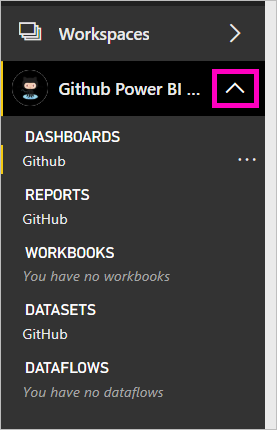

# Connect to GitHub with Power BI
This Power BI template app pulls data from your GitHub account. It generates an app and a workspace with a dashboard, a set of reports, and a dataset. The GitHub app for Power BI shows you insights into your GitHub repository, also known as repo, with data around contributions, issues, pull requests, and active users.

Connect to the [GitHub template app](https://app.powerbi.com/getdata/services/github) or read more about the [GitHub integration](https://powerbi.microsoft.com/integrations/github) with Power BI.

You can also try the [GitHub tutorial](service-tutorial-connect-to-github.md). It installs real GitHub data about the public repo for the  Power BI documentation.

>[!NOTE]
>The template app requires the GitHub account to have access to the repo. More details on requirements below.

## How to connect
[!INCLUDE [powerbi-service-apps-get-more-apps](./includes/powerbi-service-apps-get-more-apps.md)]
   
3. Select **GitHub** \> **Get it now**.

4. In the **Apps** pane, select the **MailChimp** tile.

    

6. In **Get started with your new app**, select **Connect data**.

    

5. Enter the repository name and repository owner of the repo. See details on [finding these parameters](#FindingParams) below.
   
    

5. Enter your GitHub credentials (this step might be skipped if you're already signed in with your browser). 
6. For **Authentication Method**, select **oAuth2** \> **Sign In**. 
7. Follow the Github authentication screens. Grant the GitHub for Power BI template app permission to the GitHub data.
   
   
   
    Power BI connects with GitHub and connects to your data.  The data is refreshed once a day. After Power BI imports the data, you see the contents of your new GitHub workspace.

9. Select the arrow next to the workspace name in the left navigation bar. You see the workspace contains a dashboard and a report.

    

8. Select the new [GitHub dashboard](https://powerbi.microsoft.com/integrations/github). 
   
    

## Modify and publish your app

Because you've installed a template app, you can make changes to the report and the dashboard, and then publish it as an *app* to colleagues in your organization. 

Read about [distributing apps](service-create-distribute-apps.md) to your colleagues.

## What's included in the app
The following data is available from GitHub in Power BI:     

| Table name | Description |
| --- | --- |
| Contributions |The contributions table gives the total additions, deletions, and commits authored by the contributor aggregated per week. The top 100 contributors are included. |
| Issues |List all issues for the selected repo and it contains calculations like total and average time to close an issue, Total open issues,  Total closed issues. This table will be empty when there are no issues in the repo. |
| Pull requests |This table contains all the Pull Requests for the repo and who pulled the request. It also contains calculations around how many open, closed, and total pull requests, how long it took to pull the requests and how long the average pull request took. This table will be empty when there are no issues in the repo. |
| Users |This table provides a list of GitHub users or contributors who have made contributions, filed issues, or solved Pull requests for the repo selected. |
| Milestones |It has all the Milestones for the selected repo. |
| DateTable |This table contains dates from today and for years in the past that allow you to analyze your GitHub data by date. |
| ContributionPunchCard |This table can be used as a contribution punch card for the selected repo. It shows commits by day of week and hour of day. This table is not connected to other tables in the model. |
| RepoDetails |This table provides details for the repo selected. |

## System requirements
* The GitHub account that has access to the repo.  
* Permission granted to the Power BI for GitHub app during first login. See details below on revoking access.  
* Sufficient API calls available to pull and refresh the data.  

### De-authorize Power BI
To de-authorize Power BI from being connected to your GitHub repo, you can Revoke access in GitHub. See this [GitHub help](https://help.github.com/articles/keeping-your-ssh-keys-and-application-access-tokens-safe/#reviewing-your-authorized-applications-oauth) topic for details.

## Finding parameters
You can determine the owner and repository by looking at the repository in GitHub itself:

The first part "Azure" is the owner and the second part "azure-sdk-for-php" is the repository itself.  You see these same two items in the URL of the repository:

    <https://github.com/Azure/azure-sdk-for-php> .

## Troubleshooting
If necessary, you can verify your GitHub credentials.  

1. In another browser window, go to the GitHub web site and log in to GitHub. You can see you’re logged in, in the upper-right corner of the GitHub site.    
2. In GitHub, navigate to the URL of the repo you plan to access in Power BI. For example: https://github.com/dotnet/corefx.  
3. Back in Power BI, try connecting to GitHub. In the Configure GitHub dialog box, use the names of the repo and repo owner for that same repo.  

## Next steps

* [Tutorial: Connect to a GitHub repo with Power BI](service-tutorial-connect-to-github.md)
* [Create the new workspaces in Power BI](service-create-the-new-workspaces.md)
* [Install and use apps in Power BI](consumer/end-user-apps.md)
* [Power BI apps for external services](service-connect-to-services.md)
* Questions? [Try asking the Power BI Community](http://community.powerbi.com/)

