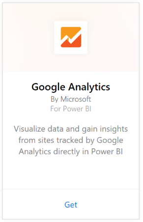
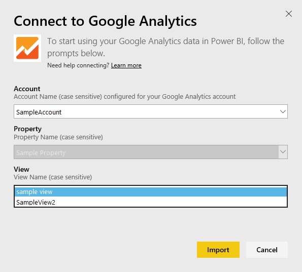

# Connect to Google Analytics with Power BI
Connecting to Google Analytics through Power BI starts by connecting to your Google Analytics account. You will get a Power BI dashboard and a set of Power BI reports that provide insights about your site traffic and user dimensions. You can interact with the dashboard and reports, but you can't save changes. The data will be refreshed automatically once per day.

Connect to [Google Analytics](https://app.powerbi.com/getdata/services/google-analytics) for Power BI. Read more about the [Google Analytics integration](https://powerbi.microsoft.com/integrations/google-analytics) with Power BI.

You can create customized dashboards and reports by starting from the [Google Analytics connector](service-google-analytics-connector.md) in Power BI Desktop. Just connect with your Google Analytics account and create your custom reports, which you can publish to the Power BI service.

## How to connect
[!INCLUDE [powerbi-service-apps-get-more-apps](./includes/powerbi-service-apps-get-more-apps.md)]

3. Select **Google Analytics** \> **Get**.
   
   
4. When prompted, enter your Google Analytics credentials. Select **oAuth 2** as the Authentication Mechanism and click **Sign In**. Follow the Google authentication flow, which may include 2-factor authentication if you have it configured.
   
   
5. Click **Accept** to allow Power BI to access your Google Analytics data.
   
   
6. Power BI connects to a specific Google Analytics View. Select the account name, property name and view name you’d like to connect to. This information can be found in your Google Analytics account, either in the top left or on the **Home** tab. See details below. 
   
   
5. Click **Connect** to begin the import process. 

## View the Google Analytics dashboard and reports
[!INCLUDE [powerbi-service-apps-open-app](./includes/powerbi-service-apps-open-app.md)]

   

[!INCLUDE [powerbi-service-apps-open-app](./includes/powerbi-service-apps-what-now.md)]

## System requirements
To connect from Power BI, you need to have a [Google Analytics](https://www.google.com/analytics/) account. Other Google accounts that do not have a Google Analytics account connected to it will see an authentication error.

## Troubleshooting
**Credentials**
If you have multiple Google accounts, please use an incognito or an in-private browser window during connection to ensure the correct account is used.

If you're getting an error indicating your credentials are invalid however you were able to sign into Google, please confirm you have a [Google Analytics](https://www.google.com/analytics/) account.

**Parameters**
Unique names are currently required for the parameters. If you see an error indicating the value you selected is duplicated, please select another value or change the names in Google Analytics to make them unique. We're actively working to improve this.

>[!NOTE]
>Parameters are case-sensitive. Enter them exactly as they appear in your Google Analytics account.

Still having issues? Open a support ticket to reach the Power BI team:

* While in the Power BI app, select the question mark \> **Contact Support.**
* From the Power BI Support site (where you're reading this article), select **Contact Support** on the right side of the page.

## Next steps
* [What are apps in Power BI?](service-create-distribute-apps.md)
* [Get data in Power BI](service-get-data.md)
* More questions? [Try asking the Power BI Community](http://community.powerbi.com/)

