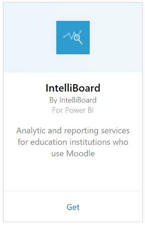
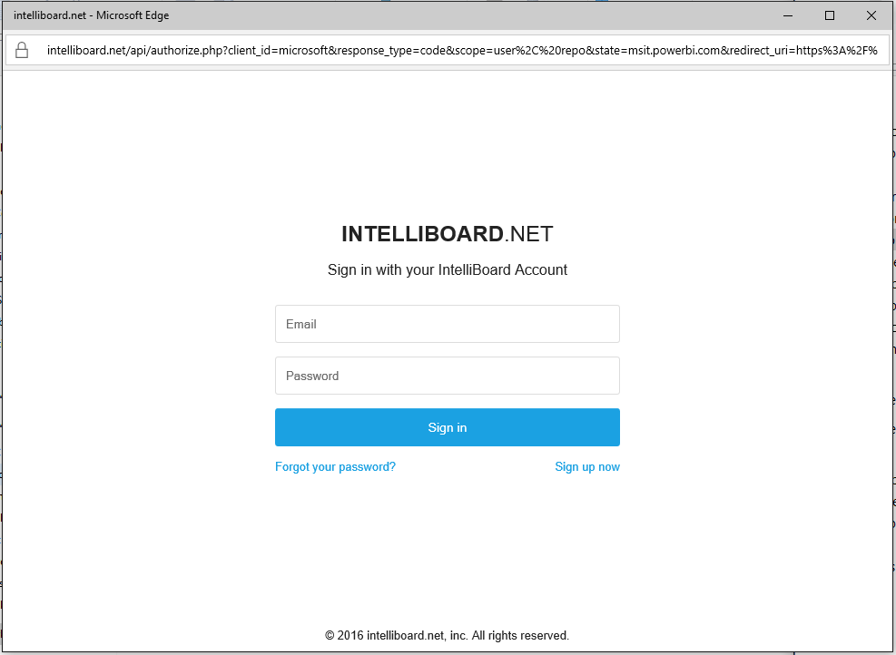

# Connect to IntelliBoard with Power BI
IntelliBoard offers simplified access to your Moodle learning management system data through reporting services. The IntelliBoard content pack for Power BI offers additional analytics, including metrics on your courses, registered users, overall performance, and your LMS activity.

Connect to the [IntelliBoard content pack](https://app.powerbi.com/getdata/services/intelliboard) for Power BI.

## How to connect
1. Select **Get Data** at the bottom of the left navigation pane.  
   
    
2. In the **Services** box, select **Get**.  
   
    
3. Select **IntelliBoard**, then select **Get**.  
   
    
4. Select **OAuth 2** and then **Sign In**. When prompted, provide your IntelliBoard credentials.
   
    
   
    
5. Once connected, a dashboard, report and dataset will automatically be loaded. When completed, the tiles will update with data from your IntelliBoard account.
   
    

**What now?**

* Try [asking a question in the Q&A box](consumer/end-user-q-and-a.md) at the top of the dashboard
* [Change the tiles](service-dashboard-edit-tile.md) in the dashboard.
* [Select a tile](consumer/end-user-tiles.md) to open the underlying report.
* While your dataset will be scheduled to refresh daily, you can change the refresh schedule or try refreshing it on demand using **Refresh Now**

## What's included
The content pack includes data from the following tables:  

    - Activity  
    - Agents  
    - Auth  
    - Countries  
    - CoursesProgress  
    - Enrollments
    - Lang  
    - Platform  
    - Totals  
    - UsersProgress    

## System requirements
An IntelliBoard account with permissions to the above tables is required in order to instantiate this content pack.

## Next steps
[What is Power BI?](power-bi-overview.md)

[Power BI - Basic Concepts](consumer/end-user-basic-concepts.md)

