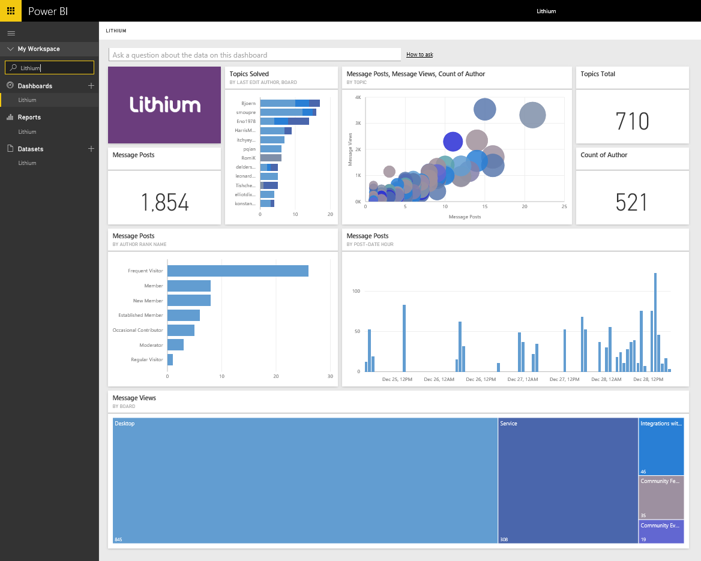

# Connect to Lithium with Power BI
Lithium builds trusted relationships between the world's best brands and their customers, helping people get answers and share their experiences. By connecting the Lithium content pack to Power BI, you can measure key metrics about your online community to help drive sales, reduce service costs and increase loyalty. 

Connect to the [Lithium content pack](https://app.powerbi.com/getdata/services/lithium) for Power BI.

Note: The Power BI content pack uses the Lithium API. Excessive calls to the API may result in additional charges from Lithium, please confirm with your Lithium administrator.

## How to connect
1. Select **Get Data** at the bottom of the left navigation pane.
   
    
2. In the **Services** box, select **Get**.
   
    
3. Select **Lithium** \> **Get**.
   
   
4. Provide the URL of your Lithium community. It will be in the form of *https://community.yoursite.com*.
   
   
5. When prompted, enter your Lithium credentials. Select **oAuth 2** as the Authentication Mechanism and click **Sign In** and follow the Lithium authentication flow.
   
   
   
   
6. Once the login flow is completed the import process will begin. When complete, a new dashboard, report and model will appear in the Navigation Pane. Select the dashboard to view your imported data.
   
    

**What Now?**

* Try [asking a question in the Q&A box](service-q-and-a.md) at the top of the dashboard
* [Change the tiles](service-dashboard-edit-tile.md) in the dashboard.
* [Select a tile](service-dashboard-tiles.md) to open the underlying report.
* While your dataset will be schedule to refreshed daily, you can change the refresh schedule or try refreshing it on demand using **Refresh Now**

## System requirements
The Lithium content pack requires a Lithium community v15.9 or greater. Please check with your Lithium admin to confirm.

### See also
[Get started with Power BI](service-get-started.md)

[Power BI - Basic Concepts](service-basic-concepts.md)

