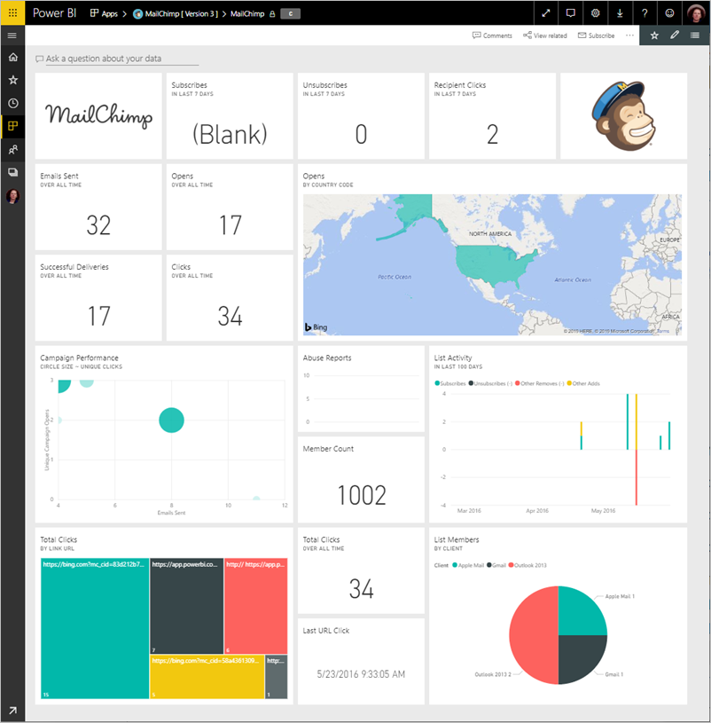

# Connect to MailChimp with Power BI
This Power BI template app pulls data from your MailChimp account. It generates a workspace with a dashboard, a set of reports, and a dataset to allow you to explore your data. Pull in analytics to create [MailChimp dashboards](https://powerbi.microsoft.com/integrations/mailchimp) and quickly identify trends within your campaigns, reports, and individual subscribers. The data refreshes daily, ensuring the data you're monitoring is up to date.

Connect to the [MailChimp template app](https://app.powerbi.com/getdata/services/mailchimp) for Power BI.

## How to connect

[!INCLUDE [powerbi-service-apps-get-more-apps](./includes/powerbi-service-apps-get-more-apps.md)]

3. Select **MailChimp** \> **Get it now**.
4. In the **Apps** pane, select the **MailChimp** tile.

    

6. In **Get started with your new app**, select **Connect data**.

    

1. For Authentication Method, select **oAuth2** \> **Sign In**.
   
    When prompted, enter your MailChimp credentials and follow the authentication process.
   
    The first time you connect you will be prompted to allow Power BI read-only access to your account. Select **Allow** to begin the import process, which can take a few minutes depending on the volume of data in your account.
   
    

5. After Power BI imports the data you will see a new dashboard, report, and dataset in the left navigation pane. This is the default dashboard that Power BI created to display your data. You can modify this dashboard to display your data in any way you want.
   
   

## Modify and publish your app

Because you've installed a template app, you can make changes to the report and the dashboard, and then publish it as an *app* to colleagues in your organization. 

Read about [distributing apps](service-create-distribute-apps.md) to your colleagues.

## Next steps

* [Create the new workspaces in Power BI](service-create-the-new-workspaces.md)
* [Install and use apps in Power BI](consumer/end-user-apps.md)
* [Power BI apps for external services](service-connect-to-services.md)
* Questions? [Try asking the Power BI Community](http://community.powerbi.com/)

