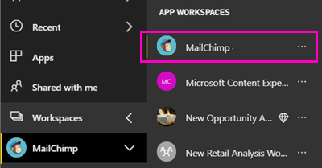
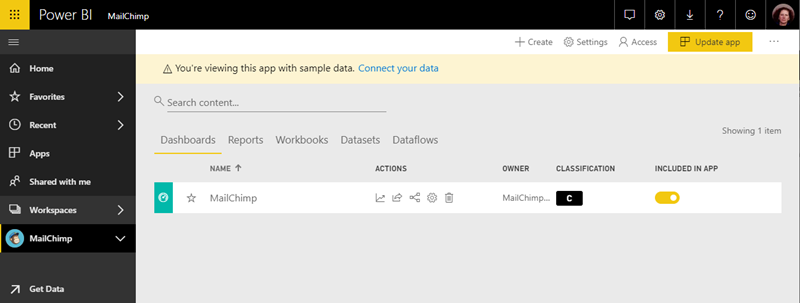

# Connect to MailChimp with Power BI
This article walks you through pulling your data from your MailChimp account with a Power BI template app. The template app generates a workspace with a dashboard, a set of reports, and a dataset to allow you to explore your MailChimp data. Pull in analytics to create [MailChimp dashboards](https://powerbi.microsoft.com/integrations/mailchimp) and quickly identify trends within your campaigns, reports, and individual subscribers. The data refreshes daily, ensuring the data you're monitoring is up to date.

After you've installed the template app, you can change the dashboard and report. Then you can distribute it as an app to colleagues in your organization.

Connect to the [MailChimp template app](https://app.powerbi.com/getdata/services/mailchimp) for Power BI.

## How to connect

[!INCLUDE [powerbi-service-apps-get-more-apps](./includes/powerbi-service-apps-get-more-apps.md)]

3. Select **MailChimp** \> **Get it now**.
4. In **Install this Power BI App?** select **Install**.
4. In the **Apps** pane, select the **MailChimp** tile.

    

6. In **Get started with your new app**, select **Connect data**.

    

1. For Authentication Method, select **oAuth2** \> **Sign In**.
   
    When prompted, enter your MailChimp credentials and follow the authentication process.
   
    The first time you connect, Power BI prompts you to allow read-only access to your account. Select **Allow** to begin the import process. It can take a few minutes, depending on the volume of data in your account.
   
    

5. After Power BI imports the data, the MailChimp dashboard opens.
   
    

## Modify and distribute your app

You've installed the MailChimp template app. That means you've also created the MailChimp app workspace. In the workspace, you can change the report and dashboard, and then distribute it as an *app* to colleagues in your organization. 

1. To view all the contents of your new MailChimp workspace, in the left navigation bar, select **Workspaces** > **MailChimp**. 

    

    This view is the content list for the workspace. In the upper-right corner, you see **Update app**. When you're ready to distribute your app to your colleagues, that's where you'll start.

    

2. Select **Reports** and **Datasets** to see the other elements in the workspace. 

    Read about [distributing apps](service-create-distribute-apps.md) to your colleagues.

## Next steps

* [Create the new workspaces in Power BI](service-create-the-new-workspaces.md)
* [Install and use apps in Power BI](consumer/end-user-apps.md)
* [Power BI apps for external services](service-connect-to-services.md)
* Questions? [Try asking the Power BI Community](http://community.powerbi.com/)

