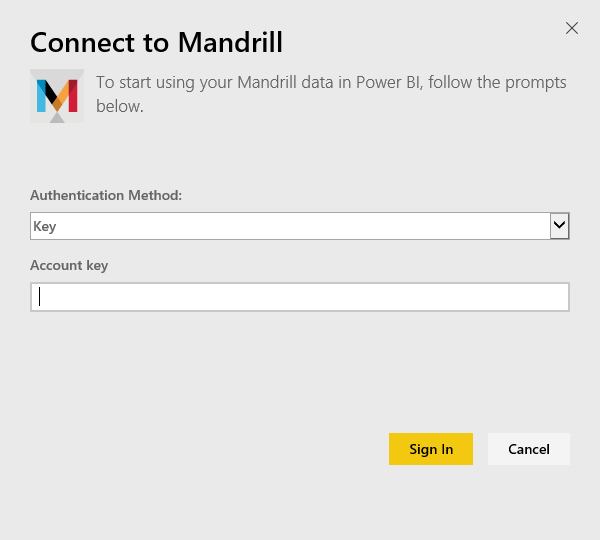

# Connect to Mandrill with Power BI
The Power BI content pack pulls data from your Mandrill account and generates a dashboard, a set of reports and a dataset to allow you to explore your data. Use Mandrill's analytics to quickly gain insights into your newsletter or marketing campaign. The data is set to refresh daily ensuring the data you're monitoring is up to date.

Connect to the [Mandrill content pack for Power BI.](http://app.powerbi.com/getdata/services/mandrill)

## How to connect
1. Select **Get Data** at the bottom of the left navigation pane.
   
    
2. In the **Services** box, select **Get**.
   
    
3. Select **Mandrill** > **Get**.
   
    
4. For **Authentication Method**, select **Key** and provide your API key. You can find the key on the **Settings** tab of the Mandrill dashboard. Select **Sign In** to begin the import process, which can take a few minutes depending on the volume of data in your account.
   
    
5. After Power BI imports the data you will see a new dashboard, report, and dataset in the left navigation pane. This is the default dashboard that Power BI created to display your data.
   
    

**What now?**

* Try [asking a question in the Q&A box](consumer/end-user-q-and-a.md) at the top of the dashboard
* [Change the tiles](service-dashboard-edit-tile.md) in the dashboard.
* [Select a tile](consumer/end-user-tiles.md) to open the underlying report.
* While your dataset will be scheduled to refresh daily, you can change the refresh schedule or try refreshing it on demand using **Refresh Now**

## Next steps
[What is Power BI?](power-bi-overview.md)

[Power BI - Basic Concepts](consumer/end-user-basic-concepts.md)

