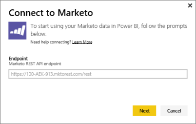

# Connect to Marketo with Power BI
The Power BI content pack for Marketo allows you to gain insights into your Marketo account with data around Leads and their activities.Creating this connection retrieves your data and automatically provides a dashboard and related reports based on that data.

Connect to the [Marketo content pack](https://app.powerbi.com/getdata/services/marketo) for Power BI.

## How to connect
1. Select **Get Data** at the bottom of the left navigation pane.
   
   
2. In the **Services** box, select **Get**.
   
    
3. Select **Marketo** \> **Get**.
   
   
4. Enter the Marketo REST endpoint supplied to you by Marketo or your Marketo admin, and select Next.
   
   
   
   Read more about the Marketo REST endpoint: [http://developers.marketo.com/documentation/rest/endpoint-url/ ](http://developers.marketo.com/documentation/rest/endpoint-url/).
5. Using the **Basic** Authentication Method, enter the Client ID as the **Username** and the Client Secret as the **Password**. Client ID and Client Secret are available in Marketo or from your marketo admin ([http://developers.marketo.com/documentation/rest/custom-service/](http://developers.marketo.com/documentation/rest/custom-service/)). 
   
   
   
   This gives the *Marketo for Power BI* content pack access to your [Marketo analytics](https://powerbi.microsoft.com/integrations/marketo) data and allows you to analyze the data in Power BI. The data is refreshed once a day.
6. Once connected to your Marketo account, a dashboard with all your data is loaded:
   
   

**What now?**

* Try [asking a question in the Q&A box](consumer/end-user-q-and-a.md) at the top of the dashboard
* [Change the tiles](service-dashboard-edit-tile.md) in the dashboard.
* [Select a tile](consumer/end-user-tiles.md) to open the underlying report.
* While your dataset will be scheduled to refresh daily, you can change the refresh schedule or try refreshing it on demand using **Refresh Now**

## What's included
The following data is available from Marketo in Power BI where the activity occurred between today and one year ago:

| Table name | Description |
| --- | --- |
| EmailActivities |Data about email sent to leads/contacts, with details about devices, categories, bounced count and percentage, clicked count and percentage, opened count and percentage, and program name. The Email Activities as shown in Power BI is an absolute email deliverability report, it does not apply any additional logic to the data. You might see some different results between the Marketo client and Power BI because of this. |
| ProgramActivities |Data on programs that have had a change a Status. This includes details such as: Reason, Success, Program acquisition count and percentage, and Program success count and percentage. |
| WebPageActivities |Data from user web page visits, including search agent, User agent, web page and hour of day. |
| Datetable |Dates from today and the past year.  Allows you to analyze your Marketo data by date. |
| Leads |Lead information like company, revenue size, number of employees,   country, industry, Lead score and Lead status. The leads are retrieved based on their presence in the email, program, and webpage activities data. |

All dates are in UTC. Depending on which time zone your account is in, dates my vary (similar as is seen in the Marketo client)

## System requirements
* The Marketo account you use for connecting has permission to access leads and activities.
* Sufficient API calls available to connect to the data.  Marketo has an API for each account.  When the limit is reached, you won't be able to load data into Power BI. 

**API Limit Details**

Importing data from Marketo uses Marketo APIs. Every customer of Marketo has a total limit of 10,000 API calls per day that are shared between all applications that use the Marketo APIs. You may use the APIs for other integrations as well as the Power BI integration. For more information on the APIs see: <http://developers.marketo.com/documentation/rest/>.

The amount of API calls Power BI makes to Marketo depends on the amount of data in your Marketo account. Power BI imports all Leads and Activities for the last year. Here is an example of data from Marketo and the amount of API calls that are used by Power BI when importing:  

| Data Type | Number of Rows | API Calls |
| --- | --- | --- |
| Leads information |15,000 |50 |
| Mail activities |150,000 |1,000 |
| Program activities |15,000 |100 |
| Web activities |150,000 |1,000 |
| Program changes |7,500 |50 |
| **Total API Calls** | |**2,200** |

## Next steps
[What is Power BI?](power-bi-overview.md)

[Get Data for Power BI](service-get-data.md)

[Power BI blog: Monitor and analyze your Marketo data with Power BI](http://blogs.msdn.com/b/powerbi/archive/2015/03/19/monitor-and-analyze-your-marketo-data-with-power-bi.aspx)

