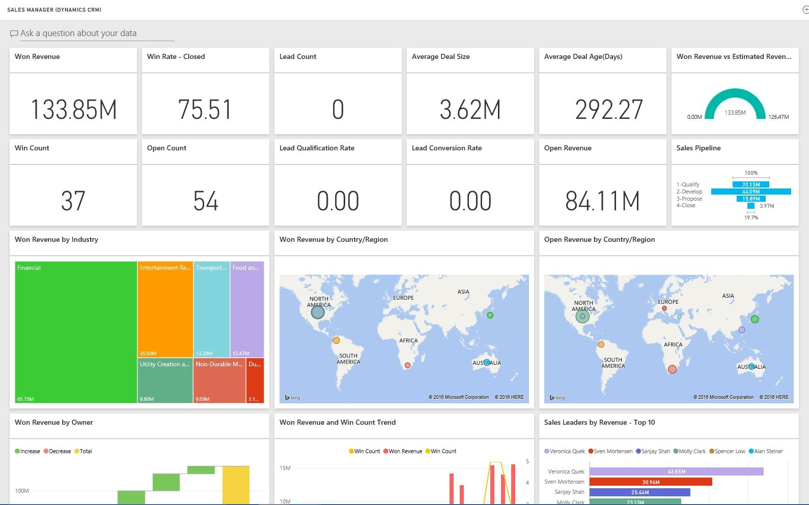

# Connect to Microsoft Dynamics CRM with Power BI
Microsoft Dynamics CRM Online for Power BI allows you to easily access and analyze your data. Power BI uses the OData feed to create a descriptive model, with all the entities and measures needed such as Accounts, Activities, Opportunities, Product, Leads, Users, and more. After you install the app, you can view the dashboard and reports in the Power BI service ([https://powerbi.com](https://powerbi.com)), and in the Power BI mobile apps. 

Connect to Dynamics CRM Online [Sales Manager](https://msit.powerbi.com/groups/me/getdata/services/dynamics-crm-sales-manager) or [Service Manager](https://msit.powerbi.com/groups/me/getdata/services/dynamics-crm-customer-service). Read more about [Dynamics CRM Online integration](https://powerbi.microsoft.com/integrations/microsoft-dynamicscrm) with Power BI.

This connection requires **Microsoft Dynamics CRM Online 2016 or later**. More details on [requirements](#Requirements) below.

## How to connect
[!INCLUDE [powerbi-service-apps-get-more-apps](./includes/powerbi-service-apps-get-more-apps.md)]
3. Select **Microsoft Dynamics CRM Sales Manager** or **Microsoft Dynamics CRM Service Manager** and click **Connect**.
   
   
4. Provide the Service URL associated with your account.  This will be in the form `https://company.crm.dynamics.com`, see more details [below](#FindingParams).
   
   
5. When prompted, provide your credentials (this step might be skipped if you're already signed in with your browser). For Authentication Method, enter **oAuth2** and click **Sign In**:
   
   
6. After connecting, you'll see a dashboard customized for a Sales Manager or Service Manager, populated with your own data:
   
   

## View the Microsoft Dynamics CRM dashboard and reports
[!INCLUDE [powerbi-service-apps-open-app](./includes/powerbi-service-apps-open-app.md)]

[!INCLUDE [powerbi-service-apps-open-app](./includes/powerbi-service-apps-what-now.md)]

## What's included
The sections below detail what's included for the [Sales Manager](#Sales) and [Service Manager](#Service) personas.

Data is limited based on the security role assigned to the Dynamics CRM Online user.

The dashboard and reports are meant to provide operational reporting on near term data with focus on a team or group. Each query is limited to retrieve a maximum of 100K records from Dynamics CRM Online. If this limit is exceeded because of high volume of data in your organization, provisioning will fail as data refresh Dynamics CRM online will be terminated. If your account is too large, consider connecting through the Power BI Desktop to build a custom solution.

### Sales Manager
The dashboard and reports contain key metrics such as:  

* Won Revenue   
* Win Rate   
* Open Revenue   
* Lost revenue   
* Expected Revenue  
* Average Deal Size and more.  

They also contain key charts such as:  

* Won and Lost Revenue Trend, Won Revenue Vs Estimated Revenue Trend  
* Won Revenue by various dimensions such as Industry, Region, Territory   
* Sales Leaders By Revenue, Activities,   
* Top Accounts, Top Won/Lost Deals,    
* New Leads Trend, Sales Pipeline and more.   

These metrics and charts help to understand your sales organization performance and analyze sales pipeline across your sales team.

Following table lists the CRM entities available for this service and also gives details on the filters applied to each of the entity records.

| CRM Entity | Filters applied |
| --- | --- |
| Account |All accounts, which have related opportunities that have been modified in the last 365 days. |
| Activity |All activities modified in the last 90 days   [modifiedon] > today - 90 days |
| Business Unit |All business units, which are not disabled   [isdisabled] = false |
| Lead |All leads modified in the last 180 days   [modifiedon] > today - 180 days |
| Opportunity |All opportunities modified in last 365 days   [modifiedon] > today - 365 days |
| Opportunity Product |All opportunity products modified in last 365 days   [modifiedon] > today - 365 days |
| Product |All active products   [statecode] <> 1 |
| Territory |All territories |
| User |All active users and not delegated admins    [isdisabled] = false and [accessmode] <> 4 |

### Service Manager
These dashboard and reports contain key metrics such as:  

* CSAT Percentage   
* SLA Met percentage   
* Escalated Cases Percentage   
* Average Handling Time   
* Total Resolved Cases  
* Total Active Cases  
* Number of Times KB Article Used in cases and more.    

They also contain key charts such as:   

* Case Volume Trends for Incoming Cases, Resolved Cases, Escalated Cases   
* Case Volume by various dimensions such as Origin, Location, Priority, Type  
* Leaders by CSAT percentage, SLA met percentage, Activities, Resolved cases  
* Most Used and Most viewed KB Articles and more.  
   
  These metrics and charts help to understand your support organization performance and analyze active cases workload across your service team and service queues.

Following table lists the CRM entities available for this service, as well as details on the filters applied to each of the entity records.

| CRM Entity | Filters applied |
| --- | --- |
| Account |All accounts which have related cases that have been modified in the last 90 days. |
| Activity |All activities modified in the last 90 days   [modifiedon] > today - 90 days |
| Case |All cases modified in the last 90 days   [modifiedon] > today - 90 days |
| Case Resolution Activity |All case resolution activities modified in the last 90 days   [modifiedon] > today - 90 days |
| Contact |All contacts, which have related cases that have been modified in the last 90 days. |
| Knowledge Article |All latest version of knowledge articles    [islatestversion] = true |
| Knowledge Article Incident |All knowledge article incidents, which are modified in the last 90 days   [modifiedon] > today - 90 days |
| Queue |All active queues    [statecode] = 0 |
| Queue Item |All case-related queue items created on the past 365 days    [createdon] > today - 365 days and   [objecttypecode] = 112 |
| User |All active users    [isdisabled] = false |

## System requirements
* A valid Dynamics CRM Online 2016 or later instance (Power BI won't work with an on-premises CRM version). If you do not have 2016 or later:
* An administrator must enable the OData endpoint in the site settings.
* An account with less than 100k records in any of the tables. Note if the account has access to more than 100k records the import will fail.

## Finding parameters
The address of the instance can be found in the URL bar of your browser. It typically has the format: `https://[instance_name].crm.dynamics.com`.

Power BI only supports Dynamics CRM 2016 endpoints. The connection will not work with earlier versions of CRM Online. Use Power BI Desktop to connect directly to your account.

## Troubleshooting
If you're having trouble connecting, confirm:  

* you're providing the correct instance URL (check with your admin)  
* the instance is CRM Online 2016  
* the OData endpoint is enabled  

Also, try connecting directly in Power BI Desktop, with the OData URL `https://[instance_name].crm.dynamics.com/api/data/v8.0/`.

If you confirm you have Dynamics CRM Online 2016 but you're still hitting issues connecting, contact your CRM Admin to confirm you have all available updates.

If you do not have CRM Online 2016 or later, use the Power BI Desktop to connect directly to your account.

If you see an error "Data refresh failed as query exceeded the maximum limit of 100000 records," consider connecting directly from the Power BI Desktop or leveraging the CRM solution template.

## Next steps
* [What are apps in Power BI?](service-create-distribute-apps.md)
* [Get data in Power BI](service-get-data.md)
* More questions? [Try asking the Power BI Community](http://community.powerbi.com/)

