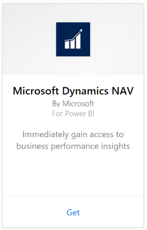

# Connect to Microsoft Dynamics NAV with Power BI
Getting insights into your Microsoft Dynamics NAV data is easy with Power BI. Power BI retrieves your data, both Sales and Financial, then builds an app with a dashboard and reports based on that data. Power BI needs your permissions to the tables where data is retrieved from, in this case sales and finance data. More details on requirements below. After you install the app, you can view the dashboard and reports in the Power BI service ([https://powerbi.com](https://powerbi.com)), and in the Power BI mobile apps. 

[Connect to the Microsoft Dynamics NAV for Power BI](https://app.powerbi.com/getdata/services/microsoft-dynamics-nav) or read more about the [Dynamics NAV integration](https://powerbi.microsoft.com/integrations/microsoft-dynamics-nav) with Power BI.

## How to connect
[!INCLUDE [powerbi-service-apps-get-more-apps](./includes/powerbi-service-apps-get-more-apps.md)]

3. Select **Microsoft Dynamics NAV**, then select **Get**.  
   
4. When prompted, enter your Microsoft Dynamics NAV OData URL. The URL should match the following pattern:
   
    `https://instance.navserver.com:7048/DynamicsNAV90_Instance1/OData/Company('CRONUS%20International%20Ltd.')`
   
   * "instance.navserver.com" with your NAV Server name
   * "DynamicsNAV90\_Instance1" with your NAV Server Instance name
   * "Company('CRONUS%20International%20Ltd.')" with your NAV Company name
     
     An easy way to obtain this URL is in Dynamics NAV to go to Web Services, find the powerbifinance web service and copy the OData URL, but leaving out the “/powerbifinance” from the URL string.  
     
5. Select **Basic** and enter your Microsoft Dynamics NAV credentials.
   
    You need admin credentials (or at least permissions to sales and finance data) for your Microsoft Dynamics NAV account.  Only Basic (Username and Password) authentication is currently supported.
   
    
6. Power BI will retrieve your Microsoft Dynamics NAV data and create a ready-to-use dashboard and report for you.   
   

## View the dashboard and reports
[!INCLUDE [powerbi-service-apps-open-app](./includes/powerbi-service-apps-open-app.md)]

[!INCLUDE [powerbi-service-apps-open-app](./includes/powerbi-service-apps-what-now.md)]

## What's included
The dashboard and reports contain data from the following tables (case sensitive):  

* ItemSalesAndProfit  
* ItemSalesByCustomer  
* powerbifinance  
* SalesDashboard  
* SalesOpportunities  
* SalesOrdersBySalesPerson  
* TopCustomerOverview  

## System requirements
To import your Microsoft Dynamics NAV data into Power BI, you need to have permissions to the sales and finance data tables where data is retrieved from (listed above). The tables are also required to have some data, empty tables will currently fail to import.

## Troubleshooting
Power BI uses Microsoft Dynamics NAV's web services to retrieve your data. If you have a lot of data in your Microsoft Dynamics NAV instance, a suggestion to minimize the impact on your web service usage is to change the refresh frequency depending on your needs. Another suggestion is to have one admin create the app and share it instead of having every admin create their own.

**"Parameter validation failed, please make sure all parameters are valid"**  
If you see this error after typing your Microsoft Dynamics NAV URL. Make sure the following requirements are satisfied:

* The URL follows exactly this pattern:
  
    `https://instance.navserver.com:7048/DynamicsNAV90_Instance1/OData/Company('CRONUS%20International%20Ltd.')`
  
  * "instance.navserver.com" with your NAV Server name
  * "DynamicsNAV90\_Instance1" with your NAV Server Instance name
  * "Company('CRONUS%20International%20Ltd.')" with your NAV Company name
* Make sure all the letters are lower case.  
* Make sure the URL is in 'https'.  
* Make sure there are no trailing forward slash at the end of the URL.

**"Login failed"**  
If you get a "login failed" error after using your Microsoft Dynamics NAV credentials to login, then you may be hitting one of the following issues:

* The account you are using doesn't have permissions to retrieve the Microsoft Dynamics NAV data from your account. Verify it is an admin account and try again.
* The Dynamics NAV instance you're trying to connect to doesn't have a valid SSL certificate. In this case you'll see a more detailed error message ("unable to establish trusted SSL relationship"). Note that self-signed certs are not supported.

**"Oops"**  
If you see an "Oops" error dialog after you pass the authentication dialog box, Power BI is running into an issue while loading the data.

* Verify the URL follows the pattern specified above. A common mistake is to specify:
  
    `https://instance.navserver.com:7048/DynamicsNAV90\_Instance1/OData`
  
    However, you need to include the 'Company('CRONUS%20International%20Ltd.')' section with your NAV Company name:
  
    `https://instance.navserver.com:7048/DynamicsNAV90\_Instance1/OData/Company('CRONUS%20International%20Ltd.')`

## Next steps
* [What are apps in Power BI?](service-create-distribute-apps.md)
* [Get data in Power BI](service-get-data.md)
* More questions? [Try asking the Power BI Community](http://community.powerbi.com/)

