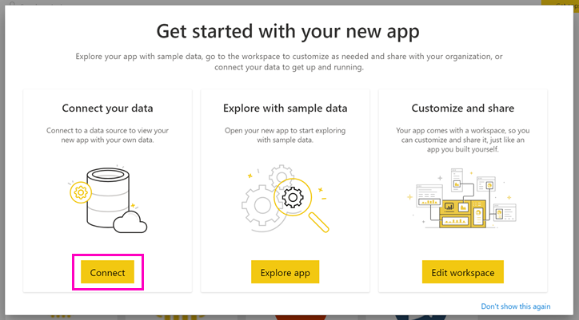
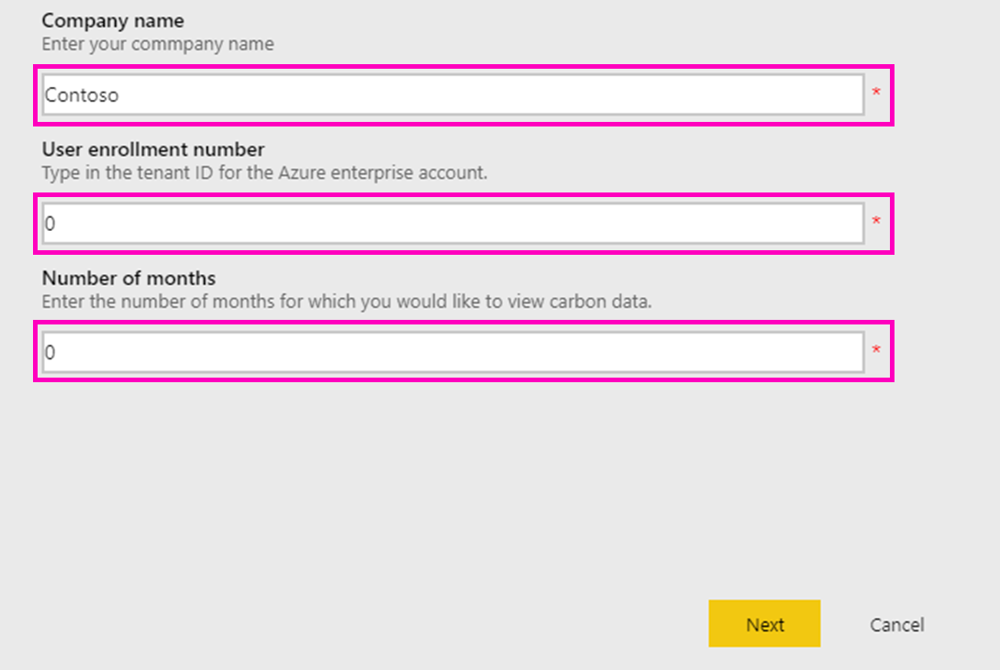
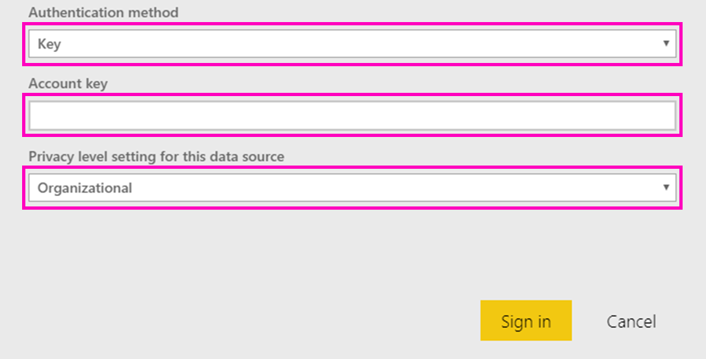

# Connect the Microsoft Sustainability Calculator
Gain insights into the carbon emissions of your IT infrastructure to make more sustainable computing decisions

The Microsoft Sustainability Calculator provides new insight into carbon emissions data associated with Azure services. Those responsible for reporting on and driving sustainability within their organizations now have the ability to quantify the carbon impact of each Azure subscription, as well as see estimated carbon savings from running those workloads in Azure versus on-premises datacenters. This data may be used for greenhouse gas reporting of scope 3 emissions. Access to the Microsoft Sustainability Calculator will require your tenant ID and access key, typically available through your organization’s Azure administrator.

To use this app, you will need information from the Azure Enterprise Portal. Your enterprise’s system administrators may be able to help you obtain this information. Please review these instructions and obtain the required information prior to installing the App. 

This connector version only supports enterprise enrollments from [https://ea.azure.com](https://ea.azure.com/). China enrollments aren't currently supported.

## How to connect
[!INCLUDE [powerbi-service-apps-get-more-apps](./includes/powerbi-service-apps-get-more-apps.md)]

1. Select **Microsoft Sustainability Calculator** \> **Get it now**.
1. In **Install this Power BI App?** select **Install**.
1. In the **Apps** pane, select the **Microsoft Sustainability Calculator** tile.
1. In **Get started with your new app**, select **Connect**.

    

1. Enter the **Company name, User enrollment number,** and **Number of months \> Sign In.** See details on [finding these parameters](#finding-parameters) below.

    

1. For **Authentication method**, select **Key**, and for **Privacy level**, select **Organizational**.
1. For **Key**, enter your **Access key \> Sign In**.

    

1. The import process begins automatically. When complete, a new dashboard, report, and model appear in the **Navigation Pane**. Select the report to view your imported data.

## Finding parameters

To find your company **Enrollment ID** and **Access key**, work with your Azure administrator to get the required information. Your administrator will

1. Log into the [Azure enterprise Portal](https://ea.azure.com), and click on **Manage** on the left-hand ribbon and obtain the **Enrollment Number** as shown below
2. From the [Azure Enterprise Portal](https://ea.azure.com), click on **Reports** and then API Access Key, as shown below to obtain the Primary Enrollment Account Key

## Using the App

To update the parameters at any point, navigate to the **Dataset** settings and access the associated with the app workspace, and update the tenant ID, company name, or months of data. After applying your parameters, click **Refresh** to reload the data with the new parameters applied.