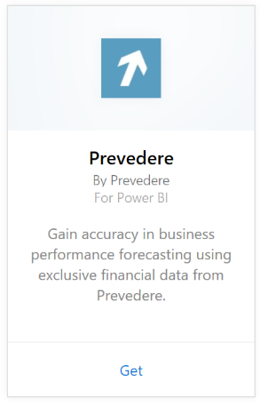
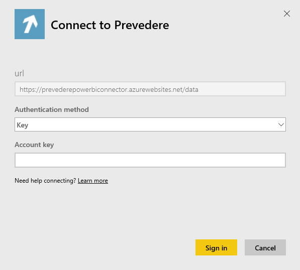
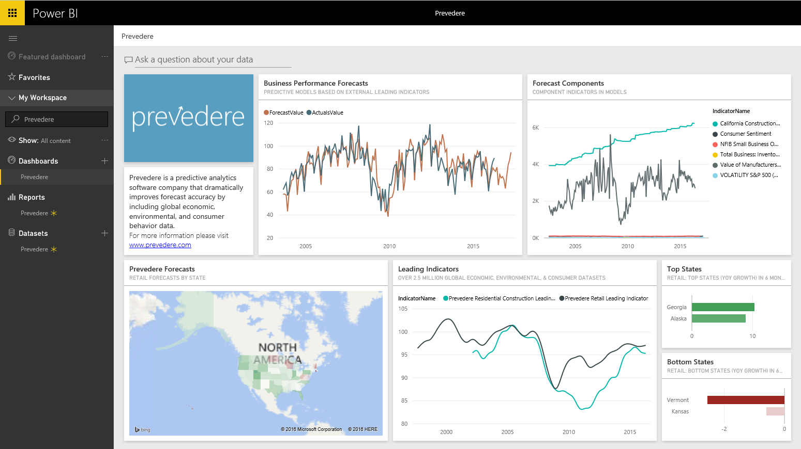

# Connect to Prevedere with Power BI
Gain access to exclusive and critical financial information to confidently and proactively drive your business forward.

Connect to the [Prevedere content pack](https://app.powerbi.com/getdata/services/prevedere) for Power BI.

>[!NOTE]
>If you are not an existing Prevedere user, please use the [sample key](https://prevederepowerbiconnector.azurewebsites.net/static/learnmore.html) to try it out.

## How to connect
1. Select **Get Data** at the bottom of the left navigation pane.
   
   
2. In the **Services** box, select **Get**.
   
   
3. Select **Prevedere** and then **Get**.
   
   
4. For **Authentication Method**, select **Key** and enter your Prevedere API key.
   
    
5. Select **Sign in** to begin the import process. When complete, a new dashboard, report and model will appear in the Navigation Pane. Select the dashboard to view your imported data.
   
     

**What now?**

* Try [asking a question in the Q&A box](consumer/end-user-q-and-a.md) at the top of the dashboard
* [Change the tiles](service-dashboard-edit-tile.md) in the dashboard.
* [Select a tile](consumer/end-user-tiles.md) to open the underlying report.
* While your dataset will be scheduled to refresh daily, you can change the refresh schedule or try refreshing it on demand using **Refresh Now**

## What's included
The content pack gains insights on your retail forecasts, forecast models, leading indicators, and more.

## System requirements
This content pack requires access to a Prevedere API key or the sample key (see below).

## Finding parameters

Existing customers can access their data using their API key. If you are not yet a customer, you can see a sample of the data and analyses using the [sample key](https://prevederepowerbiconnector.azurewebsites.net/static/learnmore.html).

## Troubleshooting
The data may take some time to load depending on the size of your instance.

## Next steps
[Get started in Power BI](service-get-started.md)

[Get data in Power BI](service-get-data.md)

