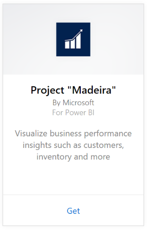
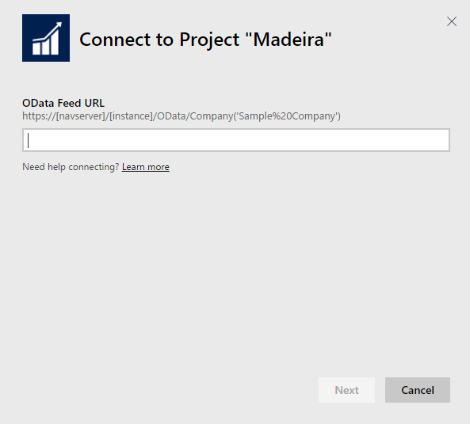
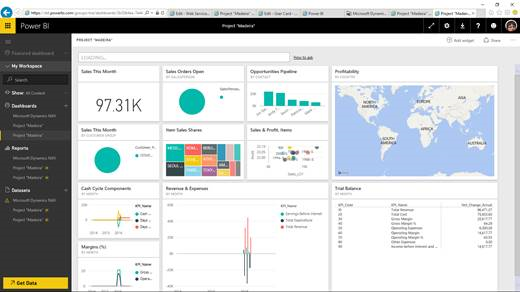
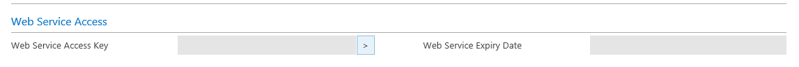
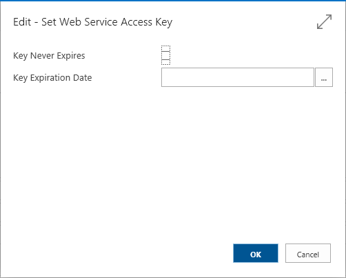
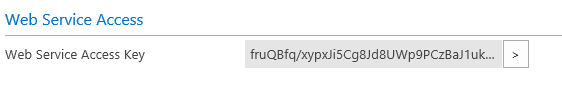

# Connect to Project "Madeira" with Power BI
Getting insights into your Project “Madeira” data is easy with Power BI and the Project “Madeira” content pack. Power BI retrieves your data, both Sales and Financial data then builds an out-of-box dashboard and reports based on that data.
Connect to the Project "Madeira" for Power BI or read more about the Project "Madeira" integration with Power BI.

>[!NOTE]
>This content pack requires permissions to the tables where data is retrieved from, in this case sales and finance data. More details on requirements [below](#Requirements).

Connect to the [Project "Madeira" Analytics content pack](https://app.powerbi.com/getdata/services/project-madeira) for Power BI.

## How to connect
1. Select **Get Data** at the bottom of the left navigation pane.  
    
2. In the **Services** box, select **Get**.  
    
3. Select **Project "Madeira"**, then select **Get**.  
    
4. When prompted, enter your Project “Madeira” URL. The URL needs to follow the following pattern exactly https://mycronusus.projectmadeira.com:7048/NAV/OData/Company('CRONUS%20US') with your Project “Madeira” company name. Note that there is no trailing slash at the end, and the connection is must be https. See details on finding this URL [below](#FindingParams).  
   
    
5. When prompted, select Basic as the Authentication Method, enter your Project “Madeira” email address as the username, and then enter the web service access key for your Project “Madeira” account as the password. If you are already signed in to Project “Madeira” in your browser, you may not be prompted for credentials. See details on generating this access key [below](#FindingParams).  
   
    >[!NOTE]
    >You must be a superuser in Project “Madeira”.
   
   
6. Once connected, a dashboard, report and dataset will automatically be loaded. When completed, the tiles will update with data from your account.  
   
    

**What now?**

* Try [asking a question in the Q&A box](power-bi-q-and-a.md) at the top of the dashboard
* [Change the tiles](service-dashboard-edit-tile.md) in the dashboard.
* [Select a tile](service-dashboard-tiles.md) to open the underlying report.
* While your dataset will be schedule to refreshed daily, you can change the refresh schedule or try refreshing it on demand using **Refresh Now**

## System requirements
To import your Project “Madeira” data into Power BI, you need to have permissions to the sales and finance data tables where data is retrieved from. All the tables (case sensitive) required for the content pack include:  
 
    ´´´ 
    - ItemSalesAndProfit  
    - ItemSalesByCustomer  
    - powerbifinance  
    - SalesDashboard  
    - SalesOpportunities  
    - SalesOrdersBySalesPerson  
    - TopCustomerOverview  
    ´´´ 

## Finding Parameters
**Getting the right URL**
An easy way to obtain this URL is in Project “Madeira” to go to Web Services, find the powerbifinance web service and copy the Odata URL (use right-click and Copy Shortcut), but leaving out the “/powerbifinance…” part from the URL string.

**Web Service Access Keys**
In order to use data from Project "Madeira", you will need to create a web service access key for your user account. In Project “Madeira”, search for the Users page, and then open the card for your user account. Here you can generate a new web services access key and copy it to the Password field in the Power BI connection page.

When you start using Web Service Access Keys you will have to use in going forward, so select OK to the message that pops up.
When Creating the key you can select if it expires at a specific date or not.

When you choose OK, a key is created, so you can copy it copy it to the Password field in the Power BI connection page.

## Troubleshooting
The Power BI dashboard relies on the published web services that are listed above, and it will show data from the demonstration company or your own company if you import data from your current finance solution. However, if something goes wrong, this section provides a workaround for the most typical issues.

**"Parameter validation failed, please make sure all parameters are valid"**

If you see this error after you enter your Project “Madeira” URL, make sure the following requirements are satisfied:  

   - The URL follows exactly this pattern https://*mycronusus*.projectmadeira.com:7048/NAV/OData/Company('*CRONUS%20US*')  
   - Delete any text after the company name in parenthesis  
   - Make sure there are no trailing forward slash at the end of the URL.  
   - Make sure the URL is uses a secure connection as indicated by the URL starting with https.  

**"Login failed"**
If you get a "login failed" error when you log in to the dashboard, using your Project “Madeira” credentials, then this can be caused by one of the following issues:  

    - The account you are using does not have permissions to read the Project “Madeira” data from your account. Verify your user account in Project "Madeira", and make sure that you have used the right web service access key as the password, and then try again.  
    - The Project "Madeira" instance that you are trying to connect to does not have a valid SSL certificate. In this case you'll see a more detailed error message ("unable to establish trusted SSL relationship"). Note that self-signed certs are not supported.  

**"Oops"**
If you see an "Oops" error dialog after you pass the authentication dialog, this is most frequently caused by a problem connecting to the data for the content pack. Verify that the URL follows the pattern that was specified earlier:  
    https://*mycronusus*.projectmadeira.com:7048/NAV/OData/Company('*CRONUS%20US*')

A common mistake is to specify the full URL for a specific web service:  
    https://*mycronusus*.projectmadeira.com:7048/NAV/OData/Company('*CRONUS%20US*')/powerbifinance

Or you might have forgotten to specify the company name:   
    https://*mycronusus*.projectmadeira.com:7048/NAV/OData/

## Next steps
[Get started with Power BI](service-get-started.md)

[Power BI - Basic Concepts](service-basic-concepts.md)

