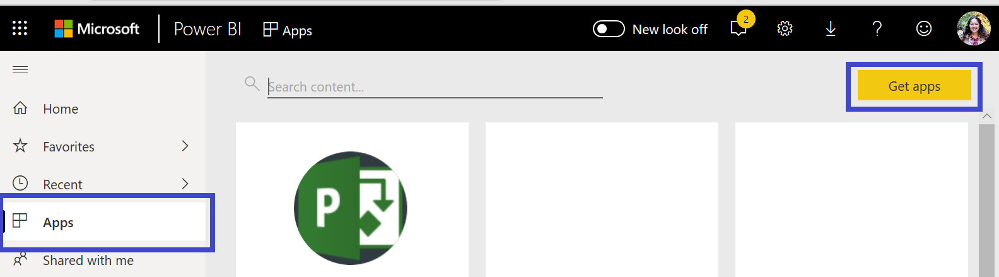
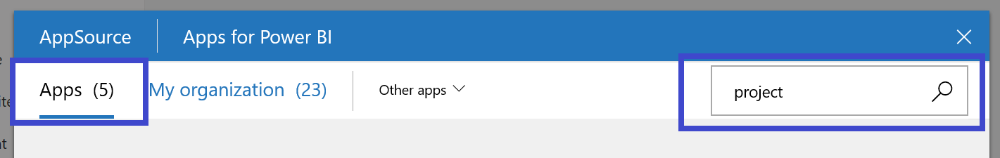
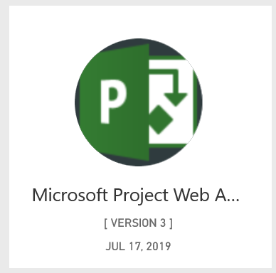
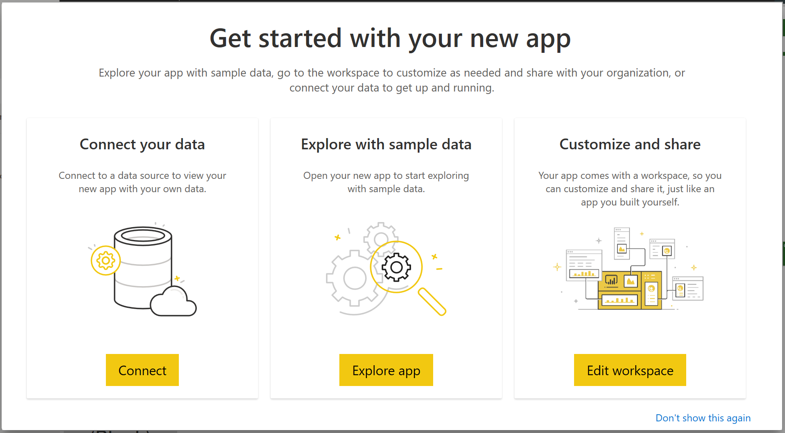

# Connect to Project Web App with Power BI
Microsoft Project Web App is a flexible online solution for project portfolio management (PPM) and everyday work. Project Web App enables organizations to get started, prioritize project portfolio investments and deliver the intended business value. The Project Web App Template App for Power BI allows you to unlock insight from Project Web App to help manage projects, portfolios and resources.

Connect to the [Project Web App Template App](https://appsource.microsoft.com/product/power-bi/pbi_msprojectonline.pbi-microsoftprojectwebapp) for Power BI.

## How to connect
1. Select **Apps** in the left navigation pane > select **Get apps* in the upper right corner.
   
    
2. In the **Services** box, select **Get**.
   
   
3. In AppSource, select the **Apps** tab, and search/select **Microsoft Project Web App**.
   
4. In **Install this Power BI App?** select **Install**. 

   
5. In the **Apps** pane, select the **Microsoft Project Web App** tile. 
   
    
6. In **Get started wtih your new app**, select **Connect data**.
   
   
7. In the **Project Web App URL** text box, enter the URL for the Project Web Add (PWA) you want to connect to.  Note this may differ from the example if you have a custom domain. In the **PWA Site Language** text box, type the number that corresponds to your PWA site language. Type the single digit '1' for English, '2' for French, '3' for German, '4' for Portuguese (Brazil), '5' for Portuguese (Portugal) and '6' for Spanish. 
   
    
8. For Authentication Method, select **oAuth2** \> **Sign In**. When prompted, enter your Project Web App credentials and follow the authentication process.
   
    
    
Note that you need to have Portfolio Viewer, Portfolio Manager or Administrator permissions for the Project Web App you are connecting to.

9. You’ll see a notification indicating your data is loading. Depending on the size of your account this may take some time. After Power BI imports the data, you will see the contents of your new workspace. You may need to refresh the dataset to get the latest updates. 

After Power BI imports the data you will see the report with 13 pages and dataset in the left navigation pane. 

7. Once your reports are ready, go ahead and start exploring your Project Web App data! The Template App comes with 13 rich and detailed reports for the Portfolio Overview (6 report pages), Resource Overview (5 report pages) and Project Status (2 report pages). 

   
   
   
   
   

**What now?**

* [Change the tiles](service-dashboard-edit-tile.md) in the dashboard.
* [Select a tile](service-dashboard-tiles.md) to open the underlying report.
* While your dataset will be schedule to refreshed daily, you can change the refresh schedule or try refreshing it on demand using **Refresh Now**

**Expand the Template App**

Download the [GitHub PBIT file](https://github.com/OfficeDev/Project-Power-BI-Content-Packs) to further customize and update the Content Pack

## Next steps
[Get started in Power BI](service-get-started.md)

[Get data in Power BI](service-get-data.md)

