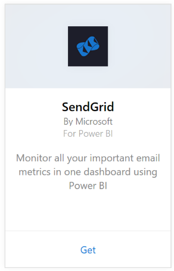
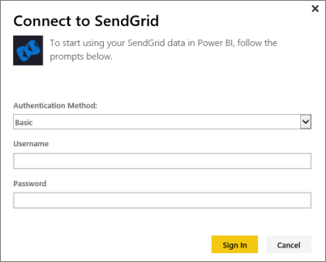
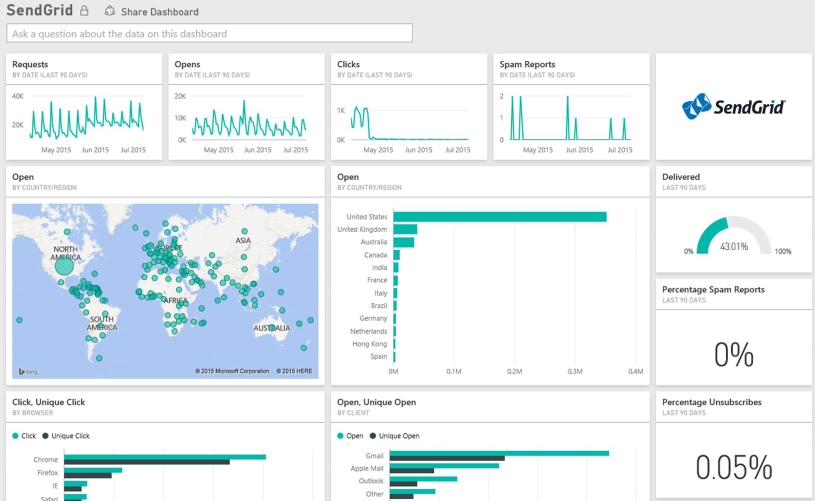

# Connect to SendGrid with Power BI
The Power BI content pack for SendGrid allows you to extract insights and statistics from your SendGrid account. Using the SendGrid content pack you can visualize your SendGrid statistics in a dashboard.

Connect to the [SendGrid content pack](https://app.powerbi.com/getdata/services/sendgrid) for Power BI.

## How to connect
1. Select **Get Data** at the bottom of the left navigation pane.
   
    
2. In the **Services** box, select **Get**.
   
    
3. Select the **SendGrid** content pack and click **Get**.
   
    
4. When prompted, provide your SendGrid user name and password. Select **Sign In**.
   
   
5. After Power BI imports the data, you see a new dashboard, report, and dataset in the left navigation pane, populated with your email statistics for the past 90 days. New items are marked with a yellow asterisk \*.
   
   

**What now?**

* Try [asking a question in the Q&A box](consumer/end-user-q-and-a.md) at the top of the dashboard
* [Change the tiles](service-dashboard-edit-tile.md) in the dashboard.
* [Select a tile](consumer/end-user-tiles.md) to open the underlying report.
* While your dataset will be scheduled to refresh daily, you can change the refresh schedule or try refreshing it on demand using **Refresh Now**

## What's included
The following metrics are available in the SendGrid dashboard:

* Overall email statistics - Requests, Delivered, Bounced, Spam Blocked, Spam Report, etc.
* Email statistics by category
* Email statistics by geography
* Email statistics by ISP
* Email statistics by device, client, browser

## Next steps
[What is Power BI?](power-bi-overview.md)

[Get Data](service-get-data.md)

