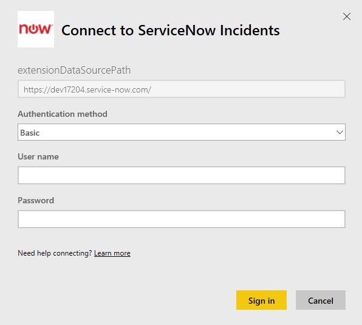
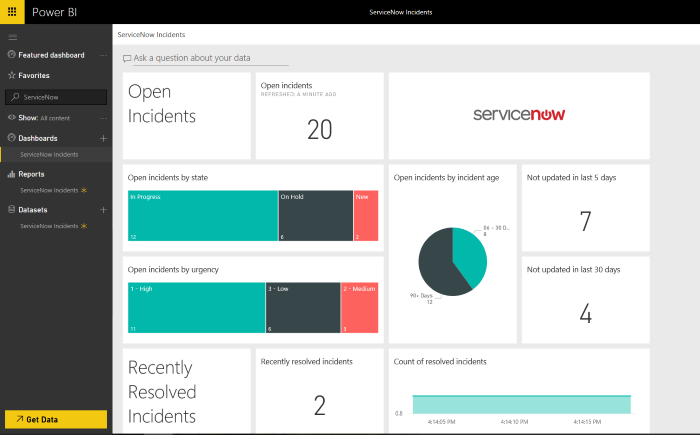

# Connect to ServiceNow with Power BI for incident reporting
ServiceNow offers multiple products and solutions including business, operations and IT management to improve your business. This content pack includes multiple reports and insights on your open, recently resolved and recently closed incidents.  

Connect to the Power BI content pack for [ServiceNow Incidents](https://app.powerbi.com/getdata/services/servicenow).

## How to connect
1. Select **Get Data** at the bottom of the left navigation pane.
   
    
2. In the **Services** box, select **Get**.
   
    
3. Select **ServiceNow Incidents** \> **Get**.
   
   
4. Provide the URL of your ServiceNow instance and the range of days/records to bring in. Note as soon as one limit is hit the import will stop.
   
   
5. When prompted, enter your ServiceNow **Basic** credentials. Note single sign on is not supported today, more details on the system requirements below.
   
   
6. Once the login flow is completed the import process will begin. When complete, a new dashboard, report and model will appear in the Navigation Pane. Select the dashboard to view your imported data.
   
    

**What now?**

* Try [asking a question in the Q&A box](consumer/end-user-q-and-a.md) at the top of the dashboard
* [Change the tiles](service-dashboard-edit-tile.md) in the dashboard.
* [Select a tile](consumer/end-user-tiles.md) to open the underlying report.
* While your dataset will be scheduled to refresh daily, you can change the refresh schedule or try refreshing it on demand using **Refresh Now**

## System requirements
To connect you will need:  

* An account that can access yourorganization.service-now.com with Basic authentication (Single Sign-On is not supported in this version)  
* The account must have rest_service role and read access to incident table  

## Troubleshooting
If you're hitting a credential error during load, please review the access requirements above. If you have the correct permissions and are still hitting issues, please work with your ServiceNow admin to ensure you have any additional permissions that may be required for your custom instance.

If you're seeing long load times, please review the number of incidents and number of days you specified during connection and consider reducing it.

## Next steps
[What is Power BI?](power-bi-overview.md)

[Power BI - Basic Concepts](consumer/end-user-basic-concepts.md)

