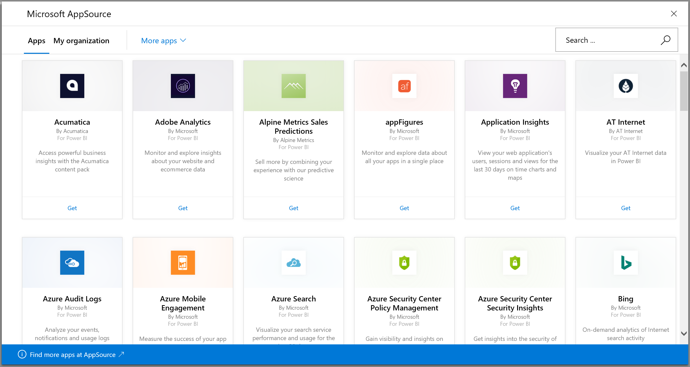
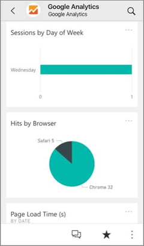
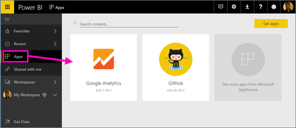
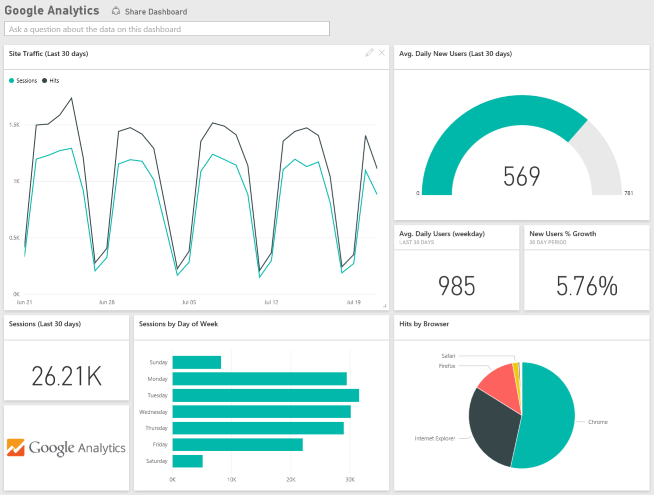
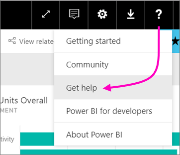

# Connect to the services you use with Power BI
You can connect to a number of services you use to run your business, such as Salesforce, Microsoft Dynamics, and Google Analytics. Power BI starts by using your credentials to connect to the service, and then creates a Power BI app with a dashboard and a set of Power BI reports that automatically show your data and provide visual insights about your business. 

Log in to Power BI to view all of the [services you can connect to](https://app.powerbi.com/getdata/services). The Power BI team adds new services regularly.

After you install the app, you can view the dashboard and reports in the Power BI service ([https://powerbi.com](https://powerbi.com)), and in the Power BI mobile apps. 

## Get started
[!INCLUDE [powerbi-service-apps-get-more-apps](./includes/powerbi-service-apps-get-more-apps.md)]

## View the dashboard and reports
When the import is complete, the new app appears on the Apps page.

1. Select **Apps** in the left navigation pane > select the app.
   
     
2. You can ask a question by typing in the Q&A box, or click a tile to open the underlying report. 
   
    
   
    You can filter and highlight the data in the report, but you can't save your changes.

## What's included
After connecting to a service, you see a newly created app with a dashboard, reports, and dataset. The data from the service is focused on a specific scenario and may not include all the information from the service. The data is scheduled to refresh automatically once per day. You can control the schedule by selecting the dataset.

You can also use [Power BI Desktop](desktop-get-the-desktop.md) to connect to some services, such as Google Analytics, and create your own customized dashboards and reports.  

For more details on connecting to specific services, please refer to the individual help pages.

## Troubleshooting
**Empty tiles**  
While Power BI is first connecting to the service, you may see an empty set of tiles on your dashboard. If you still see an empty dashboard after 2 hours, it's likely the connection failed. If you didn't see an error message with information on correcting the issue, please file a support ticket.

* Select the question mark icon (**?**) in the upper-right corner >  **Get help**.
  
    

**Missing information**  
The dashboard and reports include content from the service focused on a specific scenario and do not include all the information from the service. If there's a specific metric that you're not seeing in the content pack, please add an idea on the [Power BI Support](https://support.powerbi.com/forums/265200-power-bi) page.

## Suggesting services
Do you use a service you'd like to suggest for a Power BI app? Go to the [Power BI Support](https://support.powerbi.com/forums/265200-power-bi) page and let us know.

Do you have a service you'd like to build an app for? [Submit your nomination](https://azure.microsoft.com/marketplace/programs/certified/apply/) and select "Publish a Power BI Content Pack" to get started.

## Next steps
* [What are apps in Power BI?](service-install-use-apps.md)
* [Get data in Power BI](service-get-data.md)
* More questions? [Try asking the Power BI Community](http://community.powerbi.com/)

