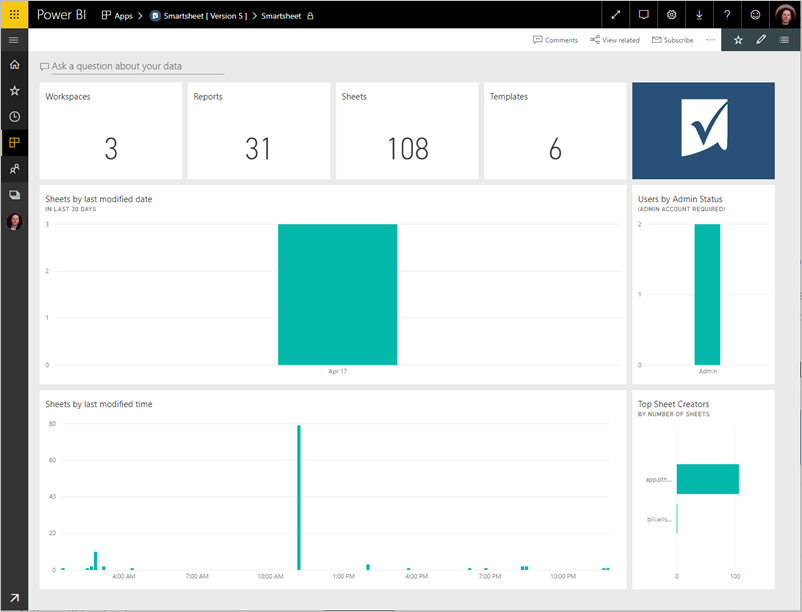

# Connect to Smartsheet with Power BI
This article walks you through pulling your data from your Smartsheet account with a Power BI template app. The template app generates a workspace with a dashboard, a set of reports, and a dataset to allow you to explore your Smartsheet data. 

Smartsheet offers an easy platform for collaboration and file sharing. The Smartsheet template app for Power BI provides a dashboard, reports and dataset that shows an overview of your Smartsheet account. You can also use [Power BI Desktop](desktop-connect-to-data.md) to connect directly to individual sheets in your account. 

Connect to the [Smartsheet template app](https://app.powerbi.com/groups/me/getdata/services/smartsheet) for Power BI.

>[!NOTE]
>Smartsheet admin account is preferred to connect and load the Power BI template app as it has additional access.

## How to connect

[!INCLUDE [powerbi-service-apps-get-more-apps](./includes/powerbi-service-apps-get-more-apps.md)]

3. Select **Smartsheet** \> **Get it now**.
4. In **Install this Power BI App?** select **Install**.
4. In the **Apps** pane, select the **Smartsheet** tile.

    

6. In **Get started with your new app**, select **Connect data**.

    

4. For Authentication Method, select **oAuth2 \> Sign In**.
   
   When prompted, enter your Smartsheet credentials and follow the authentication process.
   
   
   
   

5. After Power BI imports the data, the Smartsheet dashboard opens.
   
   

1. To view the contents of your new Smartsheet workspace, in the left navigation bar, select **Workspaces** >  the arrow next to the workspace name in the . You see the workspace contains a dashboard and a report.

    

8. Select the new [GitHub dashboard](https://powerbi.microsoft.com/integrations/github). 
   
    

## Modify and distribute your app

Because you've installed a template app, you can change the report and dashboard, and then distribute it as an *app* to colleagues in your organization. 

Read about [distributing apps](service-create-distribute-apps.md) to your colleagues.

## What's included
The Smartsheet template app for Power BI includes an overview of your Smartsheet account, such as the number of workspaces, reports and sheets you have, when they're modified etc. Admin users will also see some information around the users in their system, such as top sheet creators.  

To connect directly to individual sheets in your account, you can use the Smartsheet connector in the [Power BI Desktop](desktop-connect-to-data.md).  

## Next steps:

[What is Power BI?](power-bi-overview.md)

[Get Data for Power BI](service-get-data.md)