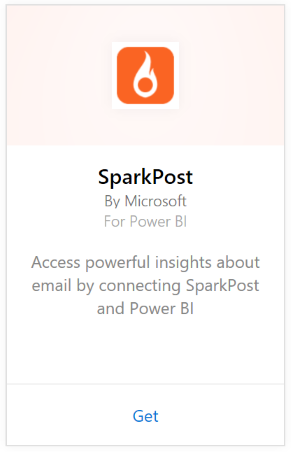

# Connect to SparkPost with Power BI
The Power BI content pack for SparkPost allows you to extract valuable datasets from your SparkPost account all into one insightful dashboard. Using the SparkPost content pack you can visualize your overall email statistics, including domains, campaigns, and engagement by ISP.

Connect to the [SparkPost content pack for Power BI](https://app.powerbi.com/getdata/services/spark-post).

## How to connect
1. Select **Get Data** at the bottom of the left navigation pane.
   
   
2. In the **Services** box, select **Get**.
   
   
3. Select the **SparkPost** content pack and click **Get**. 
   
   
4. When prompted, provide your SparkPost API key and select Sign In. See details on [finding this parameters](#FindingParams) below.
   
   
5. Your data will start to load, depending on the size of you account this may take some time. After Power BI imports the data, you’ll see the default dashboard, report, and dataset in the left navigation pane, populated with your email statistics for the past 90 days. New items are marked with a yellow asterisk \*.
   
   

**What now?**

* Try [asking a question in the Q&A box](consumer/end-user-q-and-a.md) at the top of the dashboard
* [Change the tiles](service-dashboard-edit-tile.md) in the dashboard.
* [Select a tile](consumer/end-user-tiles.md) to open the underlying report.
* While your dataset will be scheduled to refresh daily, you can change the refresh schedule or try refreshing it on demand using **Refresh Now**

## What's included
The SparkPost content pack for Power BI includes information including unique clicks, accepted rates, bounce rates, delayed rates, rejection rates and more.

## Finding parameters
The content pack uses an API key to connect your SparkPost account to Power BI. You can find your API key in your account under Account \> API & SMTP (more details [here](https://support.sparkpost.com/customer/portal/articles/1933377-create-api-keys)). We suggest using an API key with permissions for `Message Events: Read-only `and `Metrics: Read-only`

