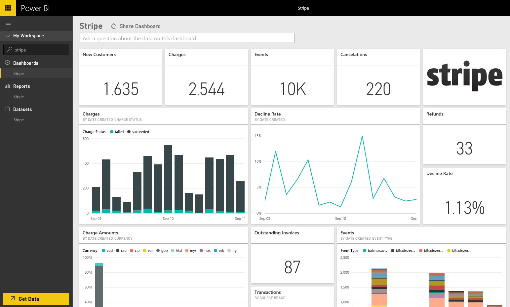

# Connect to Stripe with Power BI
Visual and explore your Stripe data in Power BI with the Power BI content pack. The Power BI Stripe content pack pulls in data about your Customers, Charges, Events and Invoices. The data includes the most recent ten thousand events and five thousand charges over the last 30 days. The content will be refreshed automatically once per day at a schedule you control. 

Connect to the [Stripe content pack for Power BI](https://app.powerbi.com/getdata/services/stripe).

## How to connect
1. Select Get Data at the bottom of the left navigation pane.  
   
    
2. In the **Services** box, select **Get**.  
   
      
3. Select **Stripe** &gt; **Get**.  
   
      
4. Provide your Stripe [API key](https://dashboard.stripe.com/account/apikeys) to connect.  
   
    
5. The import process will begin automatically. When complete, a new dashboard, report and model will appear in the Navigation Pane, marked with an asterisk. Select the dashboard to view your imported data.
   
    

**What now?**

* Try [asking a question in the Q&A box](consumer/end-user-q-and-a.md) at the top of the dashboard
* [Change the tiles](service-dashboard-edit-tile.md) in the dashboard.
* [Select a tile](consumer/end-user-tiles.md) to open the underlying report.
* While your dataset will be scheduled to refresh daily, you can change the refresh schedule or try refreshing it on demand using **Refresh Now**

## Next steps
[What is Power BI?](power-bi-overview.md)

[Get Data for Power BI](service-get-data.md)

