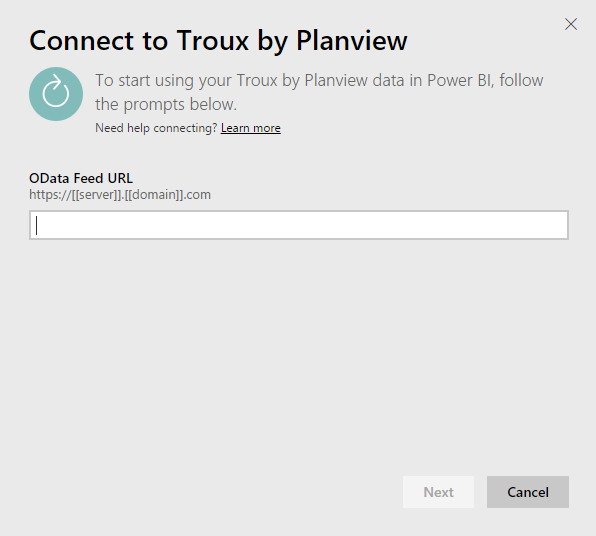

# Connect to Troux for Power BI
With the Troux content pack, you can visualize your Enterprise Architecture repository in entirely new ways directly in Power BI. The content pack offers a set of insights on your business capabilities, the applications that deliver those capabilities, and the technologies that support those applications that can be fully customized using Power BI.

Connect to the [Troux content pack](https://app.powerbi.com/getdata/services/troux) for Power BI.

## How to connect
1. Select **Get Data** at the bottom of the left navigation pane.
   
   
2. In the **Services** box, select **Get**.
   
   
3. Select **Troux** \>  **Get**.
   
   
4. Specify your Troux OData URL. See details on [finding those parameters](#FindingParams) below.
   
   
5. For **Authentication Method**, select **Basic** and provide your username and password (case sensitive), then select **Sign In**.
   
    
6. After approving, the import process will begin automatically. When complete, a new dashboard, report and model will appear in the Navigation Pane. Select the dashboard to view your imported data.
   
     

**What now?**

* Try [asking a question in the Q&A box](consumer/end-user-q-and-a.md) at the top of the dashboard
* [Change the tiles](service-dashboard-edit-tile.md) in the dashboard.
* [Select a tile](consumer/end-user-tiles.md) to open the underlying report.
* While your dataset will be scheduled to refresh daily, you can change the refresh schedule or try refreshing it on demand using **Refresh Now**

## System requirements
Access to the Troux OData feed and Troux 9.5.1 or higher is required.

## Finding parameters
Your Customer Care team can provide your unique Troux OData feed URL to you

## Troubleshooting
If you are seeing a timeout error after providing credentials, try connecting again.

## Next steps
[Get started in Power BI](service-get-started.md)

[Get data in Power BI](service-get-data.md)

