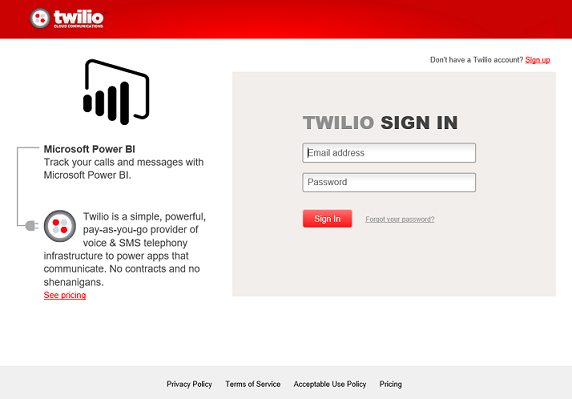

# Connect to Twilio with Power BI
The Microsoft Twilio content pack for Power BI allows you to pull your data into Power BI and creates an out of box [Twilio dashboard](https://powerbi.microsoft.com/integrations/twilio) and report that shows insights on your data. You can also create your custom reports and dashboard on the dataset Power BI creates. The data will be refreshed once a day so you are always looking at the latest data.

Connect to the [Twilio content pack](https://app.powerbi.com/getdata/services/twilio) for Power BI.

## How to connect
1. Select **Get Data** at the bottom of the left navigation pane.
   
    
2. In the **Services** box, select **Get**.
   
    
3. Select **Twilio** \> **Get**.
   
   
4. For **Authentication Method**, select **oAuth2** \> Sign In. When prompted provide your Twilio credentials and authorize the Power BI application to access your data.
   
   
5. This will begin importing data from your Twilio account, and you will have your dashboard populated with your calls and messages usage for the past 30 days. 
   
   

**What now?**

* Try [asking a question in the Q&A box](consumer/end-user-q-and-a.md) at the top of the dashboard
* [Change the tiles](service-dashboard-edit-tile.md) in the dashboard.
* [Select a tile](consumer/end-user-tiles.md) to open the underlying report.
* While your dataset will be scheduled to refresh daily, you can change the refresh schedule or try refreshing it on demand using **Refresh Now**

## What's included
The details for all calls and messages transactions for the last 30 days. You can do all sorts of analysis and aggregation on this data.

A set of already aggregated stats that you may want to keep an eye on. This set includes:

        All Time Calls Count  
        All Time Calls Duration  
        All Time Calls Price  
        All Time Messages Price  
        All Time Messages Count  
        All Time Count of Phone Numbers  
        All Time Price of Phone Numbers  
        All Time Twilio Client Calls Price  
        All Time Twilio Client Calls Duration  
        All Time Twilio Client Calls Count  
        All Time Total Price  
        All Time Inbound Calls Price  
        All Time Inbound Calls Duration  
        All Time Inbound Calls Count  
        All Time Outbound Calls Price  
        All Time Outbound Calls Duration  
        All Time Outbound Calls Count  
        This Month Calls Price  
        This Month Calls Duration  
        This Month Calls Count  
        This Month Messages Count  
        This Month Messages Price  
        This Month Count of Phone Numbers  
        This Month Price of Phone Numbers  
        This Month Twilio Client Calls Price  
        This Month Twilio Client Calls Duration  
        This Month Twilio Client Calls Count  
        This Month Total Price  
        This Month Inbound Calls Price  
        This Month Inbound Calls Duration  
        This Month Inbound Calls Count  
        This Month Outbound Calls Price  
        This Month Outbound Calls Duration  
        This Month Outbound Calls Count  
        This Month Inbound Messages Price  
        This Month Inbound Messages Count  
        This Month Outbound Messages Price  
        This Month Outbound Messages Count

## Troubleshooting
If you have a very large amount of data in the past 30 days (hundreds of thousands of transactions), the data retrieval step might fail. We are aware of the problem and working on solving it. Meanwhile, if you hit this issue please use the support link at the top of your Power BI page to let us know and we'll contact you for further investigations.

## Next steps
[Get started in Power BI](service-get-started.md)

[Get data in Power BI](service-get-data.md)

