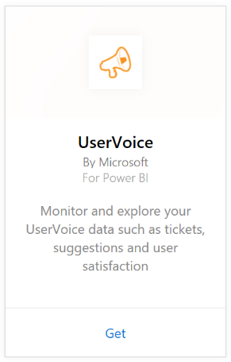

# Connect to UserVoice with Power BI
Tracking and exploring your UserVoice data is easy with Power BI and the UserVoice content pack. Power BI retrieves your data, including tickets, suggestions and satisfaction ratings, then builds an out-of-box dashboard and reports based on that data.

Connect to the [UserVoice content pack](https://app.powerbi.com/getdata/services/uservoice) for Power BI.

>[!NOTE]
>An admin account is required to connect to the Power BI content pack. The content pack also leverages the UserVoice API and will contribute usage towards the UserVoice limits. More details below.

## How to connect
1. Select **Get Data** at the bottom of the left navigation pane.
   
   
2. In the **Services** box, select **Get**.
   
    
3. Select **UserVoice**, then select **Get**.
   
   
4. When prompted, enter your UserVoice URL. The URL needs to follow the following pattern exactly `https://fabrikam.uservoice.com` replacing "fabrikam" with your product or service name.
   
   >[!NOTE]
   >There is no trailing slash at the end and the connection is in http**s**.
   
   
5. When prompted, enter your UserVoice credentials and follow the UserVoice authentication process. If you are already signed in to UserVoice in your browser, you may not be prompted for credentials. Grant the Power BI application access to your data by clicking "Allow Access".
   
   >[!NOTE]
   >You need admin credentials for your UserVoice account.
   
   
6. Power BI will retrieve your UserVoice data and create a ready-to-use dashboard and report for you. Power BI will retrieve the following data: all your suggestions, all your open tickets, all tickets created in the last 30 days including closed ones and all the user satisfaction ratings.
   
   

**What now?**

* Try [asking a question in the Q&A box](consumer/end-user-q-and-a.md) at the top of the dashboard
* [Change the tiles](service-dashboard-edit-tile.md) in the dashboard.
* [Select a tile](consumer/end-user-tiles.md) to open the underlying report.
* While your dataset will be scheduled to refresh daily, you can change the refresh schedule or try refreshing it on demand using **Refresh Now**

## Troubleshooting
**"Parameter validation failed, please make sure all parameters are valid"**

If you see this error after typing your UserVoice URL. Make sure the following requirements are satisfied:

* The URL follows exactly this pattern `https://fabrikam.uservoice.com` replacing "fabrikam" with your correct UserVoice URL prefix.
* Make sure all the letters are lower case.
* Make sure the URL is in 'http**s**'.
* Make sure there are no trailing forward slash at the end of the URL.

**"Login failed"**

If you get a "login failed" error after using your UserVoice credentials to login, then the account you are using doesn't have permissions to retrieve the UserVoice data from your account. Verify it is an admin account and try again.

"**Oops something went wrong**"

If you get this error message while the data is being loaded, make sure your UserVoice account hasn't exceeded its monthly APIs usage quota. If all looks good, try connecting again. If the problem persists, please contact Power BI support at [https://community.powerbi.com](https://community.powerbi.com/).

**Other**  

The Power BI UserVoice content pack uses UserVoice's APIs to retrieve your data. Make sure you monitor your API usage so that you don't exceed your limit. If you have a lot of data in your UserVoice account, a suggestion to minimize the impact on your API usage is to change the refresh frequency from the current default which is once a day to only refresh on weekdays or every other day depending on your needs. Another suggestion is to have one admin create the content pack and share it with the rest of the team instead of having every admin in your organization create their own putting extra unnecessary load on the APIs

## Next steps
[Get started in Power BI](service-get-started.md)

[Get data in Power BI](service-get-data.md)

