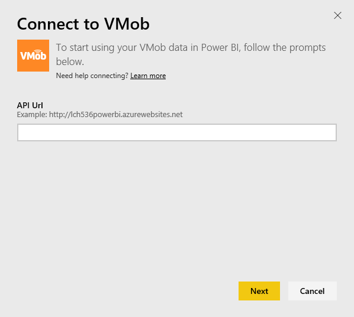
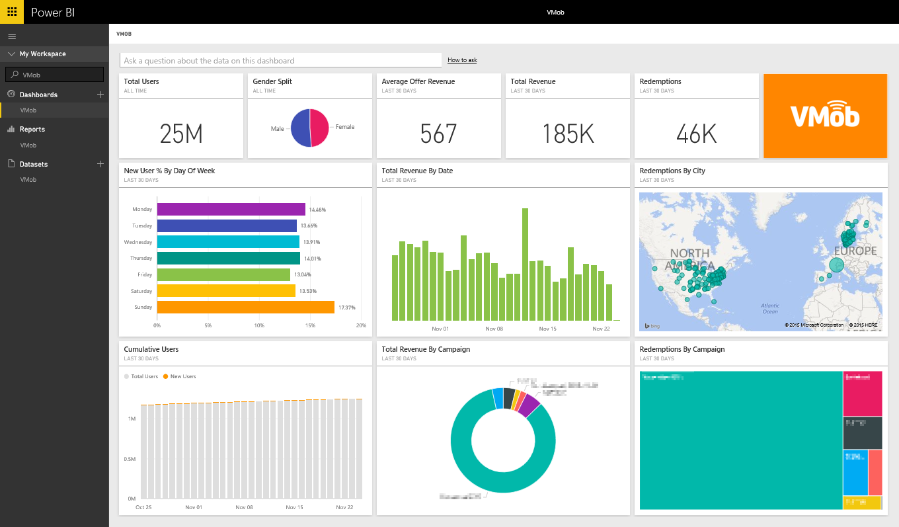

# Connect to VMob with Power BI
Tracking and exploring your VMob data is easy with Power BI and the VMob content pack. Power BI will retrieve the following data: User Statistics for all time and in the last 30 days, Retail KPI for the last 30 days and Campaign Performance for the last 30 days.

Connect to the [VMob content pack](https://app.powerbi.com/getdata/services/vmob) for Power BI.

## How to connect
1. Select **Get Data** at the bottom of the left navigation pane.
   
    
2. In the **Services** box, select **Get**.
   
   
3. Select **VMob** \> **Get**.
   
   
4. When prompted, enter your VMob URL and click on the Next button. This URL is provided by VMob separately.
   
    
5. Choose **Basic** option in the Authentication method dropdown, enter your VMob username and password and click on **Sign In** button.
   
    
6. The import process will begin automatically and Power BI will retrieve your VMob data to create a ready-to-use dashboard and report for you.
   
   

**What now?**

* Try [asking a question in the Q&A box](consumer/end-user-q-and-a.md) at the top of the dashboard
* [Change the tiles](service-dashboard-edit-tile.md) in the dashboard.
* [Select a tile](consumer/end-user-tiles.md) to open the underlying report.
* While your dataset will be scheduled to refresh daily, you can change the refresh schedule or try refreshing it on demand using **Refresh Now**

## Next steps
[Get started in Power BI](service-get-started.md)

[Get data in Power BI](service-get-data.md)

