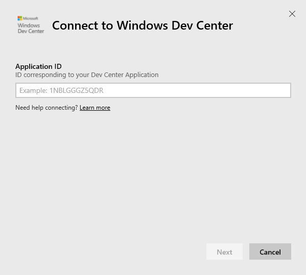
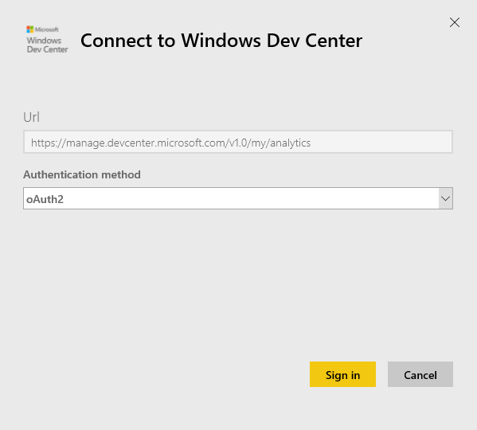
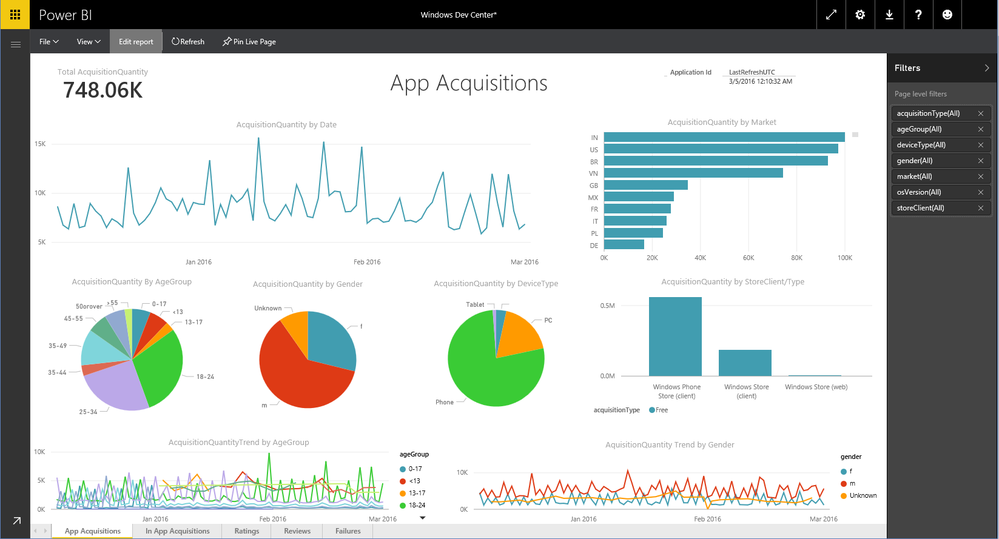

# Connect to Windows Dev Center with Power BI
Explore and monitor your Windows Dev Center app analytics data in Power BI with the Power BI content pack. The data will be refreshed automatically once per day.

Connect to the [Windows Dev Center content pack](https://app.powerbi.com/getdata/services/devcenter) for Power BI.

## How to connect
1. Select **Get Data** at the bottom of the left navigation pane.
   
   
2. In the **Services** box, select **Get**.
   
   
3. Select **Windows Dev Center** \>  **Get**.
   
   
4. Enter the application ID of an app you own and click Next. See details on [finding those parameters](#FindingParams) below.
   
   
5. For **Authentication Method**, select **oAuth2** \> **Sign In**. When prompted, enter your Azure Active Directory credentials associated with your Windows Dev Center account (more details in [System Requirements](#Requirements)).
   
    
   
    
6. After approving, the import process will begin automatically. When complete, a new dashboard, report and model will appear in the Navigation Pane. Select the dashboard to view your imported data and choose a tile to navigate to the underlying reports.
   
    
   
    

**What now?**

* Try [asking a question in the Q&A box](consumer/end-user-q-and-a.md) at the top of the dashboard
* [Change the tiles](service-dashboard-edit-tile.md) in the dashboard.
* [Select a tile](consumer/end-user-tiles.md) to open the underlying report.
* While your dataset will be scheduled to refresh daily, you can change the refresh schedule or try refreshing it on demand using **Refresh Now**

## What's included
The Dev Center Power BI content pack includes analytics data for your app and IAP acquisitions, ratings, reviews and app health. Data is limited to the last 3 months. and is a moving window, so the dates included will update as the dataset refreshes.

## System requirements
This content pack requires at least one at least one app published to the Windows Store and a Windows Dev Center account (more details [here](https://msdn.microsoft.com/windows/uwp/publish/manage-account-users)).

## Finding parameters
You can find the application ID for an app by going to the App identity page under App management.

The application ID is on the end of your URL for Windows 10 Store, https://www.microsoft.com/store/apps/ **{applicationId}**

## Next steps
[Get started in Power BI](service-get-started.md)

[Get data in Power BI](service-get-data.md)

