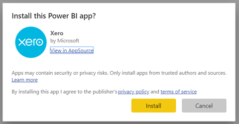
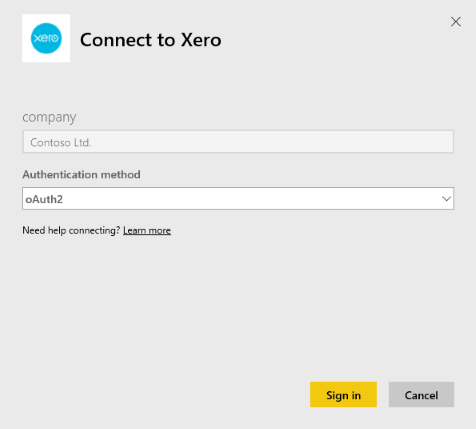

# Connect to Xero with Power BI
Xero is easy to use online accounting software that’s designed specifically for small businesses. Create compelling visualizations based on your Xero financials with this Power BI template app. Your default dashboard includes many small business metrics like cash position, revenue vs. expenses, profit loss trend, debtor days, and return on investment.

Connect to the [Xero template app](https://app.powerbi.com/getdata/services/xero) for Power BI or learn more about the [Xero and Power BI](https://help.xero.com/Power-BI) integration.

## How to connect

[!INCLUDE [powerbi-service-apps-get-more-apps](./includes/powerbi-service-apps-get-more-apps.md)]

3. Select **Xero** \> **Get it now**.
4. In **Install this Power BI app?** select **Install**.

    

4. In the **Apps** pane, select the **Xero** tile.

   

6. In **Get started with your new app**, select **Connect**.

    

4. Enter a nickname for the organization associated with your Xero account. Anything will do, it's mostly to help users with multiple Xero organizations keep them all straight. See details on [finding parameters](#FindingParams) later in this article.

    

5. For **Authentication Method**, select **OAuth**. When prompted sign into your Xero account and select the organization to connect to. Once sign-in is complete, select **Sign In** to start the loading process.
   
    
   
    
6. After approving, the import process will begin automatically. When complete, a new dashboard, report, and model will appear in the Navigation Pane. Select the dashboard to view your imported data.
   
     

**What now?**

* Try [asking a question in the Q&A box](consumer/end-user-q-and-a.md) at the top of the dashboard
* [Change the tiles](service-dashboard-edit-tile.md) in the dashboard.
* [Select a tile](consumer/end-user-tiles.md) to open the underlying report.
* While your dataset will be scheduled to refresh daily, you can change the refresh schedule or try refreshing it on demand using **Refresh Now**

## What's included
The template app dashboard includes tiles and metrics that cover a variety of areas, with corresponding reports to learn more:  

| Area | Dashboard Tiles | Report |
| --- | --- | --- |
| Cash |Daily cash flow  Cash in  Cash out  Closing balance by account  Closing balance today |Bank Accounts |
| Customer |Invoiced sales  Invoiced sales by customer  Invoiced sales growth trend  Invoices due  Outstanding receivables  Overdue receivables |Customer  Inventory |
| Supplier |Billed purchases  Billed purchases by supplier  Billed purchases growth trend   Bills due  Outstanding payables  Overdue payables |Suppliers  Inventory |
| Inventory |Monthly sales amount by product |Inventory |
| Profit and loss |Monthly profit and loss  Net profit this fiscal year  Net profit this month  Top expense accounts |Profit and Loss |
| Balance sheet |Total assets  Total liabilities  Equity |Balance Sheet |
| Health |Current ratio  Gross profit percentage   Return on total assets  Total liabilities to equity ratio |Health  Glossary and Technical Notes |

The dataset also includes the following tables to customize your reports and dashboards:  

* Addresses  
* Alerts  
* Bank Statement Daily Balance  
* Bank Statements  
* Contacts  
* Expense Claims  
* Invoice Line Items  
* Invoices  
* Items  
* Month End  
* Organization  
* Trial Balance  
* Xero Accounts

## System requirements
The following roles are required to access the Xero template app: "Standard + Reports" or "Advisor".

## Finding parameters
Provide a name for your organization to track in Power BI. A specific name allows you to connect to multiple different organizations. You can't connect to the same organization multiple times, as it will affect the scheduled refresh.   

## Troubleshooting
* Xero users must have the following roles to access the Xero template app for Power BI: "Standard + Reports" or "Advisor". The template app relies on the user-based permissions to access reporting data through Power BI.  
* If you receive a failure after loading for some time, verify how long it took to see that error message. The access token provided by Xero is only valid for 30 minutes, so accounts with more data than can be loaded in that time frame will fail. We're actively working to improve this limitation.
* During the load, the tiles on the dashboard are in a generic loading state. They stay that way until the full load completes. If you receive a notification that your load completed but the tiles are still loading, try refreshing the dashboard tiles using the ... in the top right of your dashboard.
* If your template app fails to refresh, check if you have connected to the same organization more than once in Power BI. Xero only allows a single active connection to an organization and you may see an error indicating your credentials are invalid if you connect to the same one more than once.  
* For issues connecting the Xero template app for Power BI, like error messages or slow load times, first clear the cache / cookies and restart the browser, then reconnect to Power BI.  

For other issues, file a ticket at https://support.powerbi.com if the issue persists.

## Next steps
[Get started in Power BI](service-get-started.md)

[Get data in Power BI](service-get-data.md)

