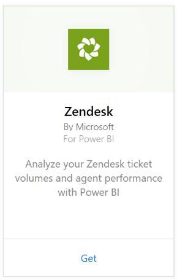
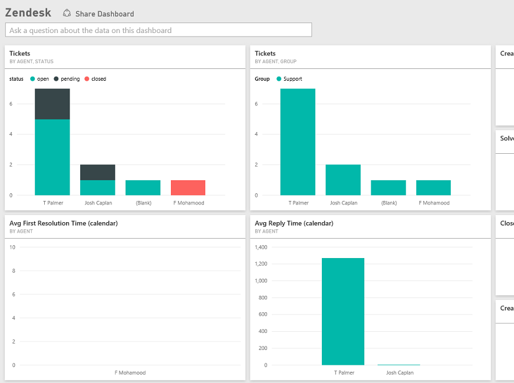

# Connect to Zendesk with Power BI
The Zendesk content pack offers a Power BI dashboard and a set of Power BI reports that provide insights about your ticket volumes and agent performance. You can use the dashboard and reports provided, or customize them to highlight the information you care most about.  The data will be refreshed automatically once a day. 

Connect to the [Zendesk content pack](https://app.powerbi.com/getdata/services/zendesk) or read more about the [Zendesk integration](https://powerbi.microsoft.com/integrations/zendesk) with Power BI.

>[!NOTE]
>A Zendesk Admin account is required to connect. More details on [requirements](#Requirements) below.

## How to connect
1. Select **Get Data** at the bottom of the left navigation pane.
   
   
2. In the **Services** box, select **Get**.
   
    
3. Select **Zendesk** \> **Get.**
   
   
4. Provide the URL associated with your account. This will be in the form **https://company.zendesk.com**, see details on [finding these parameters](#FindingParams) below.
   
   
5. When prompted, enter your Zendesk credentials.  Select **oAuth 2** as the Authentication Mechanism and click **Sign In**. Follow the Zendesk authentication flow. (If you are already signed in to Zendesk in your browser, you may not be prompted for credentials.)
   
   > [!NOTE]
   > This content pack requires you connect with a Zendesk Admin account. 
   > 
   > 
   
   
6. Click **Allow** to allow Power BI to access your Zendesk data.
   
   
7. Click **Connect** to begin the import process. After Power BI imports the data, you see a new dashboard, report, and dataset in the left navigation pane. New items are marked with a yellow asterisk \*.
   
   

**What now?**

* Try [asking a question in the Q&A box](consumer/end-user-q-and-a.md) at the top of the dashboard
* [Change the tiles](service-dashboard-edit-tile.md) in the dashboard.
* [Select a tile](consumer/end-user-tiles.md) to open the underlying report.
* While your dataset will be scheduled to refresh daily, you can change the refresh schedule or try refreshing it on demand using **Refresh Now**

## What's included
The Power BI content pack includes data on the following:  

* Users (end users and agents)  
* Organizations  
* Groups  
* Tickets  

There's also a set of measures that have been calculated, such as Average Wait Time and Tickets Solved in the Last 7 days. A full list is included in the content pack.

## System requirements
A Zendesk Administrator account is required to access the Zendesk content pack. If you're an agent or an end user and are interested in viewing your Zendesk data, please add a suggestion and review the Zendesk connector in the [Power BI Desktop](desktop-connect-to-data.md).

## Finding parameters
Your Zendesk URL will be the same as the URL you use to sign into your Zendesk account. If you're not sure of your Zendesk URL, you can use the Zendesk [login help](https://www.zendesk.com/login/).

## Troubleshooting
If you are having issues connecting, please check your Zendesk URL and confirm you're using an Zendesk administrator account.

## Next steps
* [What is Power BI?](power-bi-overview.md)
* [Get data](service-get-data.md)

