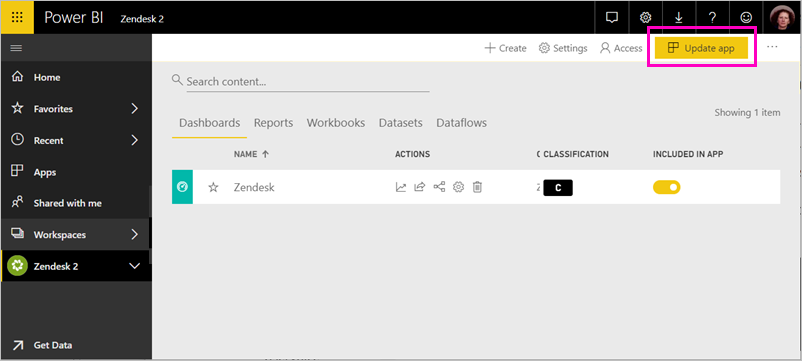

# Connect to Zendesk with Power BI

This article walks you through pulling your data from your Zendesk account with a Power BI template app. The Zendesk app offers a Power BI dashboard and a set of Power BI reports that provide insights about your ticket volumes and agent performance. The data is refreshed automatically once a day. 

After you've installed the template app, you can customize the dashboard and report to highlight the information you care about most. Then you can distribute it as an app to colleagues in your organization.

Connect to the [Zendesk content pack](https://app.powerbi.com/getdata/services/zendesk) or read more about the [Zendesk integration](https://powerbi.microsoft.com/integrations/zendesk) with Power BI.

After you've installed the template app, you can change the dashboard and report. Then you can distribute it as an app to colleagues in your organization.

>[!NOTE]
>You need a Zendesk Admin account to connect. More details on [requirements](#system-requirements) below.

## How to connect

[!INCLUDE [powerbi-service-apps-get-more-apps](./includes/powerbi-service-apps-get-more-apps.md)]

3. Select **Zendesk** \> **Get it now**.
4. In **Install this Power BI App?** select **Install**.
4. In the **Apps** pane, select the **Zendesk** tile.

    

6. In **Get started with your new app**, select **Connect data**.

    

4. Provide the URL associated with your account. The URL has the form **https://company.zendesk.com**. See details on [finding these parameters](#finding-parameters) below.
   
   

5. When prompted, enter your Zendesk credentials.  Select **oAuth 2** as the Authentication Mechanism and click **Sign In**. Follow the Zendesk authentication flow. (If you're already signed in to Zendesk in your browser, you may not be prompted for credentials.)
   
   > [!NOTE]
   > This content pack requires that you connect with a Zendesk Admin account. 
   > 
   
   
6. Click **Allow** to allow Power BI to access your Zendesk data.
   
   
7. Click **Connect** to begin the import process. 
8. After Power BI imports the data, you see the content list for your Zendesk app: a new dashboard, report, and dataset.
9. Select the dashboard to start the exploration process.

    
   
## Modify and distribute your app

You've installed the Zendesk template app. That means you've also created the Zendesk app workspace. In the workspace, you can change the report and dashboard, and then distribute it as an *app* to colleagues in your organization. 

1. To view all the contents of your new Zendesk workspace, in the left navigation bar, select **Workspaces** > **Zendesk**. 

    

    This view is the content list for the workspace. In the upper-right corner, you see **Update app**. When you're ready to distribute your app to your colleagues, that's where you'll start. 

    

2. Select **Reports** and **Datasets** to see the other elements in the workspace.

    Read about [distributing apps](service-create-distribute-apps.md) to your colleagues.

## System requirements
A Zendesk Administrator account is required to access the Zendesk content pack. If you're an agent or an end user and are interested in viewing your Zendesk data, add a suggestion and review the Zendesk connector in the [Power BI Desktop](desktop-connect-to-data.md).

## Finding parameters
Your Zendesk URL will be the same as the URL you use to sign into your Zendesk account. If you're not sure of your Zendesk URL, you can use the Zendesk [login help](https://www.zendesk.com/login/).

## Troubleshooting
If you're having issues connecting, check your Zendesk URL and confirm you're using a Zendesk administrator account.

## Next steps

* [Create the new workspaces in Power BI](service-create-the-new-workspaces.md)
* [Install and use apps in Power BI](consumer/end-user-apps.md)
* [COnnect to Power BI apps for external services](service-connect-to-services.md)
* Questions? [Try asking the Power BI Community](http://community.powerbi.com/)

