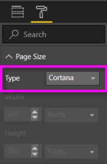
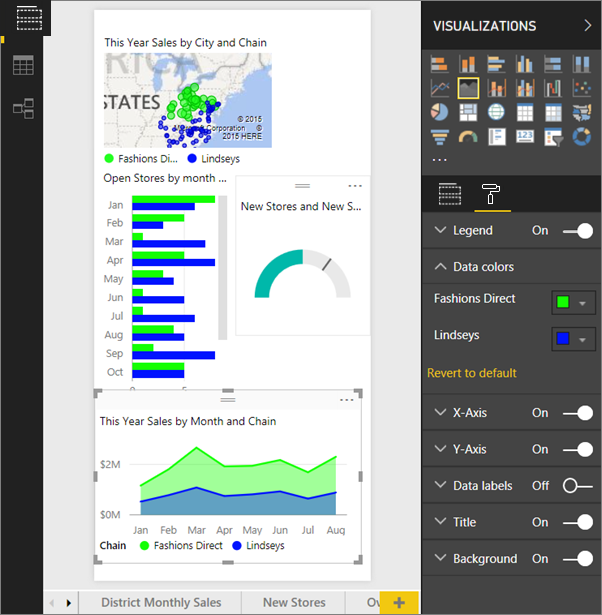
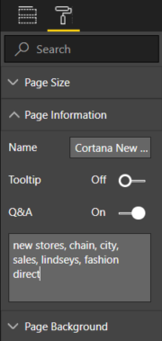
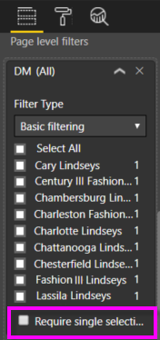

# Use Power BI service or Power BI Desktop to create a custom Answer Page for Cortana
Use the full capabilities of Power BI to create special report pages, called *Cortana answer pages* (and sometimes called "Cortana answer cards") designed specifically to answer Cortana questions.

> [!IMPORTANT]
> If you are trying out the Cortana and Power BI **dashboard** preview, you can skip the rest of this article. There are no setup requirements for Cortana to be able to search your Power BI dashboards.
> 
> 

## Before you begin
We have 4 documents that guide you through setting up and using Cortana for Power BI. If you haven't already, we recommend that you start by reading article 1. And article 2 is especially important because it describes some steps you'll need to take before you can begin using Cortana answer pages.

**Article 1** [Learn how Cortana and Power BI work together](service-cortana-intro.md)

**Article 2**: [For searching Power BI reports: Enable the Cortana - Power BI - Windows integration](service-cortana-enable.md)

**Article 3**: This article

**Article 4**: [Troubleshoot issues](service-cortana-troubleshoot.md)

## Create a Cortana answer page designed specifically for Cortana
A *Cortana answer page* in a report is sized specifically for Cortana so that Cortana can display it in-screen as an answer to a question.  To create an answer page for Cortana:

1. We recommend starting with a [blank report page](power-bi-report-add-page.md).
2. In the **Visualizations** pane, select the paint roller icon and choose **Page Size > Type > Cortana**.
   
    
3. Create a visual or a set of visuals that you want to appear in Cortana in response to a particular question (or set of questions).
4. Ensure that all visuals fit within the page borders.  Optionally, modify display settings, data labels, colors, and backgrounds.  
   
    
5. Name the page and add alternate names.  Cortana uses these names when it searches for results. In the **Visualizations** pane, select the paintbrush icon and choose **Page Information**. Enable Q&A for this visual by moving the slider to **On**.
   
    
   
   > [!TIP]
   > To improve results, avoid using words that are also column names.
   > 
   > 
6. Optionally, if your report has page level filters, you may want to set **Require single selection**. Cortana will only display this report as an answer if one, and only one, of the filter items is specified in the question. **Require single selection** can be found at the bottom of the **Filters** pane.
   
   > [!NOTE]
   > You don't have to set **Require single selection** to ask Cortana to display a report with page level filters.  For example “show sales for Charlotte Lindseys” will display the answer page regardless of the Require Single Selection setting.
   > 
   > 
   
     
   
      For example, if you ask Cortana:
   
   * "show sales by store name," this answer page will not appear because you did not include any of the items in the required page level filter.
   * "show sales for Cary Lindseys and Charlotte Lindseys," this answer page will not appear because you specified more than one item from the required page level filter.
   * "show sales for Charlotte Lindseys," this answer page will display.
     
     = "show sales" this answer page will not appear because you didn't include any of the items in the required page level filter.

> [!IMPORTANT]
> Before your Cortana answer page can be accessed by Cortana, you will need to [Enable the dataset for Cortana](service-cortana-enable.md).
> 
> 

## How does Cortana order the results?
Results with high scoring answers (such as a complete match of a specified page name) will appear first as a *best match* in Cortana. Multiple best matches can appear if there are multiple Cortana answer pages in Power BI. Medium or lower scoring answers, such as answers not based on the name of an answer page or a question with words not understood by Power BI, are listed as links below best matches in Cortana.

> [!NOTE]
> When a new dataset or custom Cortana answer page is added to Power BI and enabled for Cortana it can take up to 30 minutes for results to begin appearing in Cortana. Logging in and out of Windows 10, or otherwise restarting the Cortana process in Windows 10, will allow new content to appear immediately.
> 
> 

## Next steps
[Using Cortana with Power BI](service-cortana-intro.md)

Still can't get Cortana to work with Power BI?  Try the [Cortana troubleshooter](service-cortana-troubleshoot.md).

More questions? [Try the Power BI Community](http://community.powerbi.com/)

