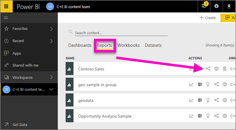
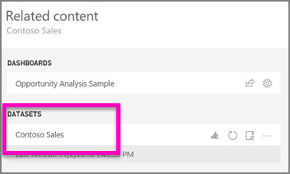
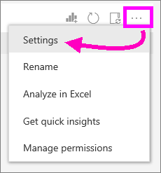
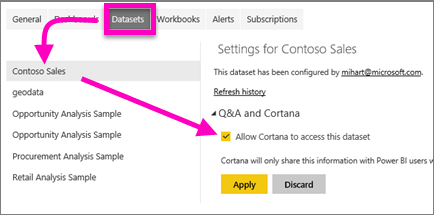
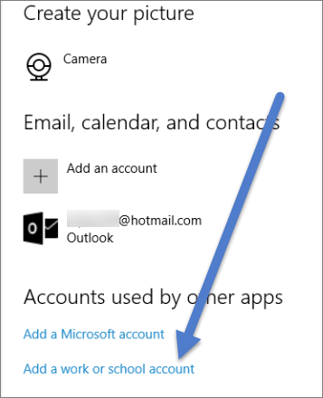

# Enable Cortana to access Power BI reports (and their underlying datasets)
You've read the [Introduction to Cortana and Power BI](service-cortana-intro.md) (if not, you might want to read that first and then come back). And now you want to try it out yourself.  Before you can ask natural language questions in Cortana and find answers from data stored in Power BI ***reports***, there are a few requirements. Specifically, you'll need to do the following.

> [!NOTE]
> If you are trying out the Cortana and Power BI ***dashboard*** preview, you can skip the rest of this article. There are no setup requirements for Cortana to be able to search your Power BI dashboards.
> 
> 

In Power BI service

* enable one or more datasets for Cortana (reports are built on top of datasets, so Cortana needs access to those datasets)

In Microsoft Windows

* Check that you are running Windows 10 version 1511 or later
* Make sure that Power BI and Windows can "talk" to each other. This means connecting your account to Windows.

## Use Power BI service to enable Cortana to access report pages in Power BI
Enabling reports in Power BI to be accessed by Cortana is a simple process.  In fact all you have to do is enable the report's underlying dataset by selecting “Enable Cortana to access this dataset”. After that, any user who has access to the dataset in Power BI, via regular Power BI sharing, apps, and content pack features, will be able to get answers from the report in Cortana in Windows 10.

You'll need to sign in to Power BI service (not Power BI Desktop) and repeat these steps for each dataset that you want Cortana to be able to access.

1. Determine which dataset(s) to enable. From the report content list, select the report you'd like Cortana to access and choose the **View related** icon   .
   
    
2. The dataset associated with this report is **Contoso Sales**.
   
    
3. To the right of the dataset name, select the **ellipses (...) > Settings**.  
   
    
4. Select **Q&A and Cortana** > **Allow Cortana to access this dataset** > **Apply**.
   
   
   
   In this example, we're enabling Cortana on the Contoso Sales dataset.
   
   > [!NOTE]
   > When a new dataset or Cortana answer card is added to Power BI and enabled for Cortana, it can take up to 30 minutes for results to begin appearing. Logging in and out of Windows 10, or otherwise restarting the Cortana process in Windows 10, will allow new content to appear immediately.
   > 
   > If you enable a dataset for Cortana, and that dataset is part of a content pack or app you own, you will need to re-publish for your colleagues to also be able to use it with Cortana.
   > 
   > 

## Add your Power BI credentials to Windows
You'll need to be running Windows 10 version 1511 or higher.

1. Determine which Windows 10 version you are running. Open **Settings**.
    

    Then select **System > About**. Towards the bottom of the screen you'll see **Windows specifications > Version**

   * If you have Windows 10 version 1511 (Windows 10 November 2015 Update) up until 1607, add your work or school account and Microsoft account (complete steps 2 and 3 below).
   * If you have Windows 10 version 1607 (Windows 10 July 2016 update) or later, add your work or school account (complete only step 2 below).
1. Add your work or school account for Cortana.
   
   * Open **Settings** > **Accounts**.
     
       
   * Scroll to the bottom and select **Add a work or school account**. Or, from the **Accounts** page select **Access work or school >Connect**.
     
     

Cortana will use this work or school account to check Power BI for potential answers to your questions in Cortana.

## Next steps
[Create Cortana *answer cards* in Power BI](service-cortana-answer-cards.md)

[Troubleshoot Cortana and Power BI integration issues](service-cortana-troubleshoot.md)

More questions? [Try the Power BI Community](http://community.powerbi.com/)

