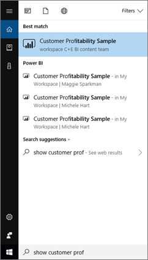
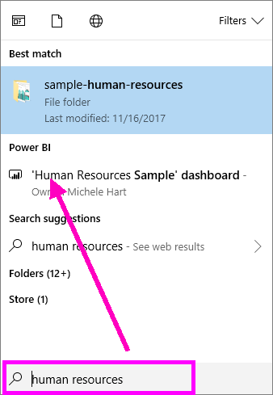
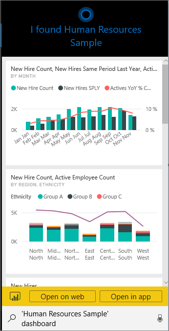
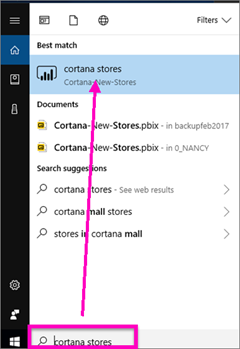
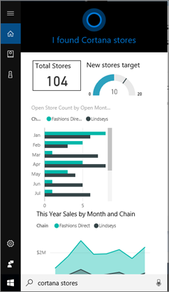
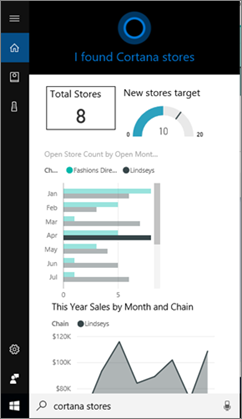

# Find and view your Power BI data with Cortana for Power BI
Use Cortana across your Windows 10 devices to get instant answers to your important business questions. By integrating with Power BI, Cortana can retrieve key information directly from Power BI dashboards and reports. All it takes is Windows 10 November 2015 version or later, Cortana, Power BI, and access to at least one dataset.

## Preview the new Cortana *dashboard* search experience for Windows 10
For a while now you've been able to [use Cortana to retrieve certain types of report pages](service-cortana-answer-cards.md). Now we've added a **new experience** -- the ability to also retrieve dashboards. Try it out and [send us feedback at Power BI Ideas](https://ideas.powerbi.com/forums/265200-power-bi). Eventually the *new experience* will be extended to include Cortana search for reports as well.  One of the key benefits of the new experience is that you don't need to do anything special to set it up -- no enabling Cortana or configuring Windows 10. It just works.

> [!NOTE]
> If it doesn't "just work," see the [Troubleshooting article](service-cortana-troubleshoot.md) for help.
> 
> 

The underlying technology is using [Microsoft Azure Search Service](https://docs.microsoft.com/azure/search/). This search service provides extra capabilities such as smart ranking, error correction, and auto complete.

Both Cortana experiences can exist side-by-side.

## Cortana for Power BI documentation
Four documents guide you through setting up and using Cortana for Power BI.

**Article 1** (this article): understand how Cortana and Power BI work together

**Article 2**: [Search Power BI reports: Enable the Cortana - Power BI - Windows integration](service-cortana-enable.md)

**Article 3**: [Search Power BI reports: create special *Cortana answer cards*](service-cortana-answer-cards.md)

**Article 4**: [Troubleshoot issues](service-cortana-troubleshoot.md)

## How Cortana and Power BI work together
When you use Cortana to ask a question, Power BI can be one of the places Cortana looks for answers. In Power BI, Cortana can find rich data-driven answers from Power BI reports (that contain a special type of report page called a *Cortana answer card*) and from Power BI dashboards.

If Cortana finds a match, it displays the name of the dashboard or report page right there in your Cortana screen. The dashboard or report page can be opened in Power BI. Report pages can also be explored right in Cortana - they're interactive.

### Cortana and Dashboards (the *new experience*)
Cortana can find answers in dashboards that you own and dashboards that have been shared with you. Ask Cortana questions using titles, keywords, owner names, workspace names, app names, and more.

Your question must have at least two words for Cortana to find an answer. So if you search on a dashboard with a one-word name (Marketing) add the word "show" or "Power BI" or the owner name to your question, as in "show Marketing" and "michele hart sample". 

If your dashboard title is more than one word, Cortana only returns that dashboard if your search matches at least two of the words or one of the words plus the owner name. For a dashboard named "Customer Profitability Sample": 

* "show me customer" *doesn't* return a Power BI dashboard result.   
* "utterances such as "show me customer profitability", "customer p", "customer s", "profitability sample", "michele hart sample", "show customer profitability sample", and "show me customer p" *do* return a Power BI result.
* Adding the word "powerbi" counts as one of the two required words, so "powerbi sample" *does* return a Power BI result. 
  
    

### Cortana and Reports
 Cortana can find answers in reports that have [pages designed specifically for display by Cortana](service-cortana-answer-cards.md). Just ask questions using the title or keywords from one of these specialty report pages.  

The underlying technology for reports use [Power BI Q&A](power-bi-tutorial-q-and-a.md).

When you ask a question in Cortana, Power BI answers from report pages designed specifically for Cortana. Potential answers are determined by Cortana on the fly directly from the Cortana *answer cards* already created in Power BI.  To further explore an answer, open a result in Power BI.

> [!NOTE]
> Before Cortana can look for answers in your Power BI reports, you'll need to [enable this feature using the Power BI service and set up Windows to communicate with Power BI](service-cortana-enable.md).  
> 
> 

## Using Cortana to get answers from Power BI
1. Start in Cortana. There are many different ways to *open* Cortana: select the Cortana icon in the taskbar (pictured below), use voice commands, or tap the search icon on your Windows mobile device.
   
     
2. Once Cortana is ready, type or speak your question into the Cortana search bar. Cortana displays the available results. If there is a Power BI dashboard that matches the question, it shows up under **Best match** or **Power BI**.
   
     
   
   > [!NOTE]
   > At the current time, only English is supported.
   > 
   > 
3. Select the dashboard to open it in Cortana.

    

    You can change the layout by [editing the *phone view* of the dashboard](service-create-dashboard-mobile-phone-view.md). 

1. From Cortana, you also have the options to open the dashboard in Power BI service or Power Bi mobile. Open the dashboard in Power BI service by selecting **Open on web**. 
   
      
4. Now let's use Cortana to search for a report. We'll need to know of a [report that has a page with a Cortana answer card ](service-cortana-answer-cards.md). In this example, a report named "Cortana-New-Stores" has a Cortana answer card page named "cortana stores".  
   
     Type or speak your question into the Cortana search bar. Cortana displays the available results. If there is a Power BI report page that matches the question, it shows up under **Best match** or **Power BI**. And in this example the .pbix file (and backup) that I used to create the answer card also displays -- under **Documents**.
   
      
5. Select the **Cortana stores** report page to display it in the Cortana window.
   
       
   
    Remember, an *answer card* is a special type of Power BI report page that was created by a dataset owner.  For more information, see [Create a Cortana answer card](service-cortana-answer-cards.md).
6. But that's not all. Interact with the visualizations on the answer card as you would in Power BI.
   
   * For example, select an element on one visualization to cross-filter and highlight the other visualizations on the answer card.
     
     
   * Or, use natural language to filter the results instead.  For example, ask "Cortana stores for Lindseys" and see the card filtered to only show data for the Lindseys chain.
     
     
7. Continue exploring. Scroll to the bottom of the Cortana window and select **Open in Power BI**.
   
     
8. The report page opens in Power BI.    
     

## Considerations and troubleshooting
* Cortana doesn't have access to any Cortana cards that haven't been [enabled for Power BI](service-cortana-enable.md).
* Still can't get Cortana to work with Power BI?  Try the [Cortana troubleshooter](service-cortana-troubleshoot.md).
* Cortana for Power BI is currently only available in English.
* Cortana for Power BI is only available on Windows mobile devices.

More questions? [Try the Power BI Community](http://community.powerbi.com/).
Feedback? [Send feedback to Power BI Ideas](https://ideas.powerbi.com/forums/265200-power-bi).

## Next steps
[Enable the Cortana - Power BI - Windows integration for reports](service-cortana-enable.md)

