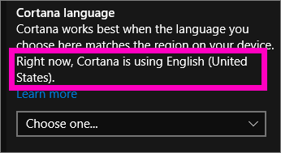
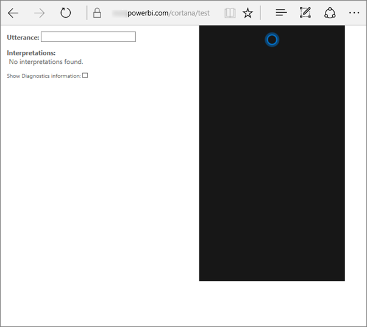

# Troubleshoot Cortana for Power BI
This article is part of a series. 

> [!IMPORTANT]
> Cortana integration is being deprecated in Power BI. Starting June 11, Cortana will no longer work for any dashboards and reports.

If you're having problems getting Cortana to integrate with Power BI, you've come to the right place. Follow the steps below to diagnose and fix the problem.

## Why doesn't Cortana find answers from my Power BI reports or dashboards?
1. Do you have a Power BI account?  If not, [sign up for a free trial](https://powerbi.microsoft.com/get-started/).
2. Is Cortana working?  Do you see the Cortana icon in your taskbar?

    

    When you select it, does Cortana open with a field in which you can type?
3. Did you use at least 2 words in your search? Cortana needs at least 2 word phrases to find answers in Power BI. Try adding "show" to the beginning of your question.
4. If your dashboard has a title with more than one word, Cortana will only return that dashboard if your search matches at least two of the words. For a dashboard named "Sales FY16":

   * "show sales" will *not* return a Power BI result.   
   * "show me sales fy16", "sales fy16", "show sales fy16", and "show me sales f" *will* return a Power BI result.    
   * Adding the words "powerbi" counts as one of the 2 required words, so "powerbi sales" *will* return a Power BI result.
5. Do you have access or edit permissions to any reports or dashboards? For reports, ensure the content you are attempting to search has an [answer card](service-cortana-answer-cards.md).  For dashboards, ensure the content you are attempting to search is in  **Shared with me**, an app workspace, or **My workspace**. [Use the troubleshooting tool](#try-the-cortana-troubleshooting-tool) for help identifying the problem.
6. Are you using a mobile device?  Currently we only support Power BI and Cortana integration on Windows mobile devices.
7. Is Cortana configured for English?  The current Cortana-Power BI integration only supports English. Open Cortana and select the cog icon to display Settings. Scroll down to **Cortana language** and ensure it's set to one of the English options.

   
8. Do you have more than 100 reports enabled for Cortana?  Cortana only searches up to 100 total.  To ensure that your report is included, move or copy it to your **My Workspace** because Cortana searches there first.
9. You might just need to give it some time. The first time you type a query the model might be *cold*. Wait a few seconds so the data can be loaded into memory, and then try again.
10. For dashboards, it can take up to 24 hours for them to become accessible to Cortana.    
11. For reports, when a new dataset or custom answer card is added to Power BI and enabled for Cortana it can take up to 30 minutes for results to begin appearing in Cortana. Logging in and out of Windows 10, or otherwise restarting the Cortana process in Windows 10, will allow new report content to appear immediately.  
12. Your Power BI Administrator can "opt out". Check with your admin to see if this is the case.

## Reports only: why doesn't Cortana find answers from my Power BI reports
1. If you're looking for answers in reports, do you have any reports with Cortana **answer cards**? Answer cards are the only way Cortana can find answers in your Power BI reports.  Learn how to create an answer card by reading [Create Cortana answer cards in Power BI service and Power BI Desktop](service-cortana-answer-cards.md).
2. Are your running Windows version 1511 or later?  Find out by opening Windows Settings and selecting **System > About**. If not, update your version of Windows.
3. Are your Windows and Power BI accounts connected? This can be confusing. Follow the instructions in [Enable Cortana for Power BI](service-cortana-enable.md#add-your-power-bi-credentials-to-windows).
4. Have the underlying datasets been enabled for Cortana? Maybe a colleague has shared a dataset that has already been enabled for Cortana. But, if not, [learn how to enable datasets for Cortana yourself](service-cortana-enable.md). It's quick and easy.

## Dashboards only: why doesn't Cortana find answers from my Power BI dashboards
1. Ensure that you are connected to your work account. Power BI needs this connection so that it can authenticate your access permissions to data. To check that you are connected or if not, to connect your work account, use the Windows search box to navigate to “Connect to work or school”.  

    
2. Do you have access to Cortana? Select the Windows search box and provide Cortana access permissions to your information.

## Try the Cortana troubleshooting tool
Still having trouble?  Now is a good time to run the Cortana troubleshooting tool and narrow down the possible issues.

### Having trouble retrieving answers from a report?
1. For reports, before running the troubleshooting tool, make sure to set the **Page level** filters on your Cortana answer cards to **Require single selection**. For help doing this see [Create Cortana answer cards](service-cortana-answer-cards.md).
2. Open the troubleshooting tool by adding "/cortana/test" to the end of your Power BI service URL. Your URL should look similar to this:

   app.powerbi.com/cortana/test

   
3. In the **Utterance** field, to troubleshoot reports, type the name of a Cortana answer card ***exactly as it appears in the Power BI tab***.

   

    

   
4. Sometimes, the first time you type something into the **Utterance** field, nothing happens. Think of it as priming the system; you're letting the troubleshooting tool know that it's time to turn on. Cut and paste or retype into the **Utterance** field again. In this example, the name of our answer card is **Cortana stores**. Pasting or typing **Cortana stores** into the tool produces a single result that displays in the **Interpretations** field. Click to see the answer card displayed in the Cortana window -- in this case, **Cortana stores**.

   

   Because we got a result, we now know that Cortana **is** enabled in Power BI. That narrows down the problem to something on the Windows side or the Cortana language setting or having more than 100 datasets enabled for Cortana.

### Having trouble retrieving answers from a dashboard?
Looking for a dashboard that has been shared with you?  Open Power BI > **Shared with me** and locate the name of the dashboard.  Then type that name into the **Utterances** field.

#### Troubleshooting tool known issues
* If the tool doesn’t fetch the results the first time; instead paste the query into the Utterance text box.
* The query must be 2 or more words, by design.  If your query is too short, add the word "show".
* Some query strings with prepositions might not work (e.g. sales by item). Try different query terms that don't use prepositions and are meaningful/unique.

More questions? [Try the Power BI Community](http://community.powerbi.com/)
