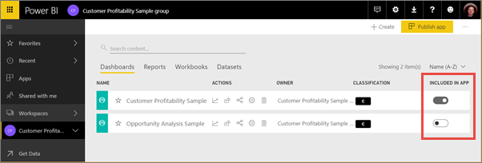
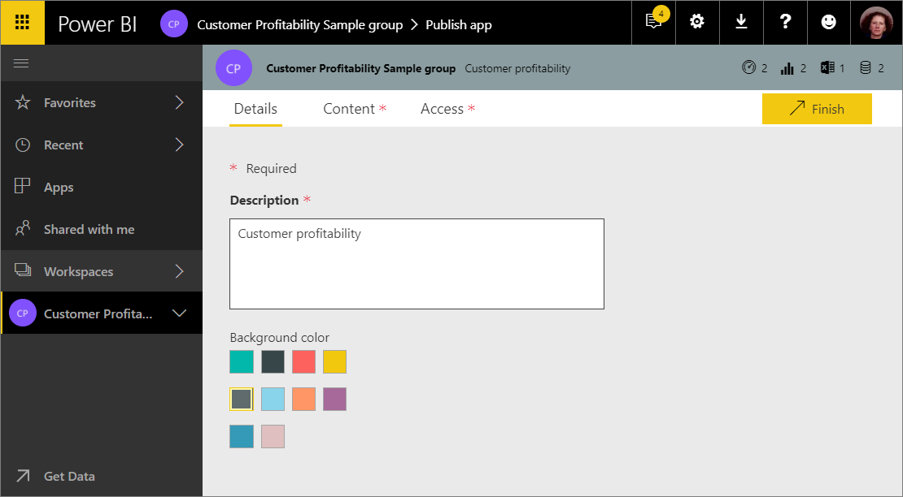

# Publish apps with dashboards and reports in Power BI

In Power BI, you can publish *apps* with collections of related dashboards and reports. You create apps in *app workspaces*, where you can collaborate on Power BI content with your colleagues. Then you can publish the finished apps to large groups of people in your organization. Read more about [creating app workspaces](service-create-workspaces.md).

**Did you know?** Power BI has released the new workspace experience. Read [Create the new workspaces](service-create-the-new-workspaces.md) to understand how these new workspaces work. 

Your business users often need multiple Power BI dashboards and reports to run their business. With Power BI apps, you can create collections of dashboards and reports and publish these apps to your whole organization or to specific people or groups. For you as a report creator or admin, apps make it easier to manage permissions on these collections.

Business users get your apps in a few different ways.

- They can find and install your app from Microsoft AppSource
- You can send them a direct link. 
- You can install it automatically in your coworkers' Power BI accounts if your Power BI administrator gives you permission. 

The Apps list in the left navigation shows all the apps they've installed. They can easily find and return to your content because it’s all in one place. They can’t modify the contents of the app, but they can interact with it either in the Power BI service, or one of the mobile apps -– filtering, highlighting, and sorting the data themselves. They get updates automatically and you can control how frequently the data refreshes. Read more about the [app experience for business users](consumer/end-user-apps.md).

## Apps and organizational content packs
Apps are the evolution of organizational content packs. Content packs aren't available in the new workspace experiences. You cannot create, publish, or install content packs in the new workspace experience. If you haven't already, start migrating your content packs to apps.

## Video: Apps and app workspaces
<iframe width="640" height="360" src="https://www.youtube.com/embed/Ey5pyrr7Lk8?showinfo=0" frameborder="0" allowfullscreen></iframe>

## Licenses for apps
Each member of an app workspace needs a Power BI Pro license. For app users, there are two options.

* Option 1: All business users need **Power BI Pro** licenses to view your app. 
* Option 2: If your app resides in a Power BI Premium capacity, free users in your organization can view app content. Read [What is Power BI Premium?](service-premium.md) for details.

## Publish your app
When the dashboards and reports in your workspace are ready, you choose which dashboards and reports you want to publish, then you publish them as an app. You can send a direct link to that wider audience, or they can find your app from the Apps tab by going to **Download and explore more apps from AppSource**. 

1. In the workspace list view, decide which dashboards and reports you want to include in the app.

     

     If you choose not to publish a report, you see a warning next to the report and its related dashboard. You can still publish the app, but the related dashboard will be missing the tiles from that report.

     

2. Select the **Publish app** button in the upper right to start the process of sharing all the content in that workspace.
   
     

3. On **Details**, fill in the description to help people find the app. You can set a background color to personalize it.
   
     

4. On **Content**, you see the content that’s going to be published as part of the app – everything that you've selected in that workspace. You can also set the app landing page – the dashboard or report people will see first when they go to your app. You can choose **None**. Then they’ll land on a list of all the content in the app. 
   
     

5. On **Access**, decide who has access to the app: either your entire organization, or individuals, Office 365 groups, distribution lists, and Active Directory security groups, whether email-enabled or not. 

6. If you have permissions, you can also decide to install the app automatically for the recipients. A Power BI admin can enable this setting in the Power BI Admin Portal. Read more [automatically installing an app](#how-to-install-an-app-automatically-for-end-users).

    

6. When you select **Finish**, you see a message confirming it’s ready to publish. In the success dialog box, you can copy the URL that’s a direct link to this app and send it to the people you’ve shared it with.
   
     

Read more about the [app experience for business users](consumer/end-user-apps.md).

## Change your published app
After you publish your app, you may want to change or update it. It’s easy to update it if you’re an admin or member of the app workspace, or a contributor in a new app workspace. 

1. Open the app workspace that corresponds to the app. 
   
     
2. Open the dashboard or the report. You see that you can make any changes you want.
   
     The app workspace is your staging area, so your changes aren't live in the app until you publish again. This lets you make changes without affecting the published apps.  

    > [!IMPORTANT]
    > If you remove a report and republish the app, even if you add the report back to the app, your app consumers lose all customizations such as bookmarks, comments, etc.  
 
3. Go back to the app workspace list of contents and select **Update app**.
   
     

4. Update **Details**, **Content**, and **Access**, if you need to, then select **Update app**.
   
     

The people you’ve published the app to automatically see the updated version of the app. 

## Automatically install apps for end users
Apps deliver data that your end users need to do their jobs. If an admin gives you permissions, you can automatically install apps for end users, making it easier to distribute the right apps to the right people or groups. Your app will appear automatically in your end users' Apps content list rather than them having to find it from Microsoft AppSource, or following an installation link. This makes it easier for you to roll out standard Power BI content to your users.

### How to install an app automatically for end users
Once the admin has assigned you permissions, you have a new option to **install the app automatically**. When you check the box and select **Finish** (or **Update app**, for existing apps), the app is pushed to all users or groups defined in the **Permissions** section of the app on the **Access** tab.

### How users get the apps that were pushed to them
After you push an app, it shows up in the Apps list automatically. You can curate the apps that specific users or job roles in your organization need to have at their fingertips.

### Considerations for automatically installing apps
Here are things to keep in mind when pushing apps to end users:

* Installing an app automatically to users can take time. Most apps will install immediately for users, but pushing apps can take time.  It depends on the number of items in the app and the number of people given access. We recommend pushing apps during off hours with plenty of time before users need them. Verify with several users before sending broad communication about the apps' availability.

* Refresh your browser. Before seeing the pushed app in the Apps list, the user may need to refresh, or close and reopen their browser.

* If the user doesn’t immediately see the app in the Apps list, they should refresh or close and reopen their browser.

* Try not to overwhelm users. Be careful not to push too many apps so your users perceive the pre-installed apps are useful to them. It’s best to control who can push apps to end users to coordinate timing. You can establish a point of contact for getting apps in your organization pushed to end users.

* Guest users who haven't accepted an invite don't get apps automatically installed for them.  

## Unpublish an app
Any member of an app workspace can unpublish the app.

>[!IMPORTANT]
>When you unpublish an app, app users lose their customizations. They lose any personal bookmarks, comments, or subscriptions associated with content in the app. Only unpublish an app if you need to remove it.
> 

* In an app workspace, select the ellipsis (**...**) in the upper-right corner > **Unpublish app**.
  
     

This action uninstalls the app for everyone you've published it to, and they no longer have access to it. It doesn't delete the app workspace or its contents.

## Next steps

* [Create the new workspaces in Power BI](service-create-the-new-workspaces.md)
* [Install and use apps in Power BI](consumer/end-user-apps.md)
* [Power BI apps for external services](service-connect-to-services.md)
* [Power BI Admin Portal](https://docs.microsoft.com/power-bi/service-admin-portal)
* Questions? [Try asking the Power BI Community](http://community.powerbi.com/)
