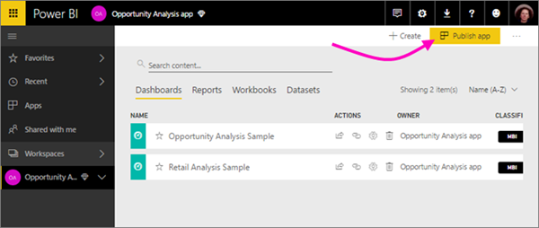
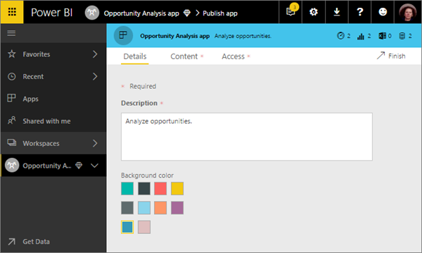
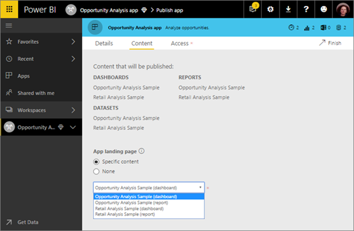

# Create and distribute apps with dashboards and reports in Power BI
## What are Power BI apps?
In Power BI, you can create *apps* to bring related dashboards and reports together, all in one place, and then distribute them to large groups of people in your organization. You can also connect to [Power BI apps for external services](service-connect-to-services.md) such as Google Analytics and Microsoft Dynamics CRM.

Your business users often need multiple Power BI dashboards and reports to run their business. Apps bring the pieces together so they don't have to remember the names of all these dashboards and how to navigate to them.  

With Power BI apps, now in preview, you can create collections of dashboards and reports and distribute these apps to your whole organization or to specific people or groups. For you as a report creator or admin, apps make it easier to manage permissions on collections of dashboards.

Business users install these apps from Microsoft AppSource, or you can send them a direct link. They can easily find and return to your content because it’s all in one place. They get updates automatically and you can control how frequently the data refreshes. Read more about the [app experience for business users](service-install-use-apps.md).

### Apps and organizational content packs
Apps are the evolution of organizational content packs. If you have organizational content packs already, they'll continue to work side by side with apps.

Now that you have an overview of apps, let’s talk about *app workspaces*, where you create apps. 

## Video: Apps and app workspaces
<iframe width="640" height="360" src="https://www.youtube.com/embed/Ey5pyrr7Lk8?showinfo=0" frameborder="0" allowfullscreen></iframe>

## Licenses for apps
As an app creator you need a Power BI Pro license. For your app users, there are two options.

* Option 1: All business users need **Power BI Pro** licenses to view your app. 
* Option 2: Free users in your organization can view app content if your app resides in a Power BI Premium capacity. Read [What is Power BI Premium?](service-premium.md) for details.

## App workspaces
*App workspaces* are the places where you create apps, so to create an app, you first need to create the app workspace. If you’ve ever worked in a group workspace in Power BI, then app workspaces will be familiar. They’re the evolution of group workspaces – staging areas and containers for the content in the app. 

You can add colleagues to these workspaces as members or admins. All app workspace members and admins need Power BI Pro licenses. In the workspace you can all collaborate on dashboards, reports, and other articles that you plan to distribute to a wider audience, or even your entire organization. 

When the content is ready, you distribute the app. You can send a direct link to that wider audience, or they can find your app from the Apps tab by going to **Download and explore more apps from AppSource**. Those people can’t modify the contents of the app, but they can interact with it either in the Power BI service, or one of the mobile apps -– filtering, highlighting, and sorting the data themselves. 

### How are app workspaces different from group workspaces?
All existing group workspaces can serve as app workspaces, and you can publish apps from any of these workspaces. Here’s one way app workspaces and group workspaces are different: You create an app workspace as a place to create and house a specific app. There’s a one-to-one relationship between the app and contents of the app workspace. Everything in the app workspace will be in the app when you distribute it. 

Now that you understand apps and app workspaces, let's start creating and publishing an app. 

## Create an app workspace
[!INCLUDE [powerbi-service-create-app-workspace](./includes/powerbi-service-create-app-workspace.md)]

It’s empty, so now you add content to it. Note that when you first create it, you may need to wait an hour or so for the workspace to propagate to Office 365. 

Adding content is just like adding content to your My Workspace, except the other people in the workspace can see and work on it, too. A big difference is that when you get done, you can distribute the content as an app. While in the app workspace, you can upload or connect to files, or connect to third-party services, just as you would in your own My Workspace. For example:

* [Connect to services](service-connect-to-services.md) such as Microsoft Dynamics CRM, Salesforce, or Google Analytics.
* [Get data from files](service-get-data-from-files.md) such as Excel, CSV, or Power BI Desktop (PBIX) files.

## Add an image to your app (optional)
By default, Power BI creates a little colored circle for your app, with the app's initials. But maybe you want to customize it with an image. To add an image, you need an Exchange Online license.

1. Select **Workspaces**, select the ellipsis (...) next to the name of the workspace, then **Members**. 
   
     
   
    The Office 365 Outlook account for the workspace opens in a new browser window.
2. When you hover over the colored circle in the upper left, it turns into a pencil icon. Select it.
   
     
3. Select the pencil icon again, and find the image you want to use.
   
     
4. Select **Save**.
   
     
   
    The image replaces the colored circle in the Office 365 Outlook window. 
   
     
   
    In a few minutes, it will appear in the app in Power BI, too.
   
     

## Distribute your app
When you’ve finished creating and perfecting the dashboards and reports in your app workspace, you package it all up as an app and distribute it.

1. In the workspace, select the **Publish app** button in the upper right to start the process of sharing all the content in that workspace.
   
     
2. First, on **Details**, fill in the description to help people find the app. You can set a background color to personalize it.
   
     
3. Next, on **Content**, you see the content that’s going to be published as part of the app – everything that’s in that workspace. You can also set the landing page – the dashboard or report people will see first when they go to your app. You can choose **None**. Then they’ll land on a list of all the content in the app. 
   
     
4. Last, on **Access**, decide who has access to the app: either everyone in your organization, or specific people or email distribution lists. 
   
     
5. When you select **Finish**, you see a message confirming it’s ready to publish.
6. In the success dialog box, you can copy the URL that’s a direct link to this app and send it to the people you’ve shared it with.
   
     

The business users that you've distributed the app to can find it in two different ways. You can send them the direct link to the app, or they can search for it in Microsoft AppSource, where they see all the apps that they can access. Either way, after that whenever they go to Apps, they’ll see this app in their list.

Read more about the [app experience for business users](service-install-use-apps.md).

## Change your published app
After you publish your app, you may want to change or update it. You notice that when you open your app from Apps, even though you’re the one who published it, you can’t edit it – **Edit Report** is grayed out. 

But it’s easy to update it if you’re an admin or member of the app workspace. 

1. Open the app workspace that corresponds to the app. 
   
     
2. Open the dashboard or the report. You see that you can make any changes you want.
   
   > [!NOTE]
   > The app workspace is your staging area, so your changes aren't pushed live to the app until you publish again. This lets you make changes without affecting the published apps. 
   > 
   > 
3. Go back to the app workspace list of contents and select **Update app**.
   
     
4. Update **Details**, **Content**, and **Access**, if you need to, then select **Update app**.
   
     

The people you’ve distributed the app to automatically see the updated version of the app. 

## Unpublish an app
Any member of an app workspace can unpublish the app.

* In an app workspace, select the ellipsis (**...**) in the upper-right corner > **Unpublish app**.
  
     

This action uninstalls the app for everyone you've distributed it to, and they no longer have access to it. It doesn't delete the app workspace or its contents.

## Power BI apps FAQ
### How are app workspaces different from group workspaces?
With this release, we have renamed all group workspaces to app workspaces. You can publish an app from any of these workspaces. The functionality remains on par with group workspaces for the most part. Over the next few months, we plan on the following enhancements to app workspaces: 

* Creating app workspaces won't create corresponding entities in Office 365 like group workspaces do. So you can create any number of app workspaces without worrying about different Office 365 groups being created behind the scenes (you can still use an Office 365 group’s OneDrive for Business to store your files). 
* Today you can add only individuals to the members and admin lists. Soon you'll be able to add multiple AD security groups or modern groups to these lists to allow for easier management.  

### How are apps different from organizational content packs?
Apps are an evolution and simplification of content packs, with a few major differences. 

* After business users install a content pack, it loses its grouped identity: it's just a list of dashboards and reports interspersed with other dashboards and reports. Apps, on the other hand, maintain their grouping and identity even after installation. This makes it easy for business users to continue to navigate to them over time.  
* You can create multiple content packs from any workspace, but an app has a 1:1 relationship with its workspace. We believe this makes apps easier to understand and maintain over the long run. See the roadmap section of the Power BI blog for more on how we plan to improve this area. 
* Over time we plan to deprecate organizational content packs, so we recommend you create apps from now on.  

### What about read-only members in groups?
In groups, you can add read-only members who can only view the content. The main problem with this approach was that you couldn't add security groups as members. 
With apps, you can publish a read-only version of your app workspace to large audiences, including security groups. You can stage your changes to the dashboards and reports in the app without affecting end users. We recommend that you use apps in this way in the future. Over the long run, we plan to deprecate read-only members of workspaces as well.  

## Next steps
* [What are apps in Power BI?](service-install-use-apps.md)
* [Power BI apps for external services](service-connect-to-services.md)
* Questions? [Try asking the Power BI Community](http://community.powerbi.com/)

