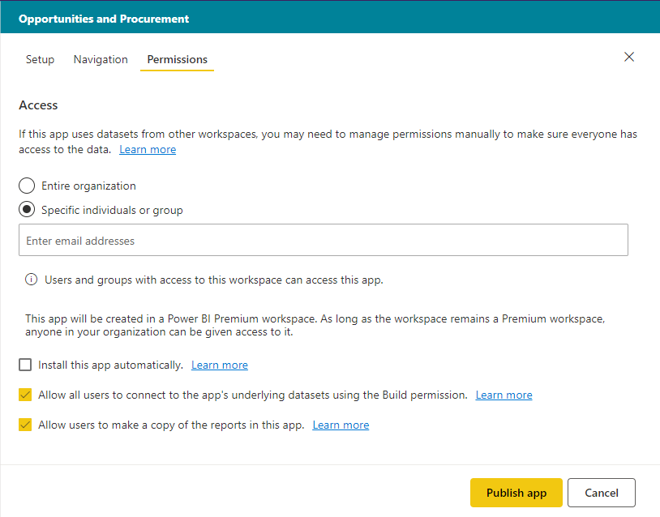

# Publish an app in Power BI

In Power BI, you can create official packaged content, then distribute it to a broad audience as an *app*. You create apps in *app workspaces*, where you can collaborate on Power BI content with your colleagues. Then you can publish the finished apps to large groups of people in your organization. 

Your business users often need multiple Power BI dashboards and reports to run their business. With Power BI apps, you can create collections of dashboards and reports and publish these apps to your whole organization or to specific people or groups. For you as a report creator or admin, apps make it easier to manage permissions on these collections.

Business users get your apps in a few different ways:

- They can find and install your app from Microsoft AppSource
- You can send them a direct link.
- You can install it automatically in your coworkers' Power BI accounts if your Power BI administrator gives you permission.

You can create the app with its own built-in navigation, so your users can easily find their way around your content. They can’t modify the contents of the app. They can interact with it either in the Power BI service, or one of the mobile apps -– filtering, highlighting, and sorting the data themselves. They get updates automatically and you can control how frequently the data refreshes. Read more about the [app experience for business users](consumer/end-user-apps.md).

## Licenses for apps
To create or update an app, you need a Power BI Pro license. For app *consumers*, there are two options.

* Option 1: All business users need **Power BI Pro** licenses to view your app. 
* Option 2: If your app workspace resides in a Power BI Premium capacity, free users in your organization can view app content. Read [What is Power BI Premium?](service-premium.md) for details.

## Publish your app
When the dashboards and reports in your workspace are ready, you choose which dashboards and reports you want to publish, then you publish them as an app. 

1. In the workspace list view, decide which dashboards and reports you want  **Included in app**.

     

     If you choose not to include a report that has a related dashboard, you see a warning next to the report. You can still publish the app, but the related dashboard won't have the tiles from that report.

     

2. Select the **Publish app** button in the upper right to start the process of creating and publishing an app from the workspace.
   
     

3. On **Setup**, fill in the name and description to help people find the app. You can set a theme color to personalize it. You can also add a link to a support site.
   
     

4. On **Navigation**, you select the content to be published as part of the app. Then you add app navigation, to organize the content in sections. See [Design the navigation experience for your app](#design-the-navigation-experience-for-your-app) in this article for details.
   
     

5. On **Access**, decide who has access to the app. 
    - In [classic workspaces](service-create-workspaces.md): everyone in your organization, specific people, or Azure Active Directory (AAD) security groups.
    - In the [new experience workspaces](service-create-the-new-workspaces.md): specific people, AAD security groups and distribution lists, and Office 365 Groups.

6. If you have permissions, you can install the app automatically for the recipients. A Power BI admin can enable this setting in the Power BI Admin Portal. Read more about [automatically installing an app](#automatically-install-apps-for-end-users) in this article.

     

7. When you select **Publish app**, you see a message confirming it’s ready to publish. In the **Share this app** dialog box, you can copy the URL that’s a direct link to this app.
   
     

You can send that direct link to the people you’ve shared it with, or they can find your app on the Apps tab by going to **Download and explore more apps from AppSource**. Read more about the [app experience for business users](consumer/end-user-apps.md).

## Change your published app
After you publish your app, you may want to change or update it. It’s easy to update it if you’re an admin or member in the new app workspace. 

1. Open the app workspace that corresponds to the app. 
   
     

2. Make any changes you want to the dashboards or reports.
 
     The app workspace is your staging area, so your changes aren't live in the app until you publish again. This lets you make changes without affecting the published apps.  
 
    > [!IMPORTANT]
    > If you remove a report and update the app, even if you add the report back to the app, your app consumers lose all customizations such as bookmarks, comments, etc.  
 
3. Go back to the app workspace list of contents and select **Update app** in the upper-right corner.
   
1. Update **Setup**, **Navigation**, and **Permissions**, if you need to, then select **Update app**.
   
The people you’ve published the app to automatically see the updated version of the app. 

## Design the navigation experience for your app
The **New navigation builder** option allows you to build a custom navigation for your app. The custom navigation makes it easier for your users to find and use content in the app. Existing apps have this option turned off and new apps default to the option being on.

When the option is off, you can select the **App landing page** to be either **Specific content**, for example a dashboard or report, or select **None** to show a basic list of content to the user.

When you turn on **New navigation builder**, you can design a custom navigation. By default all the reports, dashboards, and Excel workbooks you included in your app are listed as a flat list. 

You can further customize the app navigation by:
* Reordering the items using the up / down arrows. 
* Renaming items in the **Report details**, **Dashboard details**, and **Workbook details**.
* Hiding certain items from the navigation.
* Using the **New** option to add **sections** to group related content.
* Using the **New** option to add a **link** to an external resource to the left navigation. 

When you add a **link**, in **Link details** you can choose where the link opens. By default links open in the **Current tab**, but you can select **New tab**, or **Content area**. 

### Considerations for using the new navigation builder option
Here are general things to keep in mind when using the new navigation builder:
* Report pages are shown in the app navigation area as an expandable section
* If you turn off the new navigation builder and then publish or update your app, you lose the customizations you’ve made. For example, sections, ordering, links, and custom names for navigation items are all lost.

When adding links to your app navigation and selecting the Content area option:
* Ensure the link can be embedded. Some services block the embedding of their content in third-party sites like Power BI.
* Embedding Power BI service content like reports or dashboards in other workspaces isn't supported. 
* Embed Power BI Report Server content through its native embed URL content from an on premises deployment. Use the steps in [creating the Power BI Report Server URL](https://docs.microsoft.com/power-bi/report-server/quickstart-embed#creating-the-power-bi-report-server-report-url) to get the URL. Be aware that regular authentication rules apply, so viewing the content requires a VPN connection to the on-premises server. 
* A security warning is shown at the top of the embedded content to indicate the content isn't in Power BI.

## Automatically install apps for end users
If an admin gives you permissions, you can install apps automatically, *pushing* them to end users. This push functionality makes it easier to distribute the right apps to the right people or groups. Your app appears automatically in your end users' Apps content list. They don't have to find it from Microsoft AppSource or follow an installation link. See how admins enable [pushing apps to end users](service-admin-portal.md#push-apps-to-end-users) in the Power BI admin portal article.

### How to push an app automatically to end users
Once the admin has assigned you permissions, you have a new option to **install the app automatically**. When you check the box and select **Publish app** (or **Update app**), the app is pushed to all users or groups defined in the **Permissions** section of the app on the **Access** tab.

### How users get the apps that you push to them
After you push an app, it shows up in their Apps list automatically. In this way, you can curate the apps that specific users or job roles in your organization need to have at their fingertips.

### Considerations for automatically installing apps
Here are things to keep in mind when pushing apps to end users:

* Installing an app automatically to users can take time. Most apps install immediately for users, but pushing apps can take time.  It depends on the number of items in the app and the number of people given access. We recommend pushing apps during off hours with plenty of time before users need them. Verify with several users before sending broad communication about the apps' availability.

* Refresh the browser. Before seeing the pushed app in the Apps list, the user may need to refresh, or close and reopen their browser.

* If users don’t immediately see the app in the Apps list, they should refresh or close and reopen their browser.

* Try not to overwhelm users. Be careful not to push too may apps so your users perceive the pre-installed apps are useful to them. It’s best to control who can push apps to end users to coordinate timing. Establish a point of contact for getting apps in your organization pushed to end users.

* Guest users who haven't accepted an invite don't get apps automatically installed for them.  

## Unpublish an app
Any member of an app workspace can unpublish the app.

>[!IMPORTANT]
>When you unpublish an app, app users lose their customizations. They lose any personal bookmarks, comments, or subscriptions associated with content in the app. Only unpublish an app if you need to remove it.
> 
> 

* In an app workspace, select the ellipsis (**...**) in the upper-right corner > **Unpublish app**.
  
     

This action uninstalls the app for everyone you've published it to, and they no longer have access to it. It doesn't delete the app workspace or its contents.

## View your published app

When your app consumers open your app, they see the navigation you created, instead of the standard Power BI left navigation pane. The app navigation lists the reports and dashboards in the sections you've defined. It also lists the individual pages in each report, rather that just the report name.

## Next steps
* [Create an app workspace](service-create-workspaces.md)
* [Install and use apps in Power BI](consumer/end-user-apps.md)
* [Power BI apps for external services](service-connect-to-services.md)
* [Power BI Admin Portal](https://docs.microsoft.com/power-bi/service-admin-portal)
* Questions? [Try asking the Power BI Community](http://community.powerbi.com/)
