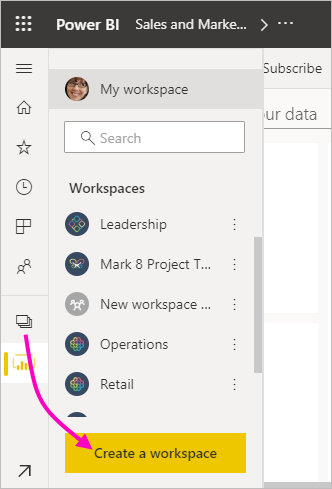
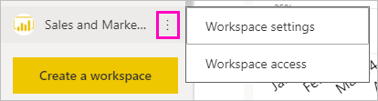
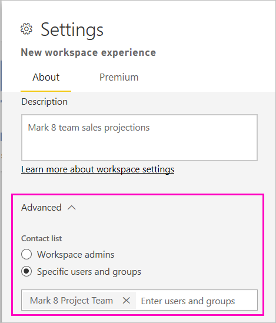
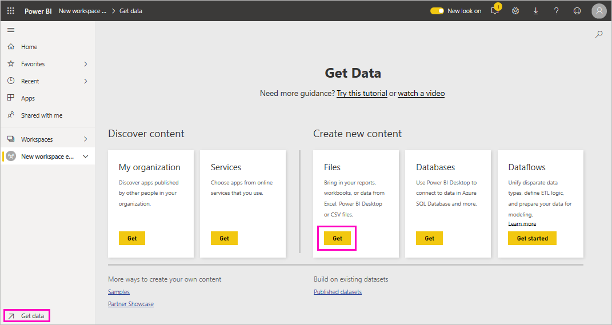
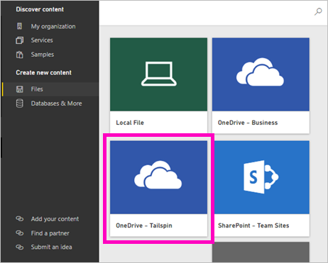
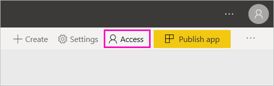
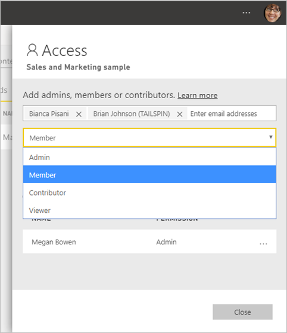

# Create the new workspaces in Power BI

Power BI is introducing a new workspace experience. Workspaces are still the place to collaborate with colleagues to create collections of dashboards, reports, and paginated reports. Then you can bundle that collection into an *app* and distribute it to your whole organization, or to specific people or groups. 

Here's what's different. In the new workspaces, you can:

- Assign workspace roles to user groups: security groups, distribution lists, Office 365 groups, and individuals.
- Create a workspace in Power BI without creating an Office 365 group.
- Use more granular workspaces roles for more flexible permissions management in a workspace.

> [!NOTE]
> To enforce row-level security (RLS) for Power BI Pro users browsing content in a workspace, assign the users the Viewer Role.

For more background, see the [new workspaces](service-new-workspaces.md) article.

## Create one of the new workspaces

1. Start by creating the workspace. Select **Workspaces** > **Create workspace**.
   
     

2. You're automatically creating an upgraded workspace, unless you opt to **Revert to classic**.
   
     
     
     If you select **Revert to classic**, you create a [workspace based on an Office 365 Group](service-create-workspaces.md). 

2. Give the workspace a name. If the name isn't available, edit it to come up with a unique name.
   
     The app for the workspace will have the same name and icon as the workspace.
   
1. Here are some optional items you can set for your workspace:

    Upload a **Workspace image**. Files can be .png or .jpg format. File size has to be less than 45 KB.
    
    [Add a **Contact list**](#workspace-contact-list). By default, the workspace admins are the contacts. 
    
    [Specify a **Workspace OneDrive**](#workspace-onedrive) by typing just the name of an existing Office 365 Group, not the URL. Now this workspace can use that Office 365 group's file storage location. 

    

    To assign the workspace to a **Dedicated capacity**, on the **Premium** tab select **Dedicated capacity**.
     
    

1. Select **Save**.

    Power BI creates the workspace and opens it. You see it in the list of workspaces you’re a member of. 

## Workspace contact list

You can specify which users receive notification about issues occurring in the workspace. By default, any user or group specified as a workspace admin is notified, but you can customize the list by adding them to the *contact list*. Users or groups in the contact list are listed in the user interface (UI) to help users get help related to the workspace.

1. Access the new **Contact list** setting in one of two ways:

    In the **Create a workspace** pane when you first create it.

    In the nav pane, select the arrow next to **Workspaces**, select **More options** (...) next to the workspace name > **Workspace settings**. The **Settings** pane opens.

    

2. Under **Advanced** > **Contact list**, accept the default, **Workspace admins**, or add your own list of **Specific users or groups**. 

    

3. Select **Save**.

## Workspace OneDrive

The Workspace OneDrive feature allows you to configure an Office 365 Group whose SharePoint Document Library file storage is available to workspace users. You create the group outside of Power BI first. 

Power BI doesn't synchronize permissions of users or groups who are configured to have workspace access with the Office 365 Group membership. The best practice is to give the same Office 365 group, whose file storage you configure in this setting Office 365 group, [access to the workspace](#give-access-to-your-workspace). Then manage workspace access by managing membership of the Office 365 group. 

1. Access the new **Workspace OneDrive** setting in one of two ways:

    In the **Create a workspace** pane when you first create it.

    In the nav pane, select the arrow next to **Workspaces**, select **More options** (...) next to the workspace name > **Workspace settings**. The **Settings** pane opens.

    

2. Under **Advanced** > **Workspace OneDrive**, type the name of the Office 365 group that you created earlier. Power BI automatically picks up the OneDrive for the group.

    

3. Select **Save**.

### Access the workspace OneDrive location

After you've configured the OneDrive location, you get to it in the same way you get to other data sources in the Power BI service.

1. In the nav pane, select **Get Data**, then in the **Files** box select **Get**.

    

1.  The **OneDrive – Business** entry is your own OneDrive for Business. The second OneDrive is the one you added.

    

### Connecting to third-party services in new workspaces

In the new workspaces experience, we're making a change to focus on *apps*. Apps for third-party services make it easy for users to get data from the services they use, such as Microsoft Dynamics CRM, Salesforce, or Google Analytics.

In the new workspace experience, you can't create or consume organizational content packs. Instead you can use the apps provided to connect to third-party services, or ask your internal teams to provide apps for any content packs you’re currently using. 

## Give access to your workspace

1. In the workspace content list, because you're an admin you see a new action, **Access**.

    

1. Add security groups, distribution lists, Office 365 groups, or individuals to these workspaces as members, contributors, or admins. See [Roles in the new workspaces](service-new-workspaces.md#roles-in-the-new-workspaces) for an explanation of the different roles.

    

9. Select **Add** > **Close**.

## Distribute an app

If you want to distribute official content to a large audience within your organization, you can publish an app from your workspace.  When the content is ready, you choose which dashboards and reports you want to publish, and then publish it as an *app*. You can create one app from each workspace.

Read about [publishing an app from the new workspaces](service-create-distribute-apps.md)

## Next steps
* Read about [organizing work in the new workspaces experience in Power BI](service-new-workspaces.md)
* [Create classic workspaces](service-create-workspaces.md)
* [Publish an app from the new workspaces in Power BI](service-create-distribute-apps.md)
* Questions? [Try asking the Power BI Community](https://community.powerbi.com/)
