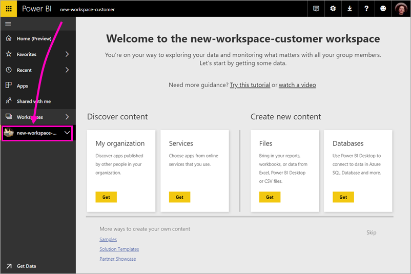

# Create the new workspaces in Power BI

Power BI is introducing a new workspace experience. Workspaces are still places to collaborate with colleagues to create collections of dashboards and reports, which you can bundle into *apps* and distribute to your whole organization or to specific people or groups. 

In the new workspaces, you can:

- Assign workspace roles to user groups: security groups, distribution lists, Office 365 groups, and individuals.
- Create a workspace in Power BI without creating an Office 365 group.
- Use more granular workspaces roles for more flexible permissions management in a workspace.

For more background, see the [new workspaces](service-new-workspaces.md) article.

## Create one of the new app workspaces

1. Start by creating the app workspace. Select **Workspaces** > **Create app workspace**.
   
     

2. You're automatically creating an upgraded workspace, unless you opt to **Revert to classic**.
   
     
     
     If you select **Revert to classic**, you create a workspace based on an Office 365 Group. Use this option if you need the **Members can only view Power BI content** option to enforce row-level security (RLS) for workspace members.

2. Give the workspace a name. If the name isn't available, edit it to come up with a unique name.
   
     The app for the workspace will have the same name and icon as the workspace.
   
1. Here are some optional items you can specify for your workspace:

    Upload an image. The file size has to be less than 45 KB.
    
    Add a **Contact list**. By default, the workspace admins are the contacts. 
    
    Specify a **Workspace OneDrive** by typing just the name of the OneDrive location, not the URL. In this step, you're not creating a OneDrive location. You're specifying an existing location. 

    

    Assign the workspace to a **Dedicated capacity**.
     
    

1. Select **Save**.

    Here in the **Welcome** screen for your new workspace, you can add data. 

    

1. For example, select **Samples** > **Customer Profitability Sample**.

7. Now in the workspace content list, because you're an admin, you also see a new action, **Access**.

    

1. Select **Access**.

1. Add security groups, distribution lists, Office 365 groups, or individuals to these workspaces as members, contributors, or admins. See [Roles in the new workspaces](service-new-workspaces.md#roles-in-the-new-workspaces) for an explanation of the different roles.

    

9. Select **Add** > **Close**.

1. Power BI creates the workspace and opens it. You see it in the list of workspaces you’re a member of. Because you’re an admin, you can select the ellipsis (…) to go back and make changes to workspace settings, adding new members, or changing their permissions. If you specified a Workspace Onedrive, a files option is shown as well.

     

## Add content to your app workspace

After you've created an new workspace experience workspace, it's time to add content to it. Adding content is similar in the new and classic workspaces. Use the Create button or use Get Data to add content to your workspace.

> [!NOTE]
> In the new workspaces, you can't consume organizational content packs, or third-party content packs. Apps are available for all third-party content packs you previously used. Use classic workspaces if you need to continue using content packs. Content packs are deprecated and will be removed in the future, so it's a best practice to use apps instead.

When you view content in the content list of an app workspace, the app workspace name is listed as the owner.

### Connecting to third-party services in new workspaces

In the new workspaces experience, we're making a change to focus on *apps*. Apps for third-party services make it easy for users to get data from the services they use, such as Microsoft Dynamics CRM, Salesforce, or Google Analytics.

Organizational apps give your users the internal data they need. We plan to add capabilities to organizational apps so users can customize the content they find within the apps. That capability will remove the need for content packs. 

In the new workspace experience, you can't create or consume organizational content packs. Instead you can use the apps provided to connect to third-party services, or ask your internal teams to provide apps for any content packs you’re currently using. 

## Distribute an app

If you want to distribute official content to a large audience within your organization, you can publish an app from your workspace.  When the content is ready, you choose which dashboards and reports you want to publish, and then publish it as an *app*. You can create one app from each workspace.

The Apps list in the left navigation shows all the apps you've installed. Your coworkers can get your app in a few different ways. 
- They can find and install your app from Microsoft AppSource
- You can send them a direct link. 
- You can install it automatically in your coworkers' Power BI accounts if your Power BI administrator gives you permission. 

Users see updated app content automatically after you publish an update from your workspace. You can control how frequently the data refreshes by setting the refresh schedule in the datasets used by the app content in your workspace. See [Publish an app from the new workspaces in Power BI](service-create-distribute-apps.md) for details.

## Next steps
* Read about [organizing work in the new workspaces experienc in Power BI](service-new-workspaces.md)
* [Create classic workspaces](service-create-workspaces.md)
* [Publish an app from the new workspaces in Power BI](service-create-distribute-apps.md)
* Questions? [Try asking the Power BI Community](http://community.powerbi.com/)
