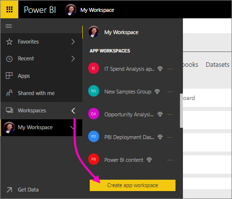

# Create the new workspaces (preview) in Power BI

Power BI is introducing a new workspace experience as a preview. Workspaces are still places to collaborate with colleagues to create collections of dashboards and reports, which you can bundle into *apps* and distribute to your whole organization or to specific people or groups. 

With the new workspaces preview you can now:

- Assign workspace roles to user groups: security groups, distribution lists, Office 365 groups, and individuals.
- Create a workspace in Power BI without creating an Office 365 group.
- Use more granular workspaces roles for more flexible permissions management in a workspace.
 
When you create one of the new workspaces, you're not creating an underlying, associated Office 365 group. All the workspace administration is in Power BI, not in Office 365. You can still add an Office 365 group to the workspace to continue managing user access to content through Office 365 groups. However, you can additionally use security groups, distribution lists, and add individuals directly within Power BI, giving you a flexible way to manage workspace access. Because workspace administration is now in Power BI, Power BI admins decide who in an organization can create workspaces. See the [Power BI admin portal article, Workspaces section](service-admin-portal.md#workspace-settings) for details. 

You add user groups or individuals to the new workspaces as members, contributors, or admins. Everyone in a user group gets the role you’ve defined. If an individual is in multiple user groups, they get highest level of permission provided by the role.  See [Roles in the new workspaces](#roles-in-the-new-workspaces) later in this article for an explanation of the different roles.

Everyone you add to an app workspace needs a Power BI Pro license. In the workspace these users can all collaborate on dashboards and reports that you plan to publish to a wider audience, or even to your entire organization. If you want to distribute content to others inside your organization, you can assign Power BI Pro licenses to those users or place the workspace in a Power BI Premium capacity.

With the new workspaces, we are redesigning some features. See [App workspace features that work differently](#app-workspace-features-that-work-differently) later in this article for an explanation of the changes you can expect to be permanent along with the preview. Because this is a preview feature, there are some limitations that you should be aware of. See [Known issues](#known-issues) later in this article for an explanation of the current limitations. 

## Roll out new app workspaces

During the preview period, old and new workspaces can coexist side by side, and you can create either. When the preview for new workspaces ends and they're generally available, old workspaces can still exist for a time. You won't be able to create them, and you'll need to prepare to migrate your workspaces to the new workspaces infrastructure. Don’t worry, you will have several months to complete migration.

## Create one of the new app workspaces

1. Start by creating the app workspace. Select **Workspaces** > **Create app workspace**.
   
     

2. In **Preview improved workspaces**, select **Try now**.
   
     

2. Give the workspace a name. If the name isn't available, edit it to come up with a unique ID.
   
     The app will have the same name as the workspace.
   
1. Add an image, if you want. The file size has to be less than 45 KB.
 
    

1. Select **Save**.

    Here in the **Welcome** screen for your new workspace, you can add data. 

    

1. For example, select **Samples** > **Customer Profitability Sample**.

    Now in the workspace content list, you see **New workspaces preview**. Because you're an admin, you also see a new action, **Access**.

    

1. Select **Access**.

1. Add security groups, distribution lists, Office 365 groups, or individuals to these workspaces as members, contributors, or admins. See [Roles in the new workspaces](#roles-in-the-new-workspaces) later in this article for an explanation of the different roles.

    

9. Select **Add** > **Close**.

1. Power BI creates the workspace and opens it. It appears in the list of workspaces you’re a member of. Because you’re an admin, you can select the ellipsis (…) to go back and make changes to workspace settings, adding new members, or changing their permissions.

     

## Add content to your app workspace

After you've created an app workspace of the new style, it's time to add content to it. Adding content is similar in the new and old style workspaces, with one exception. While in either app workspace, you can upload or connect to files, just as you would in your own My Workspace. In the new workspaces, you can't connect to organizational content packs, or third-party content packs such as Microsoft Dynamics CRM, Salesforce, or Google Analytics. In the current workspaces you can connect to content packs.

When you view content in the content list of an app workspace, the app workspace name is listed as the owner.

### Connecting to third-party services in new workspaces (preview)

In the new workspaces experience, we are making a change to focus on apps. Apps for third-party services make it easy for users to obtain data from the services they use, such as Microsoft Dynamics CRM, Salesforce, or Google Analytics.
Organizational apps give your users the internal data they need. We plan to add capabilities to organizational apps so users can customize the content they find within the apps. That will remove the need for content packs. 

With the new workspaces preview, you can't create or consume organizational content packs. Instead you can use the apps provided to connect to third-party services, or ask your internal teams to provide apps for any content packs you’re currently using. 

## Roles in the new workspaces

Roles let you manage who can do what in a workspace, so teams can collaborate. New workspaces allow you to assign roles to individuals, and to user groups: security groups, Office 365 groups, and distribution lists. 

When you assign roles to a user group, the individuals in the group have access to content. If you nest user groups, all the contained users have permission. A user who's in several user groups with different roles gets the highest level of permission granted them. 

The new workspaces offer three roles: admins, members, and contributors.

**Admins can:**

- Update and delete the workspace. 
- Add/remove people, including other admins.
- Do everything members can do.

**Members can:** 

- Add members or others with lower permissions.
- Publish and update an app.
- Share an item or share an app.
- Allow others to reshare items.
- Do everything contributors can do.

**Contributors can:** 

- Create, edit, and delete content in the workspace. 
- Publish reports to the workspace, delete content.
- Can’t give new people access to content; can’t share new content, but can share with someone with whom the workspace, item, or app is already shared. 
- Can’t modify the members of the group.
 
We’re building Request Access workflows throughout the service so users who don’t have access can request it. Request Access workflows currently exist for dashboards, reports, and apps.

## Distribute an app

When the content is ready, you choose which dashboards and reports you want to publish, and then you publish it as an *app*. You can create one app from each workspace. Your coworkers can get your app in a few different ways. You can install it automatically in your coworkers' Power BI accounts if your Power BI administrator gives you permission. Otherwise, they can find and install your app from Microsoft AppSource, or you can send them a direct link. They get updates automatically and you can control how frequently the data refreshes. See [Publish apps with dashboards and reports in Power BI](service-create-distribute-apps.md) for details.

## Convert old app workspaces to new app workspaces

During the preview period, you can't automatically convert your old app workspaces to new ones. You can however create a new app workspace and publish your content to the new location. 

When the new workspaces are generally available (GA), you can opt in to migrate the old ones automatically. At some point after GA, you'll have to migrate them.

## Power BI apps FAQ

### How are the new app workspaces different from current app workspaces?
* Creating app workspaces won't create corresponding entities in Office 365 like current app workspaces do. (You can still add an Office 365 group to your workspace by assigning it a role). 
* In current app workspaces, you can add only individuals to the members and admin lists. In the new app workspaces, you can add multiple AD security groups, distribution lists, or Office 365 groups to these lists to allow for easier user management. 
- You can create an organizational content pack from a current app workspace. You can't create one from the new app workspaces.
- You can consume an organizational content pack from a current app workspace. You can’t consume one from the new app workspaces.
- During the preview some capabilities aren't enabled yet for new app workspaces. See the next section, [Other planned new workspace features](service-create-the-new-workspaces.md#other-planned-new-app-workspace-preview-features), for details.

## Planned new app workspace preview features

Some other new app workspace preview features are still being developed, but aren't available yet as we launch the preview:

- No **Leave workspace** button.
- Usage metrics aren't supported yet.
- How Premium works: You can assign and create workspaces in a Premium capacity, but to move a workspace between capacities, go to the workspace’s settings.
- SharePoint web part embedding isn't supported yet.
- No **OneDrive** button for Office 365 groups in Get Data/Files.

## App workspace features that work differently

Some features work differently from current app workspaces in the new app workspaces. These differences are intentional, based on feedback we’ve received from customers, and will enable a more flexible approach to collaboration with workspaces:

- Members can or can't reshare: replaced by the Contributor role
- Read-only workspaces: Instead of granting users read-only access to a workspace, you'll assign users to a forthcoming Viewer role, which allows similar read-only access to the content in a workspace.

## Known issues

The following issues are known, and fixes are under development:

- Free users or user groups added as recipients of subscriptions to emails may not receive the emails, though they should. The issue occurs when one of the new workspaces is in a Premium capacity, but the My Workspace of the user creating the subscription isn't in a Premium capacity. If the My Workspace is in a Premium capacity, then free users and user groups will receive the emails.
- After a workspace is moved from a Premium capacity to shared capacity, in some cases, free users and user groups will continue to receive emails, though they should not. The issue occurs when the My Workspace of the user creating the subscription is in a Premium capacity.

## Next steps
* [Create the current workspaces](service-create-workspaces.md)
* [Install and use apps in Power BI](service-create-distribute-apps.md)
* Questions? [Try asking the Power BI Community](http://community.powerbi.com/)
