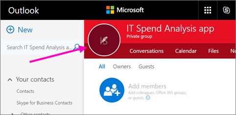
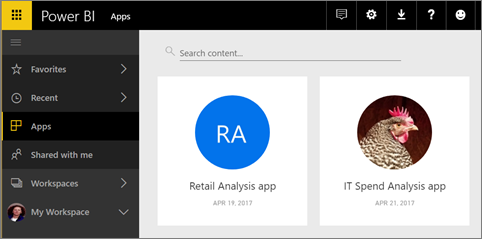

# Create classic workspaces in Power BI

In Power BI, you can create *workspaces*, places to collaborate with colleagues to create and refine collections of dashboards, reports, and paginated reports. Then you can bundle the collection together into *apps* that you can distribute to your whole organization or to specific people or groups. 

**Did you know?** Power BI offers a new workspace experience, which is now the default. Read [Organize work in the new workspaces](service-new-workspaces.md) for details about the new workspaces. 

When you create a classic workspace, you're creating an underlying, associated Office 365 group. All the workspace administration is in Office 365. You can add colleagues to these workspaces as members or admins. In the workspace, you can all collaborate on dashboards, reports, and other articles that you plan to publish to a wider audience. Everyone you add to an app workspace needs a Power BI Pro license. 

## Video: Apps and app workspaces
<iframe width="640" height="360" src="https://www.youtube.com/embed/Ey5pyrr7Lk8?showinfo=0" frameborder="0" allowfullscreen></iframe>

## Create a classic app workspace based on an Office 365 group

When you create an app workspace, it’s built on an Office 365 group.

[!INCLUDE [powerbi-service-create-app-workspace](./includes/powerbi-service-create-app-workspace.md)]

When you first create it, you may need to wait an hour or so for the workspace to propagate to Office 365. 

### Add an image to your Office 365 app workspace (optional)
By default, Power BI creates a little colored circle for your app, with the app's initials. But maybe you want to customize it with an image. To add an image, you need an Exchange Online license.

1. Select **Workspaces**, select the ellipsis (...) next to the name of the workspace, then **Members**. 
   
     
   
    The Office 365 Outlook account for the workspace opens in a new browser window.
2. When you hover over the colored circle in the upper left, it turns into a pencil icon. Select it.
   
     
3. Select the pencil icon again, and find the image you want to use.
   
     

     Images can be .png, .jpg, or .bmp files. Their file size can be large, up to 3 MB. 

4. Select **Save**.
   
     
   
    The image replaces the colored circle in the Office 365 Outlook window. 
   
     
   
    In a few minutes, it will appear in the app in Power BI, too.
   
     

## Add content to your app workspace

After you've created an app workspace, it's time to add content to it. It's just like adding content to your My Workspace, except the other people in the workspace can see and work on it, too. A big difference is that when you get done, you can publish the content as an app. 
When you view content in the content list of an app workspace, the app workspace name is listed as the owner.

### Connect to third-party services in app workspaces

Apps are provided for all the third-party services Power BI supports, making it easy for you to get data from the services you use, such as Microsoft Dynamics CRM, Salesforce, or Google Analytics. You can publish organizational apps to give your users the data they need.

In the current workspaces, you can also connect using organizational content packs, and third-party content packs such as Microsoft Dynamics CRM, Salesforce, or Google Analytics. Consider migrating your organizational content packs to apps.

## Distribute an app

If you want to distribute official content to a large audience within your organization, you can publish an app from your workspace.  When the content is ready, you choose which dashboards and reports you want to publish, and then publish it as an *app*. You can create one app from each workspace.

The Apps list in the left navigation shows all the apps you've installed. Your coworkers can get your app in a few different ways. 
- They can find and install your app from Microsoft AppSource
- You can send them a direct link. 
- You can install it automatically in your coworkers' Power BI accounts if your Power BI administrator gives you permission. 

Users see updated app content automatically after you publish an update from your workspace. You can control how frequently the data refreshes by setting the refresh schedule in the datasets used by the app content in your workspace. See [Publish an app from the new workspaces in Power BI](service-create-distribute-apps.md) for details.

## Power BI classic apps FAQ

### How are apps different from organizational content packs?
Apps are the evolution of organizational content packs. If you have organizational content packs already, they'll continue to work side by side with apps. Apps and content packs have a few major differences. 

* After business users install a content pack, it loses its grouped identity: it's just a list of dashboards and reports interspersed with other dashboards and reports. Apps, on the other hand, maintain their grouping and identity even after installation. This grouping makes it easy for business users to continue to navigate to them over time.
* You can create multiple content packs from any workspace, but an app has a 1:1 relationship with its workspace. 
* Over time we plan to deprecate organizational content packs, so we recommend you create apps from now on.  
* With the new workspace experience preview, we're taking the first steps towards deprecating organizational content packs. You can't consume or create them in preview workspaces.

See [How are the new app workspaces different from existing app workspaces?](service-new-workspaces.md#how-are-the-new-workspaces-different-from-current-workspaces) to compare the two. 

## Next steps
* [Install and use apps in Power BI](service-create-distribute-apps.md)
- [Create the new workspaces (preview)](service-create-the-new-workspaces.md)
* Questions? [Try asking the Power BI Community](http://community.powerbi.com/)
