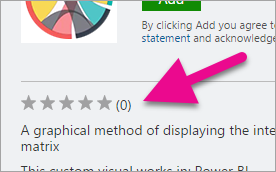

# Download and use custom visuals from Microsoft AppSource
Discover, evaluate, and use AppSource custom visuals in your Power BI reports.

AppSource has many useful custom visuals created by the community and by Microsoft that you can download and use in your Power BI reports.

What is AppSource? Simply put, it is the place to find apps, add-ins, and extensions for your Microsoft software. [AppSource](https://appsource.microsoft.com) connects millions of users of products like Office 365, Azure, Dyanmics 365, Cortana, and Power BI to solutions that help them get work done more efficiently, more insightfully, or more beautifully than before.

## Power BI custom visuals
1. To see the list of available Power BI custom visuals, select **Apps**. 

    

2. This takes you to the [Apps results page](https://appsource.microsoft.com/en-us/marketplace/apps) where you can view top apps in each category, including *Power BI Apps*. But we're looking for custom visuals, so let's narrow down the results by selecting **Power BI visuals** from the left navigation list.

    

3. AppSource displays a tile for each custom visual.  Each tile has a snapshot of the custom visual and gives a brief description and a download link. To see more details, select the tile. 

    

    On the detail page you can view screenshots, videos, detailed description and more.

## Download and use the custom visual
Select **Get it now** and then agree to the Terms of use. 

Select the link to download the custom visual.

The download page also include instructions on how to import the custom visual into Power BI Desktop and the Power BI service.

You can also download a sample report that includes the custom visual and showcases its capabilities.

## Reviews and ratings
Each custom visual can be reviewed and rated by users, connecting the end users directly with the developer.

> [!NOTE]
> Some custom visuals have passed rigorous testing and are *certified* for server-side usage. [Certified custom visuals](power-bi-custom-visuals-certified.md) are supported for exporting to PowerPoint and will display in the emails received when a user subscribes to report pages.
> 
> 

## Next steps
[Add a custom visual to a report in the Power BI Service](power-bi-report-add-custom-visual.md)  
[Publish custom visuals to the Office store](developer/office-store.md)  
[Visualizations in Power BI](power-bi-report-visualizations.md)  
[Custom Visualizations in Power BI](power-bi-custom-visuals.md)  

More questions? [Try asking the Power BI Community](http://community.powerbi.com/)