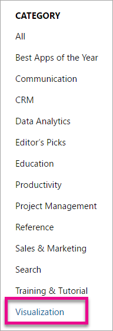
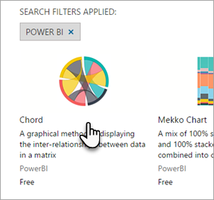
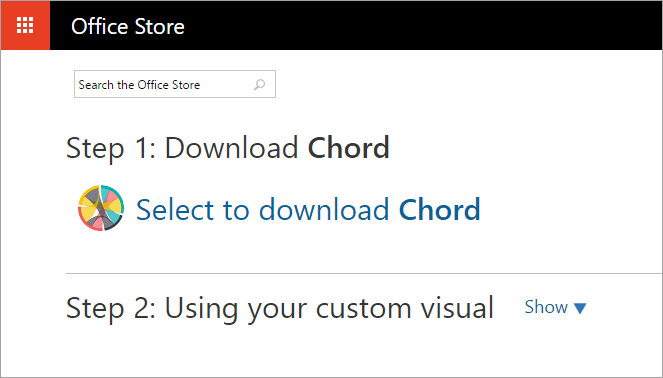

# Download and use custom visuals from the Office store
Learn how you can discover and use custom visuals from the Office store for use in your reports in Power BI.

The Office store has many useful custom visuals created by the community and [created by Microsoft](https://www.youtube.com/playlist?list=PL1N57mwBHtN1vIjfvuBIzZllrmKo-Vz6x) that you can download and use in your Power BI reports.

What is the Office store? Simply put, it is the place to find apps (add-in) for your Office 365 software. The [Office store](https://appsource.microsoft.com/marketplace/apps?product=power-bi-visuals) connects millions of users of Office 365 to solutions that help them get work done more efficiently, more insightfully or more beautifully than before.

## Power BI visualizations
Power BI is a product in the Office store. Selecting Power BI will navigate to the [Power BI custom visuals](https://appsource.microsoft.com/marketplace/apps?product=power-bi-visuals) main page where users can view top visuals in each category, including *Editor's Picks*.

If you don't select the Power BI product, you can select the "Visualization" category and view all the Power BI custom visuals among the other Office visualizations.

## Search for custom visuals
You can use the search box to search for custom visuals by name.

## View a custom visual's details page
Select a custom visuals to open its details page.

On the detail page you can view screenshots, videos, detailed description and more.

## Reviews and ratings
Each custom visual can be reviewed and rated by users, connecting the end users directly with the developer.

## Download and use
Select the **Add** button to navigate to the download page where you can download the custom visual's *pbiviz* file.

The page also include instructions on how to import the custom visual into Power BI Desktop and the Power BI service.

You can also download a sample report that includes the custom visual and showcases its capabilities.

> [!NOTE]
> Some custom visuals have passed rigorous testing and are *registered* for server-side usage. Registered custom visuals are supported for exporting to PowerPoint and will display in the emails received when a user subscribes to report pages.
> 
> 

## Next steps
[Add a custom visual to a report in the Power BI Service](power-bi-report-add-custom-visual.md)  
[Publish custom visuals to the Office store](powerbi-developer-office-store.md)  
[Visualizations in Power BI](power-bi-report-visualizations.md)  
[Custom Visualizations in Power BI](power-bi-custom-visuals.md)  

More questions? [Try asking the Power BI Community](http://community.powerbi.com/)

