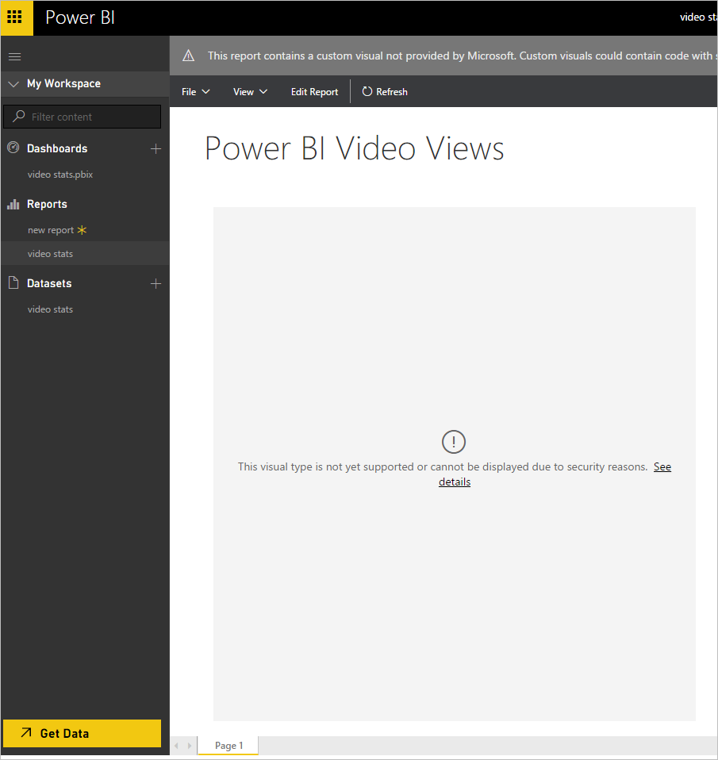

# Review custom visuals for security and privacy
Before you enable a custom visual, you should review that visual for security and privacy to make sure if will fit your organization's standards.

## Enable a custom visual
A custom visual in the report is disabled until you choose **Enable custom visuals** as shown below.  

## Considerations before you enable a custom visual

> [!WARNING]
> A custom visual could contain code with security or privacy risks; therefore, a custom visual in the report is disabled until you choose Enable custom visuals. Here are some considerations to decide whether to enable a custom visual:
> 
> 

1. Ensure you trust the author and the source of the custom visuals used in the report
2. If you are unsure what to do, you should reach out to your IT team to weigh in on whether you should enable custom visuals for reports you view.
3. If someone shares a report with you that contains a custom visual, even if they're a close co-worker, do not feel obligated to enable the custom visual. It's okay to step back and consider whether it is essential to the task at hand. It's always okay to ask someone to provide you a report without custom visuals if you don't feel confident about the custom visual.

## Security best practices for IT Professionals to enable a custom visual

> [!WARNING]
> A custom visual could contain code with security or privacy risks; therefore, a custom visual in the report is disabled until you choose Enable custom visuals. There are several best practices you can follow to evaluate a custom visual for security and privacy.
> 
> 

1. Implement a vetting process for custom visuals within the organization. Vetted custom visuals would be shared with internal users through an internal website, such as a SharePoint document library or OneNote document.
2. Provide guidance for business users on appropriate use of custom visuals and an email group for business users to send security and privacy questions to.
3. Evaluate the JavaScript code in the custom visual pbiviz file.

**To evaluate the JavaScript code in a custom visual**

A custom visual uses JavaScript and can therefore contain security or privacy risks. If you receive a custom visual or a pbix file with a custom visual from an unknown source, you may want to look at the JavaScript to see if it is safe.

To evaluate the JavaScript code in a custom visual, extract the custom visual code. Here’s how to extract the code:  

1. Save the .pbiviz file to a folder.
2. Rename the file to a .zip file.
3. Extract the zip file to a local folder.

## Custom visual file contents
The following are the contents of a pbiviz file:

| **File** | **Description** |
|:--- |:--- |
| ./package.json |A manifest file that indicates which files to load for the custom visual. |
| ./resources |Contains the CSS, TypeScript, and JavaScript used by the custom visual. |
| ./resources/&lt;name&gt; |&lt;name&gt; is the name of the custom visual. |
| ./resources/&lt;name&gt;.css |The css resource file for the custom visual. |
| ./resources/&lt;name&gt;.js |The code that executes when a user clicks Enable custom visuals or after a user Imports a custom visual. Warning JavaScript code could contain security or privacy risks. |
| ./resources/&lt;name&gt;.ts |The JavaScript source code for the visual in TypeScript format. Warning JavaScript or TypeScript code could contain security or privacy risks. |
| ./resources/&lt;name&gt;.png |The icon shown to the user for the visual. |

After you extract the pbiviz file, you can evaluate the code. Here are some best practices and threats to look for.

## Best practices to evaluate the JavaScript or TypeScript code
**JavaScript** or **TypeScript** code could contain security or privacy risks. Here are some best practices and threats to look for.

### Best practices to evaluate JavaScript code
* Always evaluate the .js file contents. This is the code that actually runs. It could be that the contents of the .ts file don't compile to the .js file included in the custom visual.
* Always evaluate the .ts file contents. You can load the .ts file into the **Developer Tools**, export the visual and compare the resulting .js file in the newly create .pbiviz file to the original .js file contained in the visual
* Check that the icon for the custom visual does not resemble too closely other visuals the user is familiar with.
* Always evaluate the visual in a test account that has minimal privileges and does not have access to any sensitive data. Ideally the test account would be a local account with no sign-in information to services other than Power BI.

### Threats to look for in JavaScript code
* Check network activity when the visual is being used in both edit and view mode. Ensure you're satisfied with the requests that are being made. You should not see requests to resources outside the Power BI domain unless the visual author has communicated this ahead of time.
* Any data you see leaving the Power BI domain should match your expectations for what 'normal' use would be. For example - if the visual implements a video player that uses an iFrame to view a video from another site, some information should travel in the IFrame requests to render the video correctly. However, if you see the entire data set being sent across the wire, you might investigate further if this is required and desired.
* Check if personally identifiable data is being sent or stored by the custom visual.
* Check if the custom visual is trying to access local machine resources such as writing files to disk or accessing cookies.
* Check if the custom visual has what appears to be obfuscated code or code without a clear purpose.
* Save copies of each visual you reviewed in the past.
* If you are reviewing an update to a visual you previously reviewed, ensure to check for changes. Always apply equal rigor to updates as you did the first time you received the visual for review
* If you find something suspicious or unclear, please reach out to us we're here to help.

## Next steps
[Visualizations in Power BI](power-bi-report-visualizations.md)  
[Custom Visualizations in Power BI](power-bi-custom-visuals.md)  
[Publish custom visuals to the Office store](developer/office-store.md)  
[Getting started with custom visuals developer tools](service-custom-visuals-getting-started-with-developer-tools.md)  
[How to certify a custom visual](power-bi-custom-visuals-certified.md)    
[Video: Creating custom visualizations for Power BI with Sachin Patney and Nico Cristache](https://www.youtube.com/watch?v=kULc2VbwjCc)  

More questions? [Try asking  the Power BI Community](http://community.powerbi.com/)

