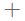
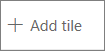
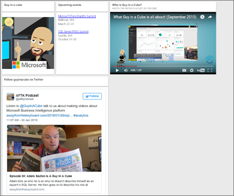
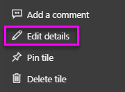

# Add image, text, video, and more to your dashboard
<iframe width="560" height="315" src="https://www.youtube.com/embed/e2PD8m1Q0vU" frameborder="0" allowfullscreen></iframe>


## Add tile
The **Add tile** control lets you directly add an image, text box, video, streaming data, or web code to your dashboard.

1. Select **Add tile** from the top menu bar. Depending on space limitations, you may see only the plus   sign.
   
    
2. Select which type of tile to add: **Image**, **Text box**, **Video**, **Web content**, or **Custom streaming data**.
   
    

## Add an image
Say you want your company logo on your dashboard, or some other image. You'll need to save the image file online and link to it. Make sure special credentials aren't required to access the image file. For example, OneDrive and SharePoint require authentication, so images stored there can't be added to a dashboard this way.  

1. Select **Image** > **Next**.
2. Add image information to the **Add image tile** window.
   
    
   
   * to display a title above the image, select *Display title and subtitle* and type a title and/or subtitle.
   * enter the image URL
   * to make the tile a hyperlink, select **Set custom link** and enter the URL.  When colleagues click this image or title, they'll be taken to this URL.
   * Select **Apply**.  On the dashboard, resize and move the image as needed.
     
     

## Add a text box or dashboard heading
1. Select **Text box > Next**.
   
   > **NOTE**: To add a dashboard heading, type your heading in the text box and increase the font.
   > 
2. Format the text box:
   
   * to display a title above the text box, select **Display title and subtitle** and type a title and/or subtitle.
   * enter and format content for the text box.  
   * Optionally, set a custom link for the title. A custom link can be an external site or a dashboard or report in your workspace. However, in this example we've added hyperlinks within the text box itself, so will leave **Set custom link** unchecked.

     
   
3. Select **Apply**.  On the dashboard, resize and move the text box as needed.
   
   

## Add a video
When you add a YouTube or Vimeo video tile to your dashboard, the video plays right on your dashboard.

1. Select **Video > Next**.
2. Add video information to the **Add video tile** pane.
   
    
   
   * to display a title and subtitle at the top of the video tile, select *Display title and subtitle* and type a title and/or subtitle. In this example, we'll add a subtitle and then turn it into a hyperlink back to the entire playlist on YouTube.
   * enter the URL for the video
   * Add a hyperlink for the title and subtitle.  Perhaps after your colleagues watch the embedded video you'd like them to view the entire playlist on YouTube -- add a link to your playlist here.
   * Select **Apply**.  On the dashboard, resize and move the video tile as needed.
     
      
3. Select the video tile to play the video.
4. Select the subtitle to visit the playlist on YouTube.

## Add streaming data
<iframe width="560" height="315" src="https://www.youtube.com/embed/kOuINwgkEkQ" frameborder="0" allowfullscreen></iframe>

## Add web content
Paste or type in any HTML content.  Power BI adds it, as a tile, to your dashboard. Enter the embed code by hand or copy/paste from sites such as Twitter, YouTube, embed.ly, and more.

1. Select **Web content > Next**.
2. Add information to the **Add web content tile** pane.
   
    
   
   * to display a title above the tile, select *Display title and subtitle* and type a title and/or subtitle.
   * enter the embed code. In this example we're copying and pasting a Twitter feed.
3. Select **Apply**.  On the dashboard, resize and move the web content tile as needed.
     
      

## Tips for embedding web content
* For iframes, use a secure source. If you enter your iframe embed code and get a blank tile, check to see if you're using **http** for the iframe source.  If so, change it to **https**.
  
  ```html
  <iframe src="https://xyz.com">
  ```
* Edit width and height information. This embed code embeds a video and sets the video player to 560 x 315 pixels.  This size will not change as you resize the tile.
  
  ```html
  <iframe width="560" height="315"
  src="https://www.youtube.com/embed/Cle_rKBpZ28" frameborder="0"
   allowfullscreen></iframe>
  ```
  
  If you'd like the player to resize to fit the tile size, set width and height to 100%.
  
  ```html
  <iframe width="100%" height="100%"
  src="https://www.youtube.com/embed/Cle_rKBpZ28" frameborder="0"
   allowfullscreen></iframe>
  ```
* This code embeds a tweet and retains, as separate links on the dashboard, links for the **AFK** podcast, **\@GuyInACube's Twitter page**, **Follow**, **#analytics**, **reply**, **retweet**, and **like**.  Selecting the tile itself takes you to the podcast on Twitter.
  
  ```html
  <blockquote class="twitter-tweet" data-partner="tweetdeck">
  <p lang="en" dir="ltr">Listen to
  <a href="https://twitter.com/GuyInACube">@GuyInACube</a> talk to
  us about making videos about Microsoft Business Intelligence
  platform
  <a href="https://t.co/TmRgalz7tv">https://t.co/TmRgalz7tv </a>
  <a href="https://twitter.com/hashtag/analytics?src=hash">
  #analytics</a></p>&mdash; AFTK Podcast (@aftkpodcast) <a
  href="https://twitter.com/aftkpodcast/status/693465456531771392">
  January 30, 2016</a></blockquote> <script async src="//platform.twitter.com/widgets.js" charset="utf-8"></script>
  ```

## Edit a tile
To make changes to a tile...

1. Hover over the top right corner of the tile and select the ellipses.
   
    
2. Select the edit icon to re-open the **Tile details** pane and make changes.
   
    

## Considerations and troubleshooting
* To make it easier to move the tile on your dashboard, add a title and/or subtitle.
* If you'd like to embed some content from a website, but the website doesn't give you embed code to copy and paste, check out embed.ly for help generating the embed code.

## Next steps
[Dashboard tiles](consumer/end-user-tiles.md)

More questions? [Try the Power BI Community](http://community.powerbi.com/).

