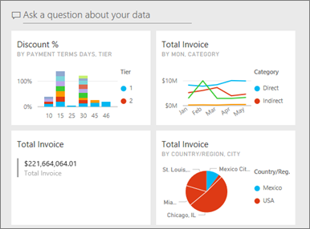

# Create a copy of a dashboard in Power BI service

 There are many different reasons to make a copy of a dashboard. Maybe you want to make changes and test its performance against the original; or create slightly different versions to distribute by colleague, region, or team. Perhaps a colleague admires your dashboard design and wants to use it for reporting out to her managers. Another reason would be if you have a new database with the same data structure and data types and want to reuse the dashboard you've already created -- this too can be done but would require some work in Power BI Desktop. 

Dashboards are created (and copied) using Power BI service and can be viewed in Power BI mobile and Power BI Embedded.  Dashboards are not available in Power BI Desktop. 

To make a copy of a dashboard, you must be the dashboard *creator*. Dashboards that have been shared with you as an app cannot be duplicated.

1. Open the dashboard.
2. From the top-right corner, select the ellipses (...) and choose **Duplicate dashboard**.
   
   
3. Give the dashboard a name and select **Duplicate**. 
   
   
4. The new dashboard is saved in the same workspace as the original. 
   
   

5.    Open the new dashboard and edit as needed. Here are some things you might want to do next:    
    a. [Move, rename, resize or even delete tiles](service-dashboard-edit-tile.md).  
    b. Edit tile details and hyperlinks by selecting the tile ellipses (...) and choosing **Edit details**.  
    c. [Add new tiles from the dashboard menubar](service-dashboard-add-widget.md) (**Add tile**)  
    d. Pin new tiles [from Q&A](service-dashboard-pin-tile-from-q-and-a.md) or [from reports](service-dashboard-pin-tile-from-report.md).  
    e. Rename the dashboard, turn Q&A on or off, and set the tile flow from the dashboard Settings pane.  (select the dashboard ellipses (...) dropdown and choose **Settings**)  
    f. Share your dashboard directly with colleagues or as part of a Power BI app. 

## Next steps
* [Tips for designing a great dashboard](service-dashboards-design-tips.md) 

More questions? [Try the Power BI Community](http://community.powerbi.com/)

