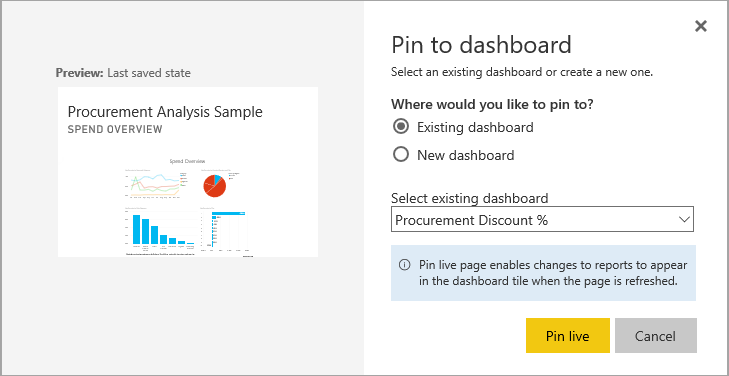

# Create a Power BI dashboard from a report
You've read [Dashboards in Power BI](service-dashboards.md), and now you want to create your own. There are many different ways to create a dashboard - from a report, from scratch, from a dataset, by duplicating an existing dashboard, and more.  

It can seem overwhelming when you're first getting started, so we'll start by creating a quick and easy dashboard by pinning visualizations from a report that's already been built. Once you complete this quickstart, you'll have a good understanding of the relationship between dashboards and reports, opening Editing view in the report editor, pinning tiles, and navigating between a dashboard and a report. Then use the links in the Table of Contents on the left or the **Next steps** at the bottom to move on to more-advanced topics.

## Who can create a dashboard?
Creating a dashboard is a **creator** feature and requires edit permissions to the report. Edit permissions are available to report creators and to those colleagues the creator grants access. For example, if David creates a report in workspaceABC and then adds you as a member of that workspace, you and David will both have edit permissions. On the other hand, if a report has been shared with you directly or as part of a [Power BI app](service-create-distribute-apps.md) (you are **consuming** the report), you won't be able to pin tiles to a dashboard.

> **NOTE**: Dashboards are a feature of Power BI service, not Power BI Desktop. Dashboards can't be created in Power BI mobile, but they can be [viewed and shared](consumer/mobile/mobile-apps-view-dashboard.md).
>
> 

## Video: Create a dashboard by pinning visuals and images from a report
Watch Amanda create a new dashboard by pinning visualizations from a report. Then follow the steps below the video to try it out yourself, using the Procurement Analysis sample.

<iframe width="560" height="315" src="https://www.youtube.com/embed/lJKgWnvl6bQ" frameborder="0" allowfullscreen></iframe>

### Prerequisites
To follow along, you'll need to download the "Procurement Analysis" sample Excel workbook and open it in Power BI service (app.powerbi.com).

## Import a dataset with a report
We'll import one of the Power BI sample datasets and use it to create our new dashboard. The sample we'll use is an Excel workbook with two PowerView sheets. When Power BI imports the workbook it will add a dataset and also a report to your workspace.  The report is automatically created from the PowerView sheets.

1. [Select this link](http://go.microsoft.com/fwlink/?LinkId=529784) to download and save the Procurement Analysis sample Excel file. We recommend saving it in your OneDrive for Business.
2. Open Power BI service in your browser (app.powerbi.com).
3. Select **My Workspace**.
4. From the left nav, select **Get Data**.

    
5. Select **Files**.

   
6. Navigate to the location where you saved the Procurement Analysis sample Excel file. Select it and choose **Connect**.

   
7. For this exercise, select **Import**.

    
8. When the Success message appears, select the **x** to close it.

   

### Open the report and pin some tiles to a dashboard
1. Staying in the same workspace, select the **Reports** tab. The newly-imported report displays with a yellow asterisk. Select the report name to open it.

    
2. The report opens in Reading view. Notice it has two tabs at the bottom: Discount Analysis and Spend Overview. Each tab represents a page of the report.
    Select **Edit report** to open the report in Editing view.

    
3. Hover over a visualization to reveal the options available. To add a visualization to a dashboard, select the pin  icon.

    
4. Since we're creating a new dashboard, select the option for **New dashboard** and give it a name.

   
5. When you select **Pin**, Power BI creates the new dashboard in the current workspace. When the **Pinned to dashboard** message appears, select **Go to dashboard**. If you're prompted to save the report, choose **Save**.

     
6. Power BI opens the new dashboard and there is one tile - the visualization you just pinned.

   
7. To return to the report, select the tile. Pin a few more tiles to the new dashboard. This time when the **Pin to dashboard** window displays, select **Existing dashboard**.  

   

## Pin an entire report page to the dashboard
Instead of pinning one visual at a time, you can [pin an entire report page as a *live tile*](service-dashboard-pin-live-tile-from-report.md). Let's do it.

1. In the report editor, select the **Spend Overview** tab to open the 2nd page of the report.

   

2. You want all of these visuals on your dashboard.  In the upper-right corner of the menubar, select **Pin live page**. On a dashboard, live page tiles update each time the page is refreshed.

   

3. When the **Pin to dashboard** window displays, select **Existing dashboard**.

   

4. When the Success message appears, select **Go to dashboard**. There you'll see the tiles you pinned from the report. In the example below, we've pinned 2 tiles from page 1 of the report and one live tile that is page 2 of the report.

   

Congratulations on creating your first dashboard! Now that you have a dashboard, there's so much more you can do with it.  Try one of the suggested **Next steps** below, or start playing and exploring on your own.   

## Next steps
* [Resize and move tiles](service-dashboard-edit-tile.md)
* [All about dashboard tiles](service-dashboard-tiles.md)
* [Share your dashboard by creating an app](service-create-workspaces.md)
* [Power BI - Basic Concepts](service-basic-concepts.md)
* [Tips for designing a great dashboard](service-dashboards-design-tips.md)

More questions? [Try the Power BI Community](http://community.powerbi.com/)
