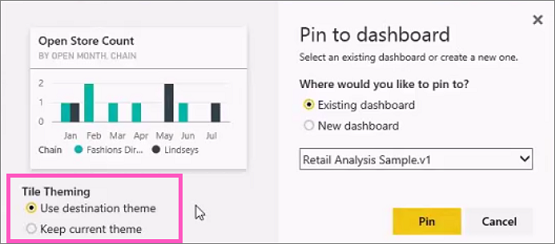
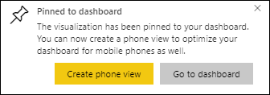

# Pin a tile to a Power BI dashboard from a report
## Pinning tiles from a report
One way to add a new [dashboard tile](consumer/end-user-tiles.md) is from within a [Power BI report](consumer/end-user-reports.md). In fact, you can add many new tiles from a report.  Each of these tiles, when clicked, is a link back into the report.

And entire report pages can be pinned to a dashboard.  This is also known as pinning a *live* tile.  *Live* because you can interact with the tile on the dashboard and because, unlike individual visualization tiles, changes made in the report are synced with the dashboard. Read more about this below.

You can't pin tiles from reports that have been shared with you or from Power BI Desktop. 

> **TIP**:
> Some visualizations use background images. Pinning may not work if the background image is too large.  Try reducing the image size or using image compression.  
> 
> 

## Pin a tile from a report
Watch Amanda create a dashboard by pinning visuals and images from a Power BI report.

<iframe width="560" height="315" src="https://www.youtube.com/embed/lJKgWnvl6bQ" frameborder="0" allowfullscreen></iframe>

Now create your own dashboard using one of the Power BI sample reports.

1. Hover over the visualization you want to pin, and select the pin  icon. Power BI opens the **Pin to dashboard** screen.
   
     
2. Decide whether to pin to an existing dashboard or new dashboard.
   
   * Existing dashboard: select the name of the dashboard from the dropdown. Dashboards that have been shared with you will not appear in the dropdown.
   * New dashboard: type the name of the new dashboard.
3. In some cases, the item you are pinning may have a *theme* already applied.  For example, visuals pinned from an Excel workbook. If so, select which theme to apply to the tile.
4. Select **Pin**.
   
   A Success message (near the top right corner) lets you know the visualization was added, as a tile, to your dashboard.
   
   
5. From the navigation pane, select the dashboard with the new tile. Select the tile to jump back into the report. Or, [edit the tile display and behavior](service-dashboard-edit-tile.md).

## Pin an entire report page
Another option is to pin an entire report page to a dashboard. This is an easy way to pin more than one visualization at a time.  Also, when you pin an entire page, the tiles are *live*; you can interact with them right there on the dashboard. And changes you make to any of the visualizations back in the report editor, like adding a filter or changing the fields used in the chart, are reflected in the dashboard tile as well.  

For more information, see [Pin an entire report page](service-dashboard-pin-live-tile-from-report.md)

## Next steps
[Dashboards in Power BI](consumer/end-user-dashboards.md)

[Dashboard tiles in Power BI](consumer/end-user-tiles.md)

[Reports in Power BI](consumer/end-user-reports.md)

[Data refresh in Power BI](refresh-data.md)

[Power BI Basic Concepts](consumer/end-user-basic-concepts.md)

More questions? [Try the Power BI Community](http://community.powerbi.com/)

